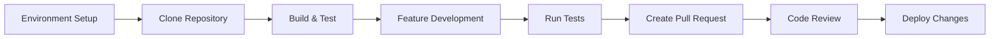
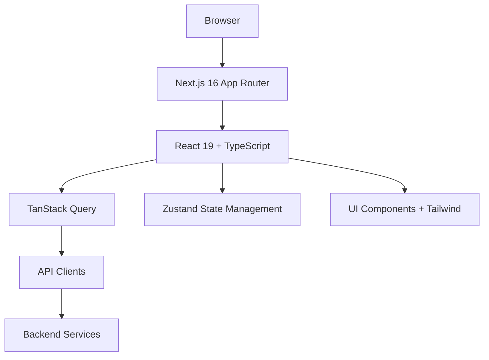
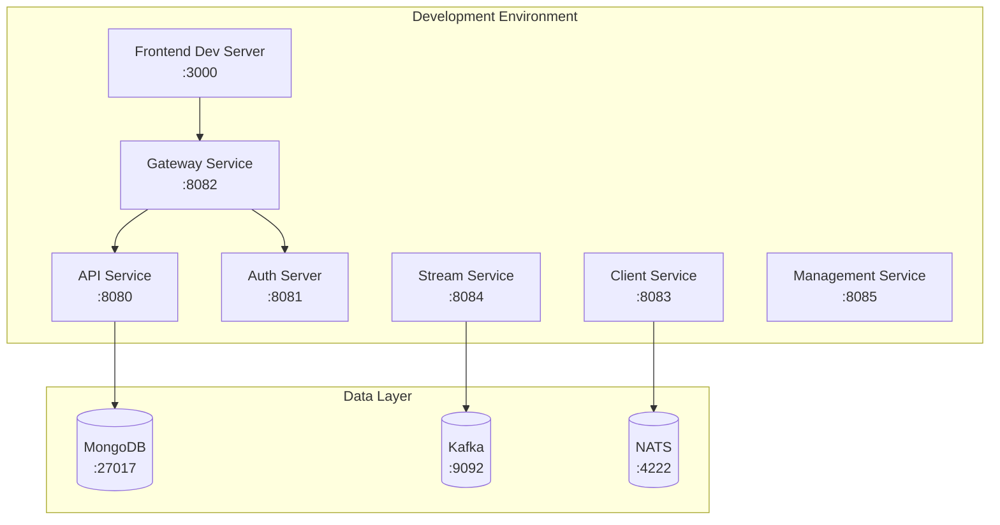
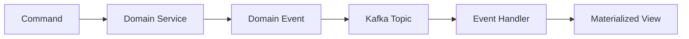

# Development Documentation

Welcome to the OpenFrame development documentation. This section provides comprehensive guides for developers working on, extending, or integrating with the OpenFrame platform.

## Overview

OpenFrame is a modern, microservices-based platform built with:

- **Backend**: Spring Boot 3.3 + Java 21
- **Frontend**: Next.js 16 + React 19 + TypeScript  
- **Architecture**: Event-driven microservices with OAuth2/OIDC
- **Data**: MongoDB, Apache Kafka, Cassandra, Pinot
- **Messaging**: NATS JetStream

## Quick Navigation

### 🚀 Getting Started
- **[Environment Setup](setup/environment.md)** - IDE, tools, and development environment
- **[Local Development](setup/local-development.md)** - Clone, build, and run locally

### 🏗️ Architecture & Design  
- **[Architecture Overview](architecture/README.md)** - System design and component relationships
- **[API Contracts](architecture/api-contracts.md)** - REST and GraphQL API specifications

### 🔒 Security
- **[Security Best Practices](security/README.md)** - Authentication, authorization, and secure coding

### 🧪 Testing
- **[Testing Guide](testing/README.md)** - Unit, integration, and end-to-end testing

### 🤝 Contributing
- **[Contributing Guidelines](contributing/guidelines.md)** - Code standards, PR process, and review checklist

## Development Workflow



## Technology Stack Deep Dive

### Backend Services

| Service | Technology | Purpose |
|---------|------------|---------|
| **API Service** | Spring Boot + Netflix DGS | REST & GraphQL APIs |
| **Authorization Server** | Spring Authorization Server | OAuth2/OIDC identity provider |
| **Gateway Service** | Spring Cloud Gateway | Edge routing & security |
| **Stream Service** | Spring Kafka | Event processing & analytics |
| **Management Service** | Spring Boot + Scheduler | System initialization & tasks |
| **Client Service** | Spring Boot + NATS | Agent communication |

### Frontend Architecture



### Data Layer

| Component | Purpose | Technology |
|-----------|---------|------------|
| **Primary DB** | Application data | MongoDB 6.0+ |
| **Event Streaming** | Real-time events | Apache Kafka 3.6+ |
| **Analytics** | Time-series analytics | Apache Pinot |
| **Audit Logs** | Immutable audit trail | Apache Cassandra |
| **Real-time Messaging** | WebSocket/SSE | NATS JetStream |

## Development Environment Architecture



## Key Development Concepts

### Multi-Tenant Architecture

OpenFrame supports multi-tenancy through:

- **Tenant Context**: ThreadLocal tenant isolation
- **Data Partitioning**: Tenant-aware database queries  
- **JWT Claims**: Tenant information in authentication tokens
- **Resource Isolation**: Per-tenant resource limits

### Event-Driven Design

The platform uses event sourcing and CQRS patterns:



### API-First Development

All features are built API-first:

1. **OpenAPI Specification** - Define contract first
2. **Code Generation** - Generate client/server stubs
3. **Contract Testing** - Verify API compatibility
4. **Documentation** - Auto-generated API docs

### Security-by-Design

Security is integrated at every layer:

- **OAuth2/OIDC** for authentication
- **JWT** for stateless authorization
- **Role-Based Access Control** (RBAC)
- **API Rate Limiting** and throttling
- **Audit Logging** for all operations

## Development Standards

### Code Quality

- **Test Coverage**: Minimum 80% line coverage
- **Code Review**: All changes require peer review
- **Static Analysis**: SonarQube quality gates
- **Security Scanning**: OWASP dependency checks

### Documentation Standards

- **API Documentation**: OpenAPI specifications
- **Code Documentation**: Javadoc for public APIs
- **Architecture Docs**: Decision records and diagrams
- **User Guides**: End-user documentation

### Version Control

- **Git Flow**: Feature branches with pull requests
- **Semantic Versioning**: For all releases
- **Conventional Commits**: Standardized commit messages
- **Release Notes**: Auto-generated from commits

## Development Tools

### Required Tools

| Tool | Version | Purpose |
|------|---------|---------|
| **Java** | 21 LTS | Backend development |
| **Node.js** | 18+ | Frontend development |
| **Maven** | 3.8+ | Build system |
| **Git** | Latest | Version control |

### Recommended IDEs

| IDE | Configuration |
|-----|---------------|
| **IntelliJ IDEA** | Spring Boot plugin, Java 21 SDK |
| **VS Code** | Java Extension Pack, React extensions |
| **Eclipse** | Spring Tools Suite (STS) |

### Development Scripts

```bash
# Start all services for development
./scripts/dev-start-all.sh

# Run tests across all modules  
./scripts/test-all.sh

# Build and package for deployment
./scripts/build-release.sh

# Database migrations
./scripts/migrate-database.sh
```

## Common Development Tasks

### Adding a New Service

1. Create service module in `openframe/services/`
2. Configure Spring Boot application
3. Add service to parent POM
4. Update gateway routing configuration
5. Add health checks and monitoring

### Adding a New API Endpoint

1. Define OpenAPI specification
2. Create REST controller or GraphQL resolver
3. Implement service layer
4. Add integration tests
5. Update API documentation

### Frontend Component Development

1. Create component in appropriate directory
2. Add TypeScript interfaces
3. Implement responsive design with Tailwind
4. Add unit tests
5. Update Storybook documentation

## Performance Considerations

### Backend Optimization

- **Connection Pooling**: Database and HTTP clients
- **Caching**: Redis for frequently accessed data
- **Async Processing**: Non-blocking I/O with WebFlux
- **Database Indexing**: Optimized MongoDB queries

### Frontend Optimization

- **Code Splitting**: Dynamic imports for routes
- **Image Optimization**: Next.js Image component
- **Bundle Analysis**: webpack-bundle-analyzer
- **Performance Monitoring**: Core Web Vitals tracking

## Debugging and Troubleshooting

### Backend Debugging

```bash
# Enable debug logging
export LOGGING_LEVEL_COM_OPENFRAME=DEBUG

# Remote debugging
java -agentlib:jdwp=transport=dt_socket,server=y,suspend=n,address=5005

# Profile with JProfiler
java -javaagent:jprofiler/agent.jar
```

### Frontend Debugging

```bash
# Enable React dev tools
export NODE_ENV=development

# Bundle analysis
npm run analyze

# Performance profiling
npm run dev -- --profile
```

## Deployment Considerations

### Local Development
- Docker Compose for dependencies
- Hot reload enabled for all services
- Mock external services

### Staging Environment
- Production-like configuration
- Real external service integration
- Performance testing

### Production
- Kubernetes orchestration
- External managed services
- Comprehensive monitoring and alerting

## Getting Help

### Internal Resources
- **Architecture documentation** for design patterns
- **API documentation** for integration details
- **Troubleshooting guides** for common issues

### Community Support
- **OpenMSP Slack**: [Developer Channel](https://join.slack.com/t/openmsp/shared_invite/zt-36bl7mx0h-3~U2nFH6nqHqoTPXMaHEHA)
- **GitHub Discussions**: Technical Q&A
- **Weekly Dev Standup**: Open to contributors

## Next Steps

Choose your development path:

- **New to OpenFrame?** Start with [Environment Setup](setup/environment.md)
- **Ready to code?** Jump to [Local Development](setup/local-development.md)  
- **Contributing?** Read [Contributing Guidelines](contributing/guidelines.md)
- **Integrating?** Check [Architecture Overview](architecture/README.md)

Happy coding! 🚀