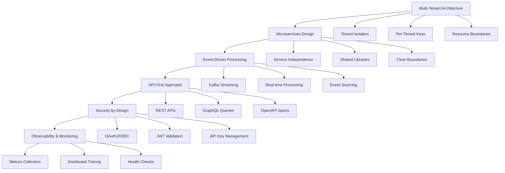
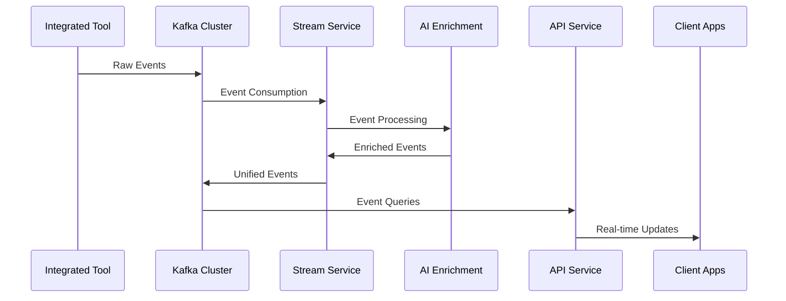

# Development Documentation

Welcome to the OpenFrame development documentation! This section provides comprehensive guides for developers working on, extending, or integrating with the OpenFrame platform.

## Overview

OpenFrame is a sophisticated multi-tenant MSP platform built with modern Java technologies and AI capabilities. The development documentation covers everything from environment setup to advanced architecture concepts.

## Documentation Structure

### 🚀 **Setup & Environment**
Essential guides to get your development environment ready:

- **[Environment Setup](setup/environment.md)** - IDE configuration, tools, and extensions
- **[Local Development](setup/local-development.md)** - Clone, build, run, and debug locally

### 🏗️ **Architecture**
Understanding OpenFrame's design and structure:

- **[Architecture Overview](architecture/README.md)** - High-level system design and component relationships

### 🔒 **Security**
Security best practices and implementation guides:

- **[Security Guidelines](security/README.md)** - Authentication, authorization, and secure coding practices

### 🧪 **Testing**
Testing strategies and implementation:

- **[Testing Overview](testing/README.md)** - Testing frameworks, patterns, and execution

### 🤝 **Contributing**
Guidelines for contributing to the OpenFrame project:

- **[Contributing Guidelines](contributing/guidelines.md)** - Code standards, workflow, and submission process

## Technology Stack

OpenFrame leverages cutting-edge technologies for enterprise-grade performance:

### Backend Technologies
- **Java 21** with **Spring Boot 3.3.0** - Modern enterprise Java platform
- **Spring Cloud 2023.0.3** - Microservices orchestration and configuration
- **Netflix DGS 7.0.0** - GraphQL framework for rich API queries
- **MongoDB** - Primary document database for operational data
- **Apache Kafka 3.6.0** - Event streaming and real-time processing
- **Apache Pinot 1.2.0** - OLAP analytics database
- **Cassandra** - Time-series and log data storage
- **NATS 0.6.2** - High-performance messaging system
- **Redis** - Caching and session management

### AI & Automation Stack
- **Anthropic Claude** via `@anthropic-ai/sdk` - Advanced AI capabilities
- **VoltAgent Core 2.4.2** (`@voltagent/core`) - AI workflow orchestration
- Custom AI enrichment pipelines for intelligent event processing

### Client Technologies
- **Rust** - High-performance OpenFrame client agent
- **Tauri** - Cross-platform desktop applications
- **React/TypeScript** - Modern web frontend components

### Development Tools
- **Maven** - Build automation and dependency management
- **Docker & Docker Compose** - Containerization and local development
- **Spring Boot DevTools** - Hot reload and development acceleration
- **Lombok** - Reduces boilerplate code

## Architecture Principles

OpenFrame follows these core architectural principles:



### Key Design Patterns

| Pattern | Implementation | Purpose |
|---------|---------------|---------|
| **Gateway Pattern** | Spring Cloud Gateway | Single entry point, routing, authentication |
| **CQRS** | Separate read/write models | Optimized queries vs. commands |
| **Event Sourcing** | Kafka-based event store | Audit trail, replay capability |
| **Circuit Breaker** | Spring Cloud Circuit Breaker | Resilience and fault tolerance |
| **Repository Pattern** | Spring Data abstractions | Clean data access layer |
| **Factory Pattern** | Service instantiation | Flexible component creation |

## Development Workflow

### Recommended Development Flow

1. **Environment Setup**
   - Follow the [Environment Setup Guide](setup/environment.md)
   - Configure your IDE with necessary plugins
   - Set up local infrastructure (Docker, databases)

2. **Local Development**
   - Use the [Local Development Guide](setup/local-development.md)
   - Enable hot reload for rapid iteration
   - Configure debug mode for step-through debugging

3. **Architecture Understanding**
   - Review the [Architecture Overview](architecture/README.md)
   - Understand service boundaries and communication patterns
   - Study the data flow and event processing models

4. **Security Implementation**
   - Follow [Security Guidelines](security/README.md)
   - Implement proper authentication and authorization
   - Review secure coding practices

5. **Testing Strategy**
   - Implement tests following [Testing Guidelines](testing/README.md)
   - Write unit, integration, and end-to-end tests
   - Ensure proper test coverage

6. **Contribution Process**
   - Follow [Contributing Guidelines](contributing/guidelines.md)
   - Adhere to code style and review processes
   - Submit well-documented pull requests

### Development Environment Requirements

| Component | Version | Purpose |
|-----------|---------|---------|
| **Java** | 21+ (Eclipse Temurin recommended) | Runtime platform |
| **Maven** | 3.6+ | Build automation |
| **Node.js** | 18+ | Frontend tooling |
| **Rust** | 1.70+ | Client agent development |
| **Docker** | 20.10+ | Containerization |
| **Docker Compose** | 2.0+ | Multi-container orchestration |

## Key Development Concepts

### Multi-Tenant Architecture

OpenFrame implements true multi-tenancy at multiple levels:

- **Data Isolation**: Tenant-specific collections and schemas
- **Authentication**: Per-tenant OAuth2 authorization servers
- **Resource Limits**: Configurable quotas and rate limiting
- **Feature Flags**: Tenant-specific feature enablement

### Event-Driven Processing

The platform processes events through multiple stages:



### AI Integration Points

OpenFrame integrates AI at multiple system levels:

1. **Event Enrichment** - Intelligent categorization and correlation
2. **Anomaly Detection** - Proactive issue identification
3. **Automated Response** - Smart remediation suggestions
4. **Natural Language Interface** - Chat-based system interaction
5. **Predictive Analytics** - Trend analysis and forecasting

## Common Development Tasks

### Adding a New Service

1. Create new Maven module in `openframe/services/`
2. Extend appropriate core library (API, gateway, etc.)
3. Implement Spring Boot application class
4. Configure service-specific properties
5. Add service to Docker Compose configuration
6. Update documentation and tests

### Implementing New APIs

1. Define GraphQL schema in DGS files
2. Create corresponding DTOs and mappers
3. Implement data fetchers for GraphQL resolvers
4. Add REST controllers for imperative operations
5. Include proper authentication and authorization
6. Write comprehensive tests

### Integrating New Tools

1. Create SDK client in `openframe-oss-lib/sdk/`
2. Implement event mapping in Stream Service
3. Add UI components for configuration
4. Create database schemas for tool data
5. Implement health checks and monitoring
6. Document integration process

## Performance Considerations

### JVM Tuning

Recommended JVM options for development:

```bash
# Basic performance settings
export JAVA_OPTS="-Xmx2g -Xms1g -XX:+UseG1GC -XX:+UseStringDeduplication"

# Development-specific options
export JAVA_OPTS="$JAVA_OPTS -XX:+AllowRedefinition -XX:+AllowEnhancedClassRedefinition"

# Debugging options
export JAVA_OPTS="$JAVA_OPTS -Xdebug -Xrunjdwp:transport=dt_socket,server=y,suspend=n,address=5005"
```

### Database Optimization

- Use appropriate MongoDB indexes
- Implement proper Kafka partitioning strategies
- Configure Redis caching for frequently accessed data
- Optimize Pinot schemas for analytical queries

### Resource Management

- Monitor memory usage with Spring Boot Actuator
- Use connection pooling for database connections
- Implement circuit breakers for external service calls
- Configure proper timeouts and retry policies

## Troubleshooting

### Common Development Issues

**Build Failures**
- Ensure Java 21 is active: `java -version`
- Clear Maven cache: `rm -rf ~/.m2/repository/com/openframe`
- Check dependency conflicts: `mvn dependency:tree`

**Service Startup Issues**
- Verify database connectivity
- Check port conflicts: `lsof -i :8080`
- Review application logs for startup errors

**Integration Problems**
- Test external service connectivity
- Verify API credentials and permissions
- Check firewall and network configurations

## Getting Help

### Community Support

- **Primary Support**: OpenMSP Slack community
  - Join: https://join.slack.com/t/openmsp/shared_invite/zt-36bl7mx0h-3~U2nFH6nqHqoTPXMaHEHA
  - Website: https://www.openmsp.ai/

### Documentation Resources

- **API Documentation**: Available at runtime via `/swagger-ui`
- **GraphQL Explorer**: Available at `/graphql` endpoint
- **Architecture Documentation**: See [Architecture Overview](architecture/README.md)

### Development Support

- **Code Reviews**: All contributions are reviewed by maintainers
- **Issue Tracking**: Managed through OpenMSP Slack channels
- **Feature Requests**: Discussed in community channels

## Next Steps

Choose your path based on your development goals:

1. **New Developer**: Start with [Environment Setup](setup/environment.md)
2. **Architecture Deep Dive**: Explore [Architecture Overview](architecture/README.md)
3. **Security Focus**: Review [Security Guidelines](security/README.md)
4. **Testing Expert**: Check [Testing Overview](testing/README.md)
5. **Ready to Contribute**: Read [Contributing Guidelines](contributing/guidelines.md)

Welcome to the OpenFrame development community! 🚀