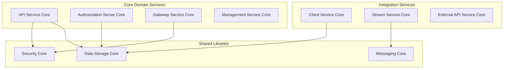
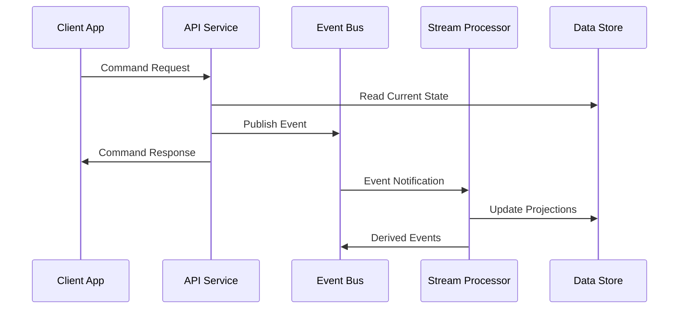

# Development Documentation

Welcome to the OpenFrame development documentation! This section provides comprehensive guides for developers working with the OpenFrame platform, from initial setup to advanced contribution patterns.

## Overview

OpenFrame is a complex, multi-tenant, microservices-based platform built with modern technologies and development practices. This documentation will help you:

- Set up a complete development environment
- Understand the system architecture and design patterns
- Follow security best practices and testing strategies
- Contribute effectively to the project

## Quick Navigation

### 🚀 Getting Started
- **[Environment Setup](setup/environment.md)** - Configure your IDE and development tools
- **[Local Development](setup/local-development.md)** - Running and debugging OpenFrame locally

### 🏗️ Architecture
- **[System Architecture](architecture/README.md)** - High-level design and component overview
- **[Microservices Design](architecture/README.md#microservices-architecture)** - Service boundaries and communication patterns
- **[Data Architecture](architecture/README.md#data-layer)** - Storage patterns and data flow

### 🔒 Security
- **[Security Overview](security/README.md)** - Authentication, authorization, and security patterns
- **[Multi-Tenant Security](security/README.md#multi-tenant-isolation)** - Tenant isolation and data security
- **[API Security](security/README.md#api-security)** - API authentication and protection

### 🧪 Testing
- **[Testing Strategy](testing/README.md)** - Comprehensive testing approach
- **[Unit Testing](testing/README.md#unit-testing)** - Service-level testing patterns
- **[Integration Testing](testing/README.md#integration-testing)** - End-to-end testing workflows

### 🤝 Contributing
- **[Contributing Guidelines](contributing/guidelines.md)** - Code style, review process, and contribution workflow
- **[Development Workflow](contributing/guidelines.md#development-workflow)** - Git workflow and pull request process

## Development Stack Overview

### Backend Technologies

| Technology | Version | Purpose | Documentation |
|------------|---------|---------|---------------|
| **Java** | 21 | Primary backend language | [OpenJDK Docs](https://openjdk.org/projects/jdk/21/) |
| **Spring Boot** | 3.3.0 | Microservices framework | [Spring Boot Reference](https://docs.spring.io/spring-boot/docs/3.3.0/reference/htmlsingle/) |
| **Spring Cloud** | 2023.0.3 | Microservices coordination | [Spring Cloud Reference](https://docs.spring.io/spring-cloud/docs/2023.0.3/reference/html/) |
| **OAuth2 Authorization Server** | Latest | Identity management | [Spring Authorization Server](https://docs.spring.io/spring-authorization-server/docs/current/reference/html/) |
| **Netflix DGS** | 7.0.0 | GraphQL implementation | [DGS Framework](https://netflix.github.io/dgs/) |
| **Apache Kafka** | 3.6.0 | Event streaming | [Kafka Documentation](https://kafka.apache.org/documentation/) |

### Frontend Technologies

| Technology | Purpose | Documentation |
|------------|---------|---------------|
| **Anthropic Claude** | AI integration | [Anthropic API Docs](https://docs.anthropic.com/) |
| **VoltAgent Core** | AI orchestration | Custom framework |
| **Node.js** | AI tooling runtime | [Node.js Docs](https://nodejs.org/docs/) |

### Data Storage

| Technology | Version | Purpose | Documentation |
|------------|---------|---------|---------------|
| **MongoDB** | 7.0+ | Primary database | [MongoDB Manual](https://www.mongodb.com/docs/) |
| **Apache Cassandra** | 4.0+ | Time-series data | [Cassandra Docs](https://cassandra.apache.org/doc/) |
| **Apache Pinot** | 1.2+ | Analytics engine | [Pinot Docs](https://docs.pinot.apache.org/) |
| **Redis** | 7.0+ | Caching & sessions | [Redis Documentation](https://redis.io/documentation) |

### Messaging & Communication

| Technology | Version | Purpose | Documentation |
|------------|---------|---------|---------------|
| **Apache Kafka** | 3.6.0 | Event streaming | [Kafka Docs](https://kafka.apache.org/documentation/) |
| **NATS** | Latest | Real-time messaging | [NATS Documentation](https://docs.nats.io/) |
| **gRPC** | 1.58.0 | Service communication | [gRPC Documentation](https://grpc.io/docs/) |
| **WebSockets** | - | Real-time client updates | [WebSocket API](https://developer.mozilla.org/en-US/docs/Web/API/WebSockets_API) |

## Architecture Patterns

### Microservices Design

OpenFrame follows Domain-Driven Design (DDD) principles with clear service boundaries:



### Event-Driven Architecture

The platform uses event sourcing and CQRS patterns for scalability:



## Development Principles

### Code Quality Standards
- **Test-Driven Development (TDD)**: Write tests before implementation
- **Clean Architecture**: Separate concerns with clear boundaries
- **SOLID Principles**: Object-oriented design best practices
- **Domain-Driven Design**: Model the business domain accurately

### Security-First Approach
- **Zero Trust Architecture**: Verify every request and transaction
- **Principle of Least Privilege**: Minimal necessary permissions
- **Defense in Depth**: Multiple security layers
- **Tenant Isolation**: Complete data and process separation

### Performance & Scalability
- **Reactive Programming**: Non-blocking, asynchronous operations
- **Event-Driven Design**: Loose coupling through events
- **Horizontal Scaling**: Stateless service design
- **Caching Strategies**: Multi-level caching for performance

## Development Workflow

### 1. Environment Setup
```bash
# Clone repository
git clone https://github.com/flamingo-stack/openframe-oss-tenant.git

# Setup development environment
cd openframe-oss-tenant
./setup-dev.sh

# Start all services
foreman start
```

### 2. Feature Development
```bash
# Create feature branch
git checkout -b feature/your-feature-name

# Make changes following coding standards
# Run tests continuously
mvn test -T 1C

# Commit with conventional commits
git commit -m "feat: add device filtering capability"
```

### 3. Testing & Quality
```bash
# Run full test suite
mvn clean verify

# Check code coverage
mvn jacoco:report

# Static analysis
mvn spotbugs:check

# Integration tests
mvn verify -P integration-tests
```

### 4. Contribution Process
1. Fork the repository
2. Create a feature branch
3. Implement changes with tests
4. Ensure all quality checks pass
5. Submit pull request to main repository
6. Address review feedback
7. Merge after approval

## Key Development Resources

### IDE Configuration
- **IntelliJ IDEA**: Spring Boot and Maven integration
- **VS Code**: Java Extension Pack and Spring Boot Tools
- **Eclipse**: Spring Tool Suite (STS)

### Debugging & Monitoring
- **Spring Boot Actuator**: Health checks and metrics
- **Micrometer**: Application metrics
- **Distributed Tracing**: Request flow visualization
- **Structured Logging**: Centralized log analysis

### API Development
- **GraphQL Playground**: Interactive API exploration
- **OpenAPI/Swagger**: REST API documentation
- **Postman Collections**: API testing automation
- **API Versioning**: Backward compatibility strategies

## Common Development Tasks

### Adding a New Microservice
1. Create new Maven module in `openframe/services/`
2. Configure Spring Boot main class
3. Set up component scanning boundaries
4. Add service-specific configuration
5. Implement health checks and actuator endpoints
6. Add to Docker Compose configuration
7. Update documentation

### Implementing New API Endpoints
1. Define DTOs in API contracts library
2. Create GraphQL schema or REST controllers
3. Implement service layer business logic
4. Add comprehensive test coverage
5. Document API changes
6. Update integration tests

### Adding Database Entities
1. Create document classes in data module
2. Define repository interfaces
3. Implement custom query methods if needed
4. Add database migration scripts
5. Update service layer to use new entities
6. Create corresponding DTOs and mappers

## Getting Help

### Community Resources
- **OpenMSP Slack**: [Join our community](https://join.slack.com/t/openmsp/shared_invite/zt-36bl7mx0h-3~U2nFH6nqHqoTPXMaHEHA)
- **Architecture Discussions**: Use #architecture channel
- **Development Questions**: Use #development channel
- **Code Reviews**: Coordinate through #code-review channel

### Documentation
- **Architecture Deep Dive**: Detailed system design documentation
- **API Reference**: Complete API documentation
- **Security Guidelines**: Security implementation patterns
- **Testing Strategies**: Comprehensive testing approaches

### Development Tools
- **Development Scripts**: Automated setup and maintenance scripts
- **Docker Configurations**: Complete development environment
- **CI/CD Pipeline**: Automated testing and deployment
- **Code Quality Tools**: Linting, formatting, and analysis

---

Ready to start developing with OpenFrame? Begin with the [Environment Setup](setup/environment.md) guide to configure your development environment, then explore the [System Architecture](architecture/README.md) to understand how everything fits together.