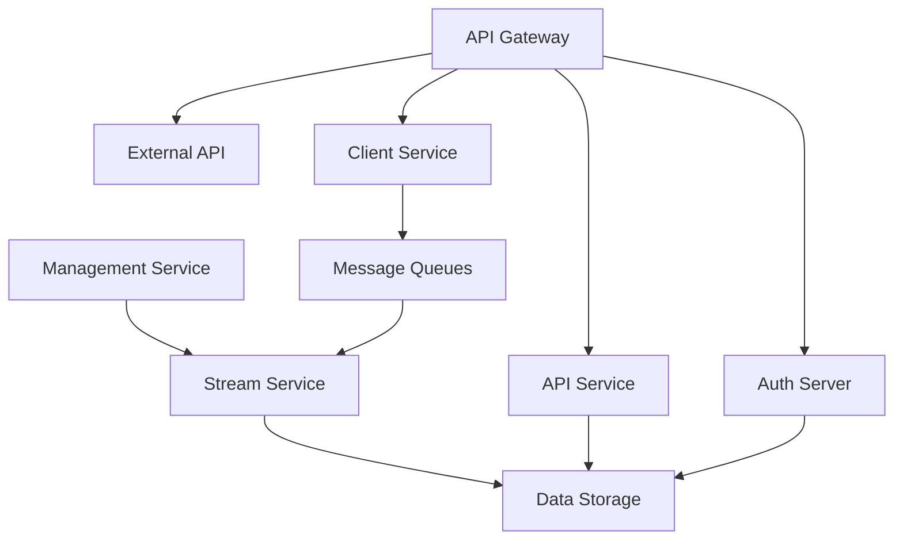

# Development Documentation

Welcome to the OpenFrame development documentation! This section provides comprehensive guides for developers who want to contribute to, extend, or deploy OpenFrame in their own environments.

## 📋 Development Section Overview

This development documentation is organized into focused sections to help you quickly find what you need:

### 🛠️ Setup & Environment
- **[Environment Setup](./setup/environment.md)** - IDE configuration, tools, and development environment setup
- **[Local Development](./setup/local-development.md)** - Running OpenFrame locally for development and testing

### 🏗️ Architecture & Design  
- **[Architecture Overview](./architecture/README.md)** - High-level system architecture and component relationships

### 🔒 Security
- **[Security Best Practices](./security/README.md)** - Authentication, authorization, and security implementation guides

### 🧪 Testing
- **[Testing Overview](./testing/README.md)** - Testing strategies, running tests, and writing new test cases

### 🤝 Contributing
- **[Contributing Guidelines](./contributing/guidelines.md)** - Code standards, PR process, and contribution workflow

## 🚀 Quick Navigation

### For New Contributors
1. Start with [Environment Setup](./setup/environment.md)
2. Follow the [Local Development](./setup/local-development.md) guide
3. Review [Contributing Guidelines](./contributing/guidelines.md)
4. Understand the [Architecture Overview](./architecture/README.md)

### For Production Deployment
1. Review [Security Best Practices](./security/README.md)
2. Study the [Architecture Overview](./architecture/README.md)
3. Follow [Local Development](./setup/local-development.md) for deployment scripts

### For Testing & QA
1. Check [Testing Overview](./testing/README.md)
2. Review [Contributing Guidelines](./contributing/guidelines.md) for quality standards

## 🏛️ Technology Stack

OpenFrame is built on modern, enterprise-grade technologies:

### Backend Technologies
| Component | Technology | Version |
|-----------|------------|---------|
| **Runtime** | Java | 21+ |
| **Framework** | Spring Boot | 3.3.0 |
| **Build Tool** | Maven | 3.8+ |
| **Architecture** | Microservices | Event-driven |

### Frontend Technologies
| Component | Technology | Purpose |
|-----------|------------|---------|
| **AI/LLM** | VoltAgent Core | AI agent functionality |
| **Validation** | Zod | Schema validation |
| **File Operations** | Glob | File pattern matching |
| **AI Integration** | Anthropic SDK | Claude AI integration |

### Infrastructure
| Component | Technology | Version |
|-----------|------------|---------|
| **Database** | MongoDB | 5.0+ |
| **Audit Storage** | Apache Cassandra | 4.0+ |
| **Caching** | Redis | 6.0+ |
| **Messaging** | Apache Kafka | 3.6.0+ |
| **Real-time** | NATS JetStream | 2.9+ |

### Client Agent
| Component | Technology | Platform |
|-----------|------------|----------|
| **Language** | Rust | Cross-platform |
| **Supported OS** | Windows, macOS, Linux | All major platforms |

## 📐 Architecture Philosophy

OpenFrame follows these architectural principles:

### 🔄 Event-Driven Architecture
- Asynchronous communication between services
- Event sourcing for audit and compliance
- Real-time updates via NATS JetStream
- Kafka for durable event streaming

### 🏢 Multi-Tenant Design
- Tenant isolation at all layers
- Per-tenant data segregation
- Scalable tenant provisioning
- Configurable tenant policies

### 🔐 Security-First Approach
- OAuth2/OIDC authentication
- JWT-based authorization
- API key management
- Role-based access control (RBAC)

### 🧩 Microservices Pattern

## 🎯 Development Workflows

### 🔧 Local Development Flow
1. **Environment Setup** → Configure IDE and dependencies
2. **Local Run** → Start services with hot reload
3. **Testing** → Run unit and integration tests
4. **Debugging** → Use IDE debugging tools

### 🤝 Contribution Flow
1. **Fork & Clone** → Get your development copy
2. **Feature Branch** → Create feature/fix branches
3. **Development** → Code following our standards
4. **Testing** → Ensure tests pass
5. **Pull Request** → Submit for review

### 🚀 Deployment Flow
1. **Build** → Maven builds for all services
2. **Package** → Docker containerization
3. **Deploy** → Kubernetes or Docker Compose
4. **Monitor** → Observe system health

## 📚 Essential Development Resources

### API Documentation
- **REST APIs**: OpenAPI/Swagger documentation
- **GraphQL**: Schema introspection and playground
- **WebSocket**: Real-time connection protocols

### Development Tools
- **IDE**: IntelliJ IDEA, VS Code, or preferred Java IDE
- **Database**: MongoDB Compass for database management  
- **API Testing**: Postman, curl, or similar tools
- **Debugging**: Built-in debuggers and logging

### Code Quality
- **Linting**: Checkstyle and ESLint configurations
- **Testing**: JUnit 5, TestContainers for integration tests
- **Documentation**: Javadoc and inline documentation standards

## 🎓 Learning Path

### For Java Developers
1. **Spring Boot 3.x** fundamentals
2. **Spring Security** OAuth2 resource servers
3. **Spring Data MongoDB** reactive programming
4. **Apache Kafka** event streaming
5. **Docker** containerization

### For Frontend Developers
1. **Modern JavaScript/TypeScript** development
2. **AI Integration** with VoltAgent patterns
3. **WebSocket** real-time communications
4. **API Integration** patterns

### For DevOps Engineers
1. **Microservices** deployment patterns
2. **Container Orchestration** (Docker, Kubernetes)
3. **Monitoring & Observability** (Prometheus, Grafana)
4. **CI/CD Pipelines** automation

## 🤝 Community & Support

### Development Community
- **Slack Channel**: [#development](https://join.slack.com/t/openmsp/shared_invite/zt-36bl7mx0h-3~U2nFH6nqHqoTPXMaHEHA) in OpenMSP Slack
- **GitHub Discussions**: Technical discussions and Q&A
- **Contributing**: Open source contribution opportunities

### Getting Help
- **Documentation**: This development section
- **Code Examples**: Reference implementations in the codebase
- **Community Support**: Ask questions in Slack
- **Issue Reporting**: GitHub Issues for bugs and feature requests

## 🎉 Ready to Start?

Choose your development journey:

- **New to OpenFrame?** → Start with [Environment Setup](./setup/environment.md)
- **Ready to Code?** → Jump to [Local Development](./setup/local-development.md)
- **Want to Contribute?** → Read [Contributing Guidelines](./contributing/guidelines.md)
- **Need Architecture Context?** → Explore [Architecture Overview](./architecture/README.md)

Welcome to the OpenFrame development community! We're excited to see what you'll build. 🚀