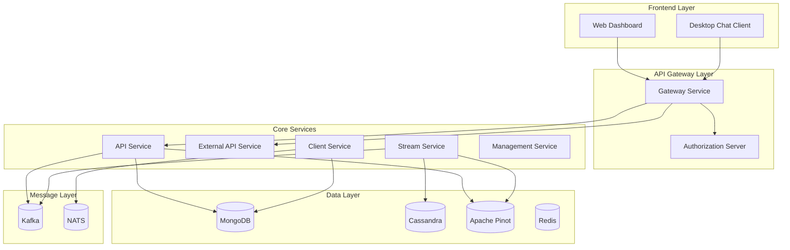

# Development Documentation

Welcome to the OpenFrame development documentation. This section provides comprehensive guides for developers working with the OpenFrame platform, from initial environment setup to advanced architecture concepts.

## Quick Navigation

### Setup Guides
- **[Environment Setup](setup/environment.md)** - Configure your development environment
- **[Local Development](setup/local-development.md)** - Running OpenFrame locally for development

### Architecture & Design
- **[Architecture Overview](architecture/README.md)** - High-level system design and component relationships
- **[Security Best Practices](security/README.md)** - Authentication, authorization, and security guidelines

### Development Workflows  
- **[Testing Overview](testing/README.md)** - Test structure, execution, and best practices
- **[Contributing Guidelines](contributing/guidelines.md)** - Code standards, workflow, and contribution process

## Development Stack Overview

OpenFrame is built on a modern, microservice-based architecture using:

### Backend Technologies
- **Java 21** with **Spring Boot 3.3.0** - Primary backend framework
- **Spring Cloud** - Microservice infrastructure and service discovery
- **Spring Security** - Authentication and authorization
- **Apache Kafka** - Event streaming and message processing
- **NATS/JetStream** - Agent communication and real-time messaging

### Data Layer
- **MongoDB** - Primary transactional document storage
- **Apache Cassandra** - Time-series data and logging
- **Apache Pinot** - Real-time analytics and OLAP queries
- **Redis** - Caching and session management

### Frontend & AI Integration
- **Node.js** - VoltAgent-powered automation engine
- **Anthropic SDK** - Claude AI integration for Mingo assistant
- **Tauri (Rust)** - Cross-platform desktop chat client
- **TypeScript/React** - Frontend framework for web UI

## Architecture at a Glance



## Development Workflow

### 1. Environment Setup
Start by setting up your local development environment with all required dependencies:

```bash
# Clone the repository
git clone https://github.com/flamingo-stack/openframe-oss-tenant.git
cd openframe-oss-tenant

# Follow the Environment Setup guide
# This includes Java 21, Maven, Node.js, and database dependencies
```

### 2. Local Development
Get the platform running locally for development and testing:

```bash
# Start development dependencies (databases, message brokers)
./scripts/dev-start-dependencies.sh

# Build and start all services
mvn clean install
./scripts/start-all-services.sh

# Start the frontend development server
cd openframe/services/openframe-frontend && npm run dev
```

### 3. Architecture Understanding
Review the architecture documentation to understand:

- **Microservice boundaries** and communication patterns
- **Data flow** between services and storage systems
- **Security model** including multi-tenant isolation
- **Event streaming** architecture and patterns

### 4. Testing & Quality
Follow testing best practices:

```bash
# Run unit tests
mvn test

# Run integration tests
mvn verify

# Run end-to-end tests
./scripts/run-e2e-tests.sh
```

### 5. Contribution Process
When ready to contribute:

- Follow the **[Contributing Guidelines](contributing/guidelines.md)** for code standards
- Submit pull requests with proper testing and documentation
- Participate in code reviews and community discussions

## Key Development Concepts

### Multi-Tenant Architecture
OpenFrame enforces tenant isolation at multiple levels:

- **JWT Claims**: Every request carries tenant context
- **Database Isolation**: Data is partitioned by tenant ID
- **OAuth Clients**: Each tenant has separate OAuth2 configuration
- **Resource Scoping**: All operations are tenant-aware

### Event-Driven Processing
The platform uses event streaming for:

- **Real-time data flow** between microservices
- **External system integration** (RMM tools, monitoring systems)
- **AI processing** and automated response workflows
- **Audit logging** and compliance tracking

### AI Integration Patterns
Mingo AI is integrated throughout the platform via:

- **VoltAgent Core** - Node.js automation engine
- **Anthropic SDK** - Claude AI for intelligent responses
- **Event Processing** - AI-driven triage and automation
- **API Extensions** - AI-enhanced endpoints and workflows

## Project Structure

```text
openframe-oss-tenant/
├── openframe/services/          # Spring Boot service applications
│   ├── openframe-api/          # Internal REST + GraphQL API
│   ├── openframe-gateway/      # API gateway and security
│   ├── openframe-client/       # Agent lifecycle management
│   └── openframe-frontend/     # Web UI (Next.js-style)
├── clients/                    # Desktop clients and tools
│   ├── openframe-client/       # Device agent (Rust)
│   └── openframe-chat/         # Desktop chat client (Tauri)
├── scripts/                    # Development and deployment scripts
├── manifests/                  # Kubernetes and Docker configurations
└── integrated-tools/           # Tool-specific configurations
```

## Common Development Tasks

### Adding a New REST Endpoint

1. **Define the endpoint** in the appropriate controller
2. **Create DTOs** for request/response objects
3. **Implement service layer** logic with proper tenant isolation
4. **Add tests** for the new functionality
5. **Update API documentation**

### Integrating a New External Tool

1. **Create SDK client** in the appropriate package
2. **Define event models** for tool-specific data
3. **Implement stream processing** for real-time integration
4. **Add configuration** and connection management
5. **Test end-to-end data flow**

### Extending Mingo AI Capabilities

1. **Define new AI policies** in the AI settings
2. **Implement VoltAgent workflows** for automation
3. **Create prompt templates** for consistent AI responses
4. **Add integration points** in relevant services
5. **Test AI behavior and accuracy**

## Development Resources

### Code Examples
- **REST Controller patterns** in the API service
- **GraphQL implementation** with DataLoaders
- **Kafka streaming** examples in Stream service
- **Multi-tenant security** configurations

### Documentation References
- **Spring Boot documentation** for framework features
- **Apache Kafka** for event streaming patterns
- **MongoDB** for document storage optimization
- **Security patterns** for OAuth2/OIDC implementation

### Community & Support
- **OpenMSP Slack Community**: [Join here](https://join.slack.com/t/openmsp/shared_invite/zt-36bl7mx0h-3~U2nFH6nqHqoTPXMaHEHA)
- **GitHub Discussions**: Platform-specific technical discussions
- **Architecture Docs**: Detailed technical documentation in this repository

## Getting Started

Ready to start developing? Begin with these guides:

1. **[Environment Setup](setup/environment.md)** - Get your development environment ready
2. **[Local Development](setup/local-development.md)** - Run the platform locally
3. **[Architecture Overview](architecture/README.md)** - Understand the system design

For specific development workflows, jump to the relevant section based on your role and goals.

---

*Happy coding! The OpenFrame platform is designed to be developer-friendly and extensible. Join our community for support and collaboration.*