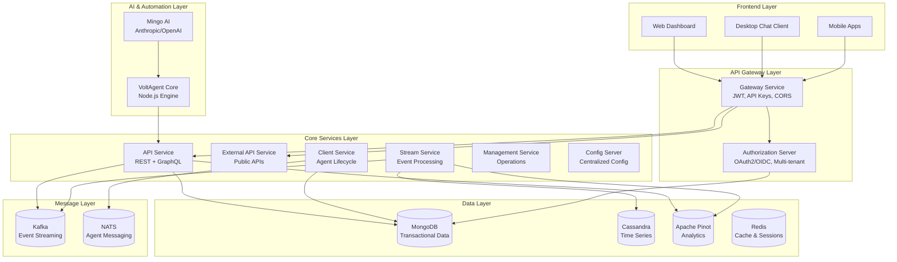
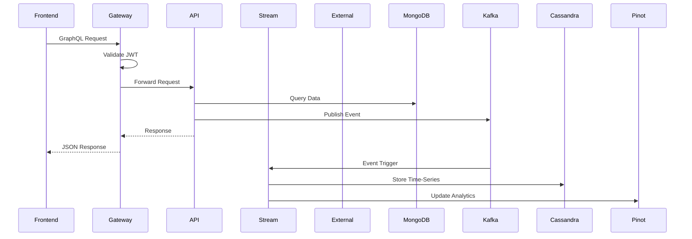
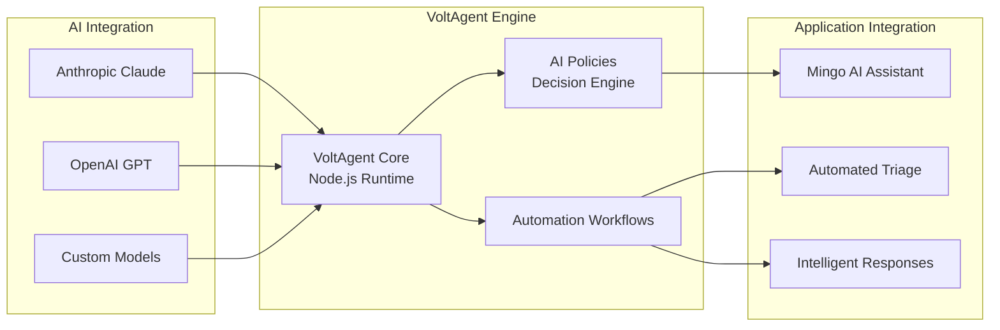
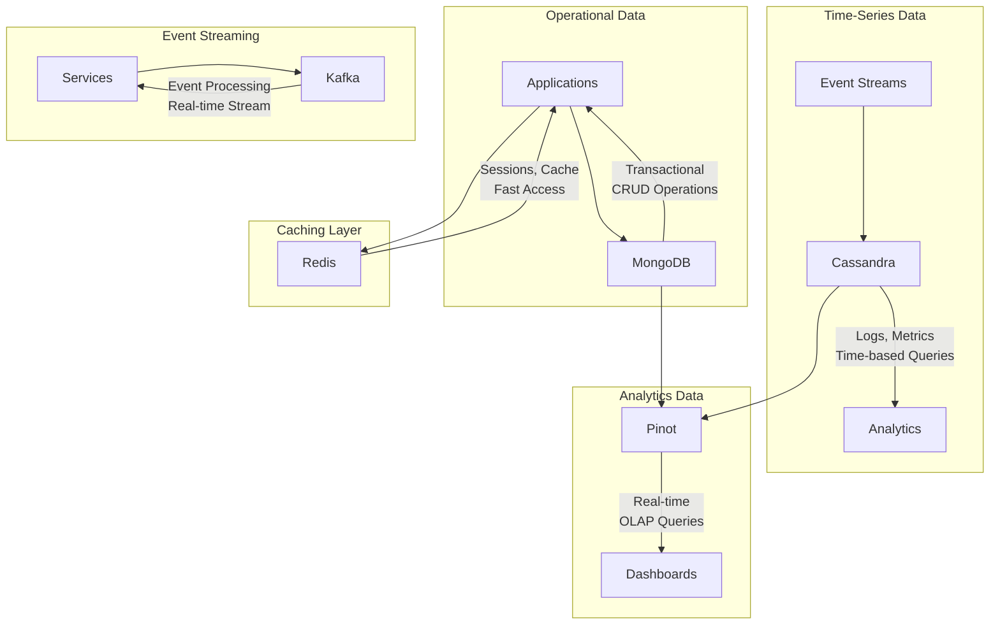
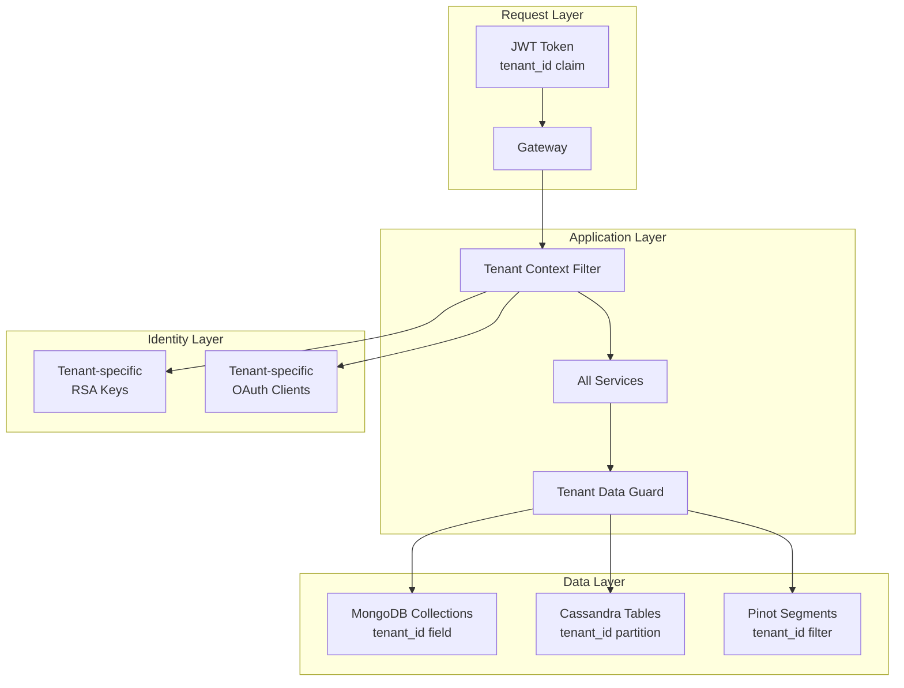
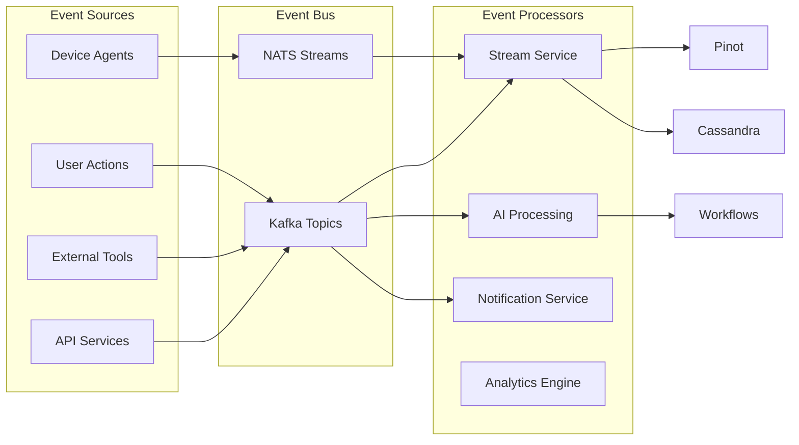
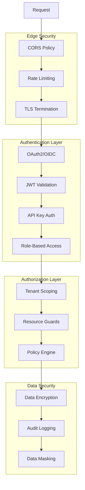
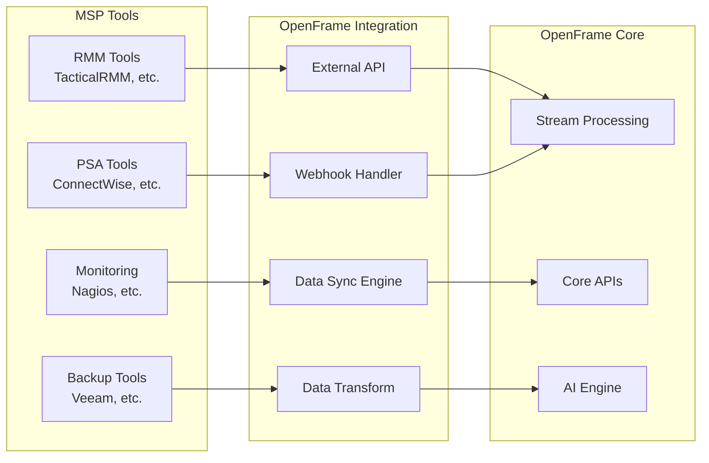
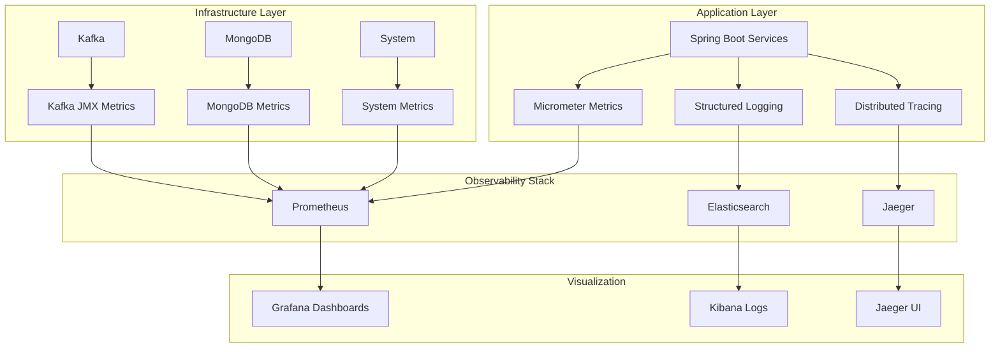

# Architecture Overview

OpenFrame follows a modern, event-driven microservice architecture designed for scalability, multi-tenancy, and AI-powered automation. This guide provides an overview of the system design, core components, and architectural decisions.

## High-Level System Architecture

## Core Components

### API Gateway Layer

The gateway layer provides a unified entry point for all client requests, handling security, routing, and cross-cutting concerns.

| Component | Purpose | Technology |
|-----------|---------|------------|
| **Gateway Service** | Request routing, JWT validation, CORS, WebSocket proxy | Spring Cloud Gateway |
| **Authorization Server** | Multi-tenant OAuth2/OIDC, token issuance, SSO flows | Spring Authorization Server |

**Key Features:**
- **Multi-tenant JWT validation** with tenant-scoped signing keys
- **API key authentication** for external integrations
- **Rate limiting** and request throttling
- **WebSocket proxying** for real-time features
- **CORS configuration** for cross-origin requests

### Core Services Layer

Business logic is distributed across specialized microservices, each with a focused responsibility.

| Service | Purpose | Port | Key Technologies |
|---------|---------|------|------------------|
| **API Service** | Internal REST + GraphQL APIs | 8080 | Spring Boot, GraphQL Java |
| **External API Service** | Public API endpoints | 8083 | Spring Boot REST |
| **Client Service** | Agent registration, lifecycle | 8084 | Spring Boot, NATS |
| **Stream Service** | Event processing, enrichment | 8085 | Kafka Streams |
| **Management Service** | Operational tooling | 8086 | Spring Boot |
| **Config Server** | Centralized configuration | 8888 | Spring Cloud Config |

#### Service Interaction Patterns

### AI & Automation Layer

OpenFrame's AI capabilities are built on a flexible architecture that supports multiple AI providers and automation workflows.

**Key Components:**
- **VoltAgent Core** - Node.js-based automation engine with AI integration
- **Mingo AI** - Intelligent assistant using Anthropic Claude and OpenAI models
- **AI Policies** - Configurable rules for automated decision making
- **Automation Workflows** - Event-driven processes for routine tasks

### Data Architecture

OpenFrame uses a polyglot persistence approach, choosing the right database technology for each use case.

**Data Store Responsibilities:**

| Technology | Use Cases | Performance Characteristics |
|------------|-----------|----------------------------|
| **MongoDB** | User data, organizations, devices, configuration | High write throughput, flexible schema |
| **Cassandra** | Logs, metrics, time-series data, audit trails | High write performance, time-based queries |
| **Apache Pinot** | Real-time analytics, dashboards, reporting | Low-latency OLAP, aggregations |
| **Redis** | Session storage, caching, rate limiting | Sub-millisecond access, in-memory performance |
| **Kafka** | Event streaming, service communication | High throughput, durable messaging |
| **NATS** | Agent communication, real-time messaging | Low latency, lightweight messaging |

## Architectural Patterns

### Multi-Tenancy Model

OpenFrame implements comprehensive multi-tenancy across all layers:

**Multi-Tenant Implementation:**
- **JWT Claims**: Every token includes `tenant_id` and `organization_id` claims
- **Data Partitioning**: All database operations are scoped by tenant ID
- **Resource Isolation**: Separate OAuth clients, RSA keys, and configurations per tenant
- **Security Boundaries**: Cross-tenant data access is architecturally prevented

### Event-Driven Architecture

The platform uses event-driven patterns for loose coupling and real-time processing:

**Event Categories:**
- **Device Events**: Agent heartbeats, status changes, performance metrics
- **User Events**: Authentication, UI interactions, configuration changes
- **System Events**: Service health, errors, audit logs
- **Integration Events**: External tool data, webhooks, sync operations

### Security Architecture

Security is implemented as a layered approach across multiple architectural boundaries:

## Key Design Decisions

### Technology Choices

**Why Spring Boot + Java 21?**
- **Enterprise-grade** ecosystem with comprehensive security
- **Strong typing** and compile-time safety for business logic
- **Extensive integration** support for databases and messaging
- **Mature tooling** for debugging, monitoring, and operations

**Why MongoDB for Primary Storage?**
- **Flexible schema** accommodates evolving MSP data models
- **Multi-document transactions** for consistency across related entities
- **Rich query capabilities** with aggregation pipelines
- **Horizontal scaling** with automatic sharding

**Why Kafka for Event Streaming?**
- **High throughput** and durability for critical business events
- **Kafka Streams** for real-time processing and aggregation
- **Strong ecosystem** with connectors and monitoring tools
- **Exactly-once semantics** for reliable event processing

**Why VoltAgent for AI Integration?**
- **Node.js performance** for high-throughput AI workflows
- **Flexible integration** with multiple AI providers
- **Workflow engine** for complex automation scenarios
- **Real-time processing** capabilities for responsive AI features

### Scalability Considerations

**Horizontal Scaling Strategy:**
- **Stateless services** enable horizontal pod scaling in Kubernetes
- **Database sharding** by tenant ID for multi-tenant scaling
- **Message partitioning** distributes load across Kafka brokers
- **Caching layers** reduce database load for read-heavy operations

**Performance Optimization:**
- **Connection pooling** for database and messaging connections
- **Async processing** for non-blocking I/O operations
- **Batch operations** for bulk data processing
- **Indexing strategy** optimized for common query patterns

### Reliability & Resilience

**Fault Tolerance Patterns:**
- **Circuit breakers** prevent cascading failures
- **Retry mechanisms** with exponential backoff
- **Bulkhead isolation** separates critical vs. non-critical operations
- **Graceful degradation** maintains core functionality during outages

**Data Consistency:**
- **Eventual consistency** for cross-service operations
- **Compensating transactions** for distributed transaction patterns
- **Event sourcing** for audit trails and replay capabilities
- **Backup and recovery** strategies for each data store

## Integration Architecture

OpenFrame is designed to integrate with existing MSP tools and workflows:

**Integration Patterns:**
- **REST APIs** for real-time data exchange
- **Webhooks** for event-driven integrations
- **Bulk sync** for periodic data synchronization
- **Stream processing** for real-time data transformation

## Monitoring and Observability

---

*This architecture overview provides the foundation for understanding OpenFrame's design principles and implementation patterns. Continue with the specific guides for [Security](../security/README.md), [Testing](../testing/README.md), and [Contributing](../contributing/guidelines.md).*