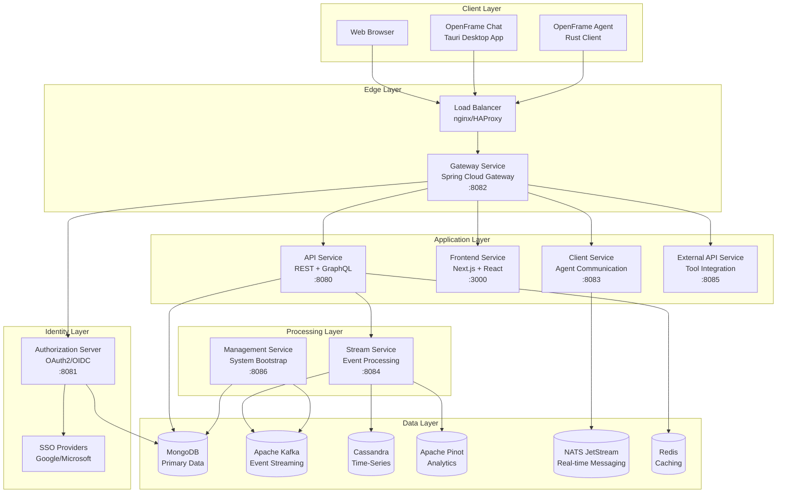
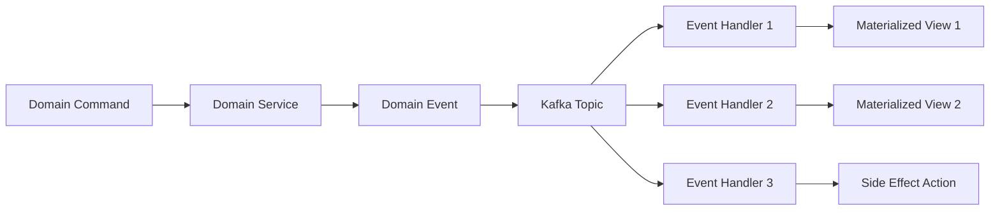
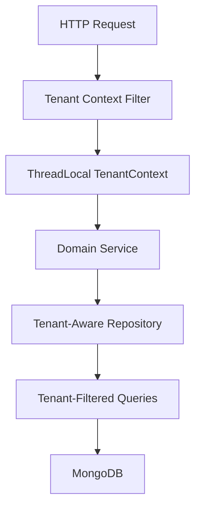
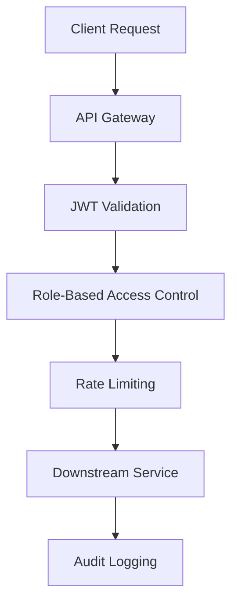
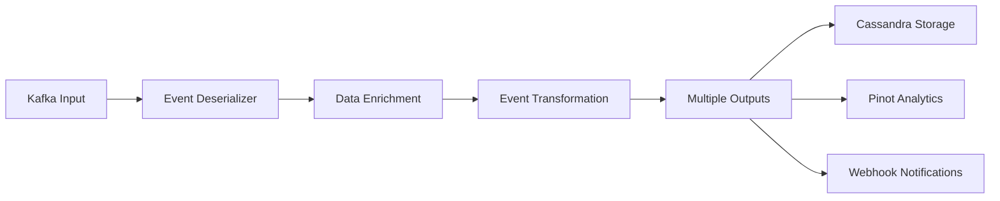
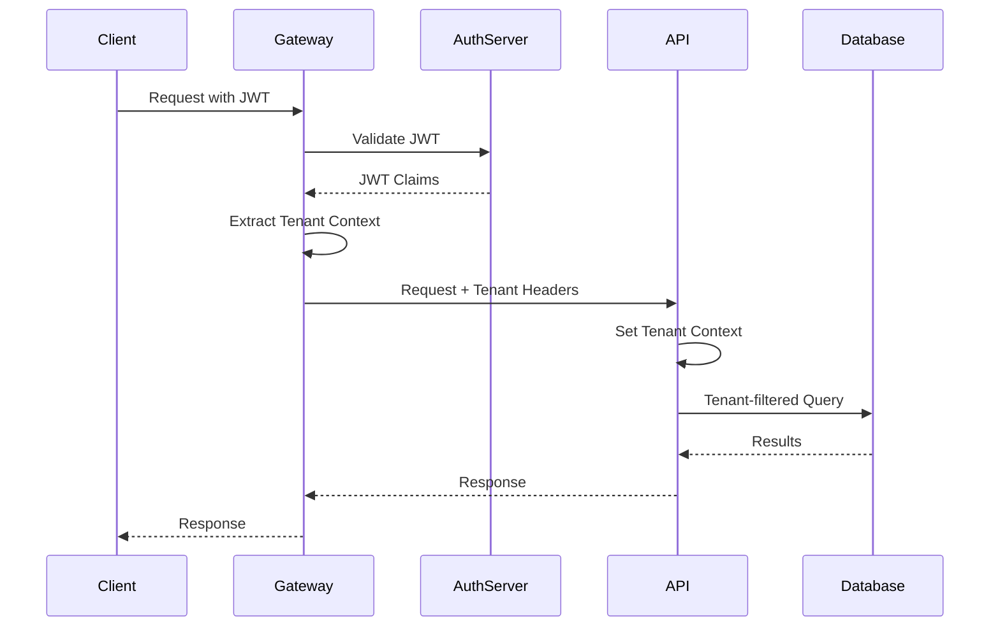
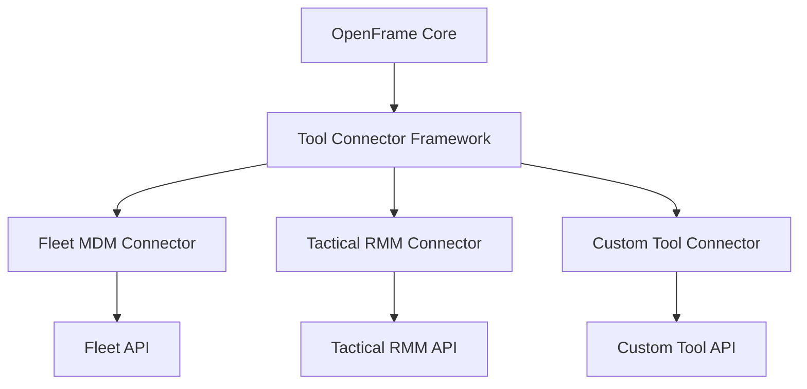
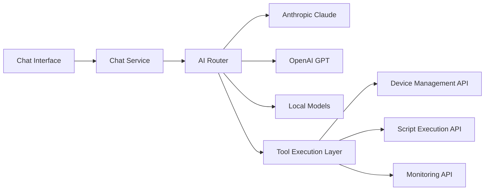

# Architecture Overview

OpenFrame is a modern, microservices-based platform designed for enterprise-scale MSP operations. This document provides a comprehensive overview of the system architecture, design decisions, and component relationships.

## High-Level Architecture



## Core Design Principles

### 1. Event-Driven Architecture

OpenFrame follows event-driven patterns using Apache Kafka as the central event bus:



**Benefits:**
- **Loose coupling** between services
- **Scalability** through asynchronous processing
- **Resilience** with event replay capabilities
- **Auditability** with complete event history

### 2. Multi-Tenant by Design

Every service is built with multi-tenancy as a first-class citizen:



**Implementation:**
- **Tenant Context**: ThreadLocal isolation per request
- **Data Partitioning**: Tenant ID in all database queries
- **Resource Isolation**: Per-tenant rate limits and quotas
- **Security Boundaries**: Cross-tenant data access prevention

### 3. API-First Development

All functionality is exposed through well-defined APIs:

| API Type | Purpose | Technology |
|----------|---------|------------|
| **REST** | CRUD operations, external integrations | Spring WebMVC |
| **GraphQL** | Complex queries, real-time subscriptions | Netflix DGS |
| **WebSocket** | Real-time bidirectional communication | Spring WebFlux |
| **gRPC** | Internal service-to-service communication | Spring Cloud |

### 4. Security by Design

Security is integrated at every architectural layer:



## Service Architecture

### Core Services

#### API Service (:8080)
**Primary business logic service**

**Responsibilities:**
- REST API endpoints for CRUD operations
- Netflix DGS GraphQL schema and resolvers
- Business rule enforcement
- Data validation and transformation

**Key Components:**
```text
openframe-api-service-core/
├── controller/          # REST controllers
├── datafetcher/        # GraphQL data fetchers
├── service/           # Business logic services
├── dto/              # Data transfer objects
└── mapper/           # Entity-DTO mapping
```

**Design Patterns:**
- **Controller → Service → Repository** layering
- **Command Query Responsibility Segregation** (CQRS)
- **DataLoader pattern** for GraphQL N+1 prevention

#### Authorization Server (:8081)
**OAuth2/OIDC identity provider**

**Responsibilities:**
- JWT token issuance and validation
- Multi-tenant SSO integration
- User registration and invitation flows
- Per-tenant RSA key management

**Key Features:**
- **Spring Authorization Server** framework
- **PKCE support** for secure authentication flows
- **Dynamic client registration** for tenants
- **SSO integration** with Google, Microsoft, custom OIDC

#### Gateway Service (:8082)
**Edge routing and security**

**Responsibilities:**
- Request routing to downstream services
- JWT token validation and extraction
- Rate limiting and throttling
- CORS and security headers
- WebSocket proxy for real-time features

**Routing Rules:**
```yaml
spring:
  cloud:
    gateway:
      routes:
        - id: api-route
          uri: http://api-service:8080
          predicates:
            - Path=/api/**
        - id: auth-route
          uri: http://auth-service:8081
          predicates:
            - Path=/oauth/**, /sas/**
```

### Supporting Services

#### Stream Service (:8084)
**Event processing and analytics**

**Responsibilities:**
- Kafka event consumption and processing
- Real-time event transformation
- Data enrichment from external sources
- Analytics pipeline feeding

**Event Processing Flow:**


#### Client Service (:8083)
**Agent communication hub**

**Responsibilities:**
- OpenFrame agent registration and authentication
- Real-time agent communication via NATS
- Agent command distribution
- Heartbeat and status monitoring

#### Management Service (:8086)
**System administration and bootstrapping**

**Responsibilities:**
- Database schema initialization
- Background task scheduling
- System health monitoring
- Configuration management

#### External API Service (:8085)
**Third-party tool integration**

**Responsibilities:**
- Fleet MDM integration
- Tactical RMM integration
- Custom tool connector framework
- API key management for external services

## Data Architecture

### Primary Database - MongoDB

**Purpose**: Transactional data storage with multi-tenant support

**Design Patterns:**
- **Document-per-tenant** for tenant isolation
- **Embedded documents** for one-to-many relationships
- **Reference documents** for many-to-many relationships
- **Compound indexes** for tenant + business key queries

**Core Collections:**
```text
tenants              # Tenant configuration and metadata
users               # User accounts and profiles
organizations       # Customer organizations
devices             # Managed devices and assets
events              # System and business events
api_keys            # API authentication tokens
sso_configs         # SSO provider configurations
```

**Indexing Strategy:**
```javascript
// Tenant-aware compound indexes
db.devices.createIndex({"tenantId": 1, "organizationId": 1, "status": 1})
db.events.createIndex({"tenantId": 1, "timestamp": -1, "eventType": 1})
db.users.createIndex({"tenantId": 1, "email": 1}, {unique: true})
```

### Event Streaming - Apache Kafka

**Purpose**: Event sourcing and real-time data pipeline

**Topic Design:**
```text
openframe.devices.events     # Device lifecycle events
openframe.users.events       # User activity events  
openframe.security.events    # Security-related events
openframe.integrations.events # External tool events
openframe.audit.events       # Audit trail events
```

**Partitioning Strategy:**
- **Tenant ID** as partition key for tenant isolation
- **Device ID** as secondary partition key for device events
- **User ID** as partition key for user events

### Time-Series Storage - Apache Cassandra

**Purpose**: High-volume time-series data with retention policies

**Keyspace Design:**
```sql
-- Metrics keyspace for time-series data
CREATE KEYSPACE openframe_metrics 
WITH replication = {
  'class': 'SimpleStrategy',
  'replication_factor': 3
};

-- Device metrics table
CREATE TABLE device_metrics (
    tenant_id UUID,
    device_id UUID,
    metric_type text,
    timestamp timestamp,
    value double,
    metadata map<text, text>,
    PRIMARY KEY ((tenant_id, device_id, metric_type), timestamp)
) WITH CLUSTERING ORDER BY (timestamp DESC)
  AND gc_grace_seconds = 86400
  AND compaction = {'class': 'TimeWindowCompactionStrategy'};
```

### Analytics - Apache Pinot

**Purpose**: Real-time analytics and OLAP queries

**Table Schema:**
```json
{
  "schemaName": "deviceMetrics",
  "dimensionFieldSpecs": [
    {"name": "tenantId", "dataType": "STRING"},
    {"name": "deviceId", "dataType": "STRING"},
    {"name": "deviceType", "dataType": "STRING"},
    {"name": "organizationId", "dataType": "STRING"}
  ],
  "metricFieldSpecs": [
    {"name": "cpuUsage", "dataType": "DOUBLE"},
    {"name": "memoryUsage", "dataType": "DOUBLE"},
    {"name": "diskUsage", "dataType": "DOUBLE"}
  ],
  "dateTimeFieldSpecs": [
    {
      "name": "timestamp",
      "dataType": "TIMESTAMP",
      "format": "1:MILLISECONDS:EPOCH",
      "granularity": "1:MINUTES"
    }
  ]
}
```

### Caching - Redis

**Purpose**: Application-level caching and session storage

**Cache Patterns:**
- **User sessions** with TTL-based expiration
- **API response caching** for expensive queries
- **Rate limiting counters** with sliding windows
- **Real-time data** for dashboard updates

**Key Patterns:**
```text
session:{tenantId}:{userId}          # User session data
cache:devices:{tenantId}:{orgId}     # Device list cache
ratelimit:{apiKey}:{endpoint}:{window} # Rate limiting counters
realtime:dashboard:{tenantId}        # Real-time dashboard data
```

## Security Architecture

### Authentication Flow



### Authorization Model

**Role-Based Access Control (RBAC):**

```text
Tenant Administrator
├── Full tenant management access
├── User and organization management
├── System configuration access
└── All data access within tenant

Organization Administrator  
├── Organization-specific management
├── User management within organization
├── Device management within organization
└── Limited system configuration

Technician
├── Device monitoring and management
├── Ticket resolution access
├── Script execution permissions
└── Read-only organization data

Viewer
├── Dashboard and report access
├── Read-only device information
├── Limited audit log access
└── No management capabilities
```

### API Security

**JWT Token Structure:**
```json
{
  "header": {
    "alg": "RS256",
    "typ": "JWT",
    "kid": "tenant-123-key-1"
  },
  "payload": {
    "sub": "user-456",
    "iss": "https://auth.openframe.ai",
    "aud": "openframe-api",
    "exp": 1640995200,
    "iat": 1640991600,
    "tenantId": "tenant-123",
    "roles": ["TENANT_ADMIN"],
    "organizationId": "org-789"
  }
}
```

**Rate Limiting Strategy:**
| Endpoint Type | Rate Limit | Window |
|---------------|------------|--------|
| **Authentication** | 10 requests | 1 minute |
| **API (authenticated)** | 1000 requests | 1 hour |
| **API (public)** | 100 requests | 1 hour |
| **GraphQL** | 500 operations | 1 hour |
| **WebSocket** | 100 connections | per user |

## Integration Architecture

### External Tool Integration

OpenFrame integrates with existing MSP tools through a unified connector framework:



**Connector Pattern:**
```java
@Component
public class FleetMdmConnector implements ToolConnector {
    
    @Override
    public String getToolType() {
        return "FLEET_MDM";
    }
    
    @Override
    public CompletableFuture<DeviceInfo> getDeviceInfo(String deviceId) {
        // Implementation for Fleet API integration
    }
    
    @Override
    public CompletableFuture<List<PolicyViolation>> checkCompliance(String deviceId) {
        // Implementation for compliance checking
    }
}
```

### AI Integration Architecture

Mingo AI integration follows a plugin-based architecture:



## Deployment Architecture

### Container Architecture

```yaml
# docker-compose.production.yml
version: '3.8'
services:
  gateway:
    image: openframe/gateway:latest
    ports: ["443:8082"]
    environment:
      - SPRING_PROFILES_ACTIVE=production
      - JWT_ISSUER_URI=https://auth.yourdomain.com
    
  api:
    image: openframe/api:latest
    environment:
      - SPRING_PROFILES_ACTIVE=production
      - MONGO_URI=mongodb://mongo-cluster:27017
    depends_on: [mongodb, kafka]
    
  auth:
    image: openframe/auth:latest
    environment:
      - SPRING_PROFILES_ACTIVE=production
    depends_on: [mongodb]
```

### Kubernetes Deployment

```yaml
apiVersion: apps/v1
kind: Deployment
metadata:
  name: openframe-api
spec:
  replicas: 3
  selector:
    matchLabels:
      app: openframe-api
  template:
    metadata:
      labels:
        app: openframe-api
    spec:
      containers:
      - name: api
        image: openframe/api:latest
        env:
        - name: SPRING_PROFILES_ACTIVE
          value: "kubernetes"
        - name: MONGO_URI
          valueFrom:
            secretKeyRef:
              name: openframe-secrets
              key: mongo-uri
```

## Performance Considerations

### Scalability Patterns

**Horizontal Scaling:**
- **Stateless services** for easy horizontal scaling
- **Database read replicas** for read-heavy workloads
- **Event sourcing** for eventually consistent data
- **Caching layers** for frequently accessed data

**Database Optimization:**
- **Connection pooling** with HikariCP
- **Query optimization** with proper indexing
- **Data partitioning** by tenant and time
- **Archive strategies** for historical data

**Caching Strategy:**
```text
L1 Cache (Application)     # In-memory caffeine cache
├── User sessions (5 min TTL)
├── Configuration data (1 hour TTL)
└── Frequently accessed entities

L2 Cache (Redis Cluster)   # Distributed caching
├── API responses (15 min TTL)
├── Database query results (30 min TTL)
├── Real-time dashboard data (1 min TTL)
└── Cross-service shared data
```

### Monitoring and Observability

**Metrics Collection:**
- **Application metrics** via Micrometer + Prometheus
- **Infrastructure metrics** via Node Exporter
- **Custom business metrics** via Spring Boot Actuator

**Distributed Tracing:**
- **Zipkin** for request tracing across services
- **Correlation IDs** for request tracking
- **Performance profiling** with async profilers

**Logging Strategy:**
```text
Application Logs
├── Structured JSON logging (ELK Stack)
├── Correlation ID injection
├── Tenant context in all log entries
└── Security event logging

Audit Logs
├── Immutable audit trail (Cassandra)
├── User action logging
├── Data access logging
└── Configuration change logging
```

## Key Design Decisions

### Technology Choices

| Decision | Chosen Technology | Alternatives Considered | Rationale |
|----------|------------------|------------------------|-----------|
| **Backend Framework** | Spring Boot 3.3 | Quarkus, Micronaut | Mature ecosystem, excellent tooling |
| **Frontend Framework** | Next.js 16 + React 19 | Vue.js, Angular | Server-side rendering, React ecosystem |
| **Database** | MongoDB | PostgreSQL, MySQL | Document flexibility, horizontal scaling |
| **Event Streaming** | Apache Kafka | RabbitMQ, Apache Pulsar | High throughput, ecosystem maturity |
| **Analytics** | Apache Pinot | ClickHouse, Apache Druid | Real-time OLAP, LinkedIn proven |
| **Authentication** | OAuth2/OIDC | Custom JWT, Auth0 | Standards-based, multi-tenant support |

### Architectural Trade-offs

**Event-Driven vs Request-Response:**
- ✅ **Chosen**: Event-driven for core workflows
- ❌ **Trade-off**: Increased complexity, eventual consistency
- **Rationale**: Better scalability and resilience for MSP operations

**Multi-Tenant vs Single-Tenant:**
- ✅ **Chosen**: Multi-tenant architecture
- ❌ **Trade-off**: Increased security complexity
- **Rationale**: Cost efficiency and simplified operations

**Microservices vs Monolith:**
- ✅ **Chosen**: Microservices with domain boundaries
- ❌ **Trade-off**: Network complexity, distributed system challenges
- **Rationale**: Team scalability and technology flexibility

## Next Steps

To dive deeper into specific aspects of the architecture:

1. **[API Contracts](api-contracts.md)** - Detailed API specifications
2. **[Security Architecture](../security/README.md)** - Security implementation details
3. **[Data Layer Design](data-layer.md)** - Database and storage patterns
4. **[Deployment Guide](../deployment/README.md)** - Production deployment strategies

## Architecture Evolution

This architecture is designed to evolve with the platform's needs:

- **Service boundaries** can be adjusted based on team organization
- **Data storage** can be optimized based on access patterns
- **Integration patterns** can be extended for new tool types
- **Security models** can be enhanced for compliance requirements

Join our [OpenMSP Slack community](https://join.slack.com/t/openmsp/shared_invite/zt-36bl7mx0h-3~U2nFH6nqHqoTPXMaHEHA) to discuss architecture decisions and contribute to the platform's evolution.