# Architecture Overview

OpenFrame is built on a modern, cloud-native architecture that emphasizes scalability, security, and maintainability. This document provides developers with a deep understanding of the system's design patterns, component interactions, and key architectural decisions.

## High-Level System Architecture

OpenFrame implements a microservices architecture with clear service boundaries, event-driven communication, and multi-tenant isolation.

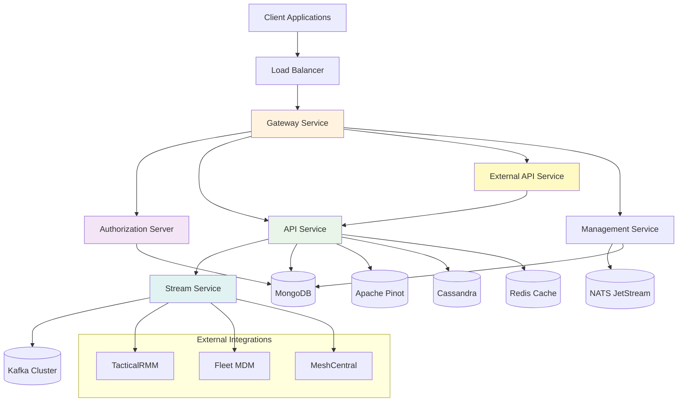

## Core Components

### Service Layer

OpenFrame consists of six primary microservices, each with distinct responsibilities:

| Service | Purpose | Technology Stack | Key Features |
|---------|---------|-----------------|--------------|
| **Gateway Service** | Edge routing, security enforcement | Spring Cloud Gateway | JWT validation, API key auth, rate limiting |
| **Authorization Server** | Multi-tenant identity management | Spring Authorization Server | OAuth2/OIDC, per-tenant keys |
| **API Service** | Internal API orchestration | Spring Boot, Netflix DGS | GraphQL, REST endpoints |
| **External API Service** | Public API interface | Spring Boot, OpenAPI | Rate limiting, API key management |
| **Management Service** | System lifecycle management | Spring Boot, ShedLock | Tool initialization, scheduling |
| **Stream Service** | Real-time event processing | Spring Boot, Kafka Streams | Event enrichment, stream joins |

### Data Layer Architecture

OpenFrame employs a polyglot persistence approach, choosing the right database for each use case:

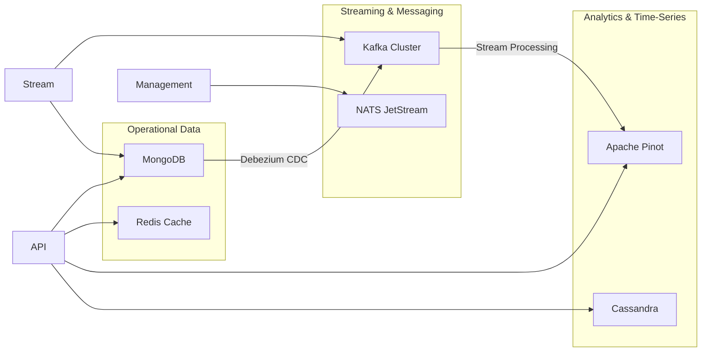

### Database Responsibilities

**MongoDB (Primary Operational Store)**
- User accounts and authentication
- Organizations and tenants
- Device inventory and configuration
- API keys and authorization data
- Tool connection configurations

**Redis (Caching Layer)**  
- Session management
- API rate limiting counters
- Frequently accessed data caching
- Real-time metrics aggregation

**Apache Pinot (Analytics Database)**
- Log event storage and querying
- Performance metrics analysis
- Real-time dashboard data
- Historical trend analysis

**Cassandra (Time-Series Data)**
- Device telemetry streams
- Application performance metrics
- Audit logs and compliance data
- High-velocity event storage

**Kafka (Event Streaming)**
- Inter-service communication
- Event sourcing and replay
- Integration tool data ingestion
- Real-time stream processing

**NATS JetStream (Command Messaging)**
- Agent command distribution
- Tool installation coordination
- System management operations
- Reliable message delivery

## Multi-Tenant Architecture

OpenFrame implements comprehensive multi-tenancy across all system layers:

### Tenant Isolation Strategy

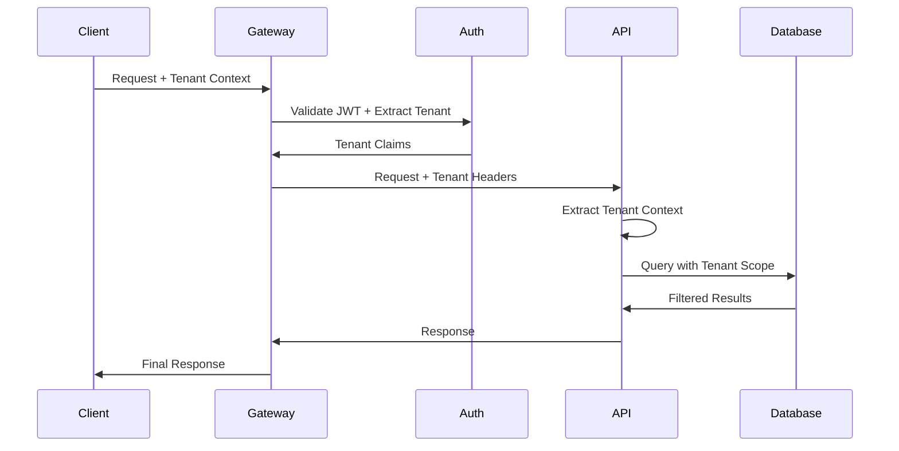

### Tenant Boundaries

**Authentication Layer:**
- Per-tenant OAuth2 authorization servers
- Tenant-specific RSA signing keys
- Isolated client registrations
- Custom authorization flows

**Data Layer:**
- MongoDB collections prefixed by tenant ID
- Kafka topics with tenant partitioning
- Redis keyspace isolation
- Pinot segments by tenant

**API Layer:**
- Tenant context propagation via headers
- Row-level security enforcement
- API rate limiting per tenant
- Resource quota management

## Event-Driven Architecture

OpenFrame processes events through multiple stages of enrichment and correlation:

### Event Processing Pipeline

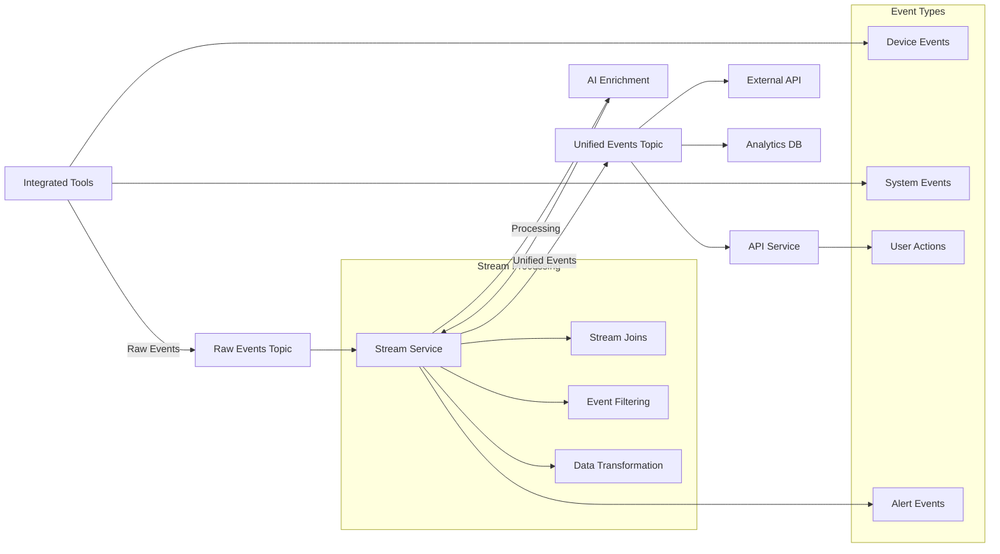

### Event Schema Evolution

OpenFrame handles schema evolution through versioned event contracts:

```java
// Example event structure
{
  "eventId": "uuid",
  "tenantId": "tenant-123", 
  "eventType": "DEVICE_STATUS_CHANGED",
  "version": "v1",
  "timestamp": "2024-01-15T10:30:00Z",
  "source": "tactical-rmm",
  "deviceId": "device-456",
  "payload": {
    "previousStatus": "ONLINE",
    "currentStatus": "OFFLINE",
    "reason": "NETWORK_TIMEOUT"
  },
  "enrichment": {
    "severity": "HIGH",
    "category": "CONNECTIVITY", 
    "suggestedActions": ["CHECK_NETWORK", "RESTART_AGENT"]
  }
}
```

## Security Architecture

### Authentication and Authorization Flow

OpenFrame implements OAuth2/OIDC with custom multi-tenant extensions:

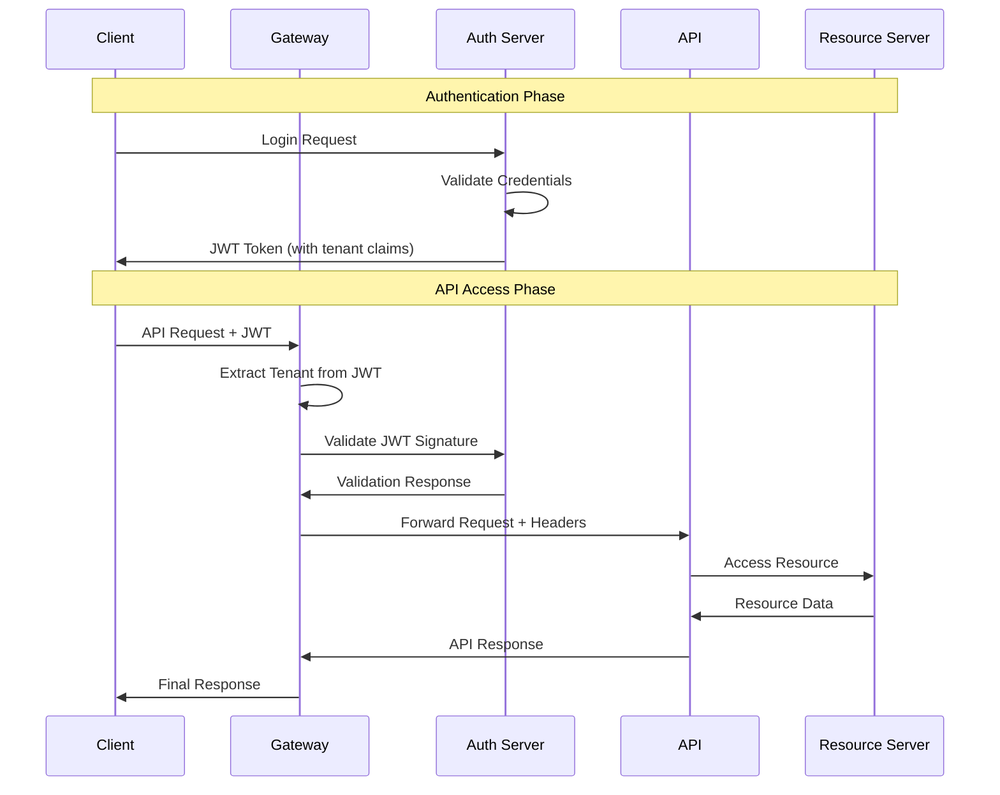

### Security Layers

**1. Transport Security**
- TLS 1.3 for all external communication
- mTLS for internal service communication
- Certificate rotation automation

**2. Authentication Security**
- RSA-256 JWT signing per tenant
- Configurable token expiration
- Refresh token rotation
- Multi-factor authentication support

**3. Authorization Security**
- Role-based access control (RBAC)
- Resource-level permissions
- API scope validation
- Rate limiting and throttling

**4. Data Security**
- Encryption at rest (AES-256)
- Field-level encryption for sensitive data
- Audit logging for all operations
- GDPR compliance features

## API Design Patterns

### GraphQL API Architecture

OpenFrame uses Netflix DGS for GraphQL implementation:

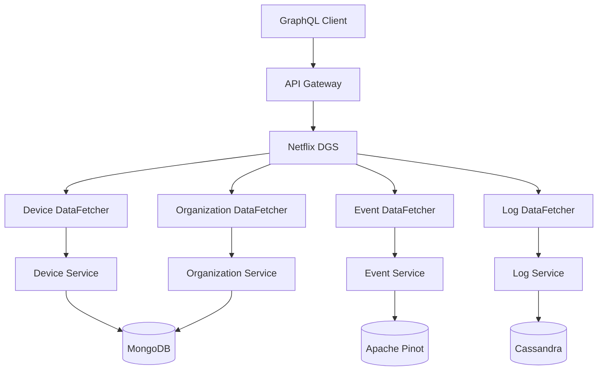

### REST API Patterns

**Resource-Oriented Design:**
```text
GET    /api/v1/organizations/{id}
POST   /api/v1/organizations
PUT    /api/v1/organizations/{id}
DELETE /api/v1/organizations/{id}

GET    /api/v1/organizations/{orgId}/devices
POST   /api/v1/organizations/{orgId}/devices
GET    /api/v1/organizations/{orgId}/devices/{deviceId}
```

**HATEOAS Implementation:**
```json
{
  "id": "org-123",
  "name": "Acme Corp",
  "devices": {
    "count": 42,
    "_links": {
      "devices": "/api/v1/organizations/org-123/devices"
    }
  },
  "_links": {
    "self": "/api/v1/organizations/org-123",
    "edit": "/api/v1/organizations/org-123",
    "users": "/api/v1/organizations/org-123/users"
  }
}
```

## Data Flow Patterns

### Command Query Responsibility Segregation (CQRS)

OpenFrame separates read and write operations for optimal performance:

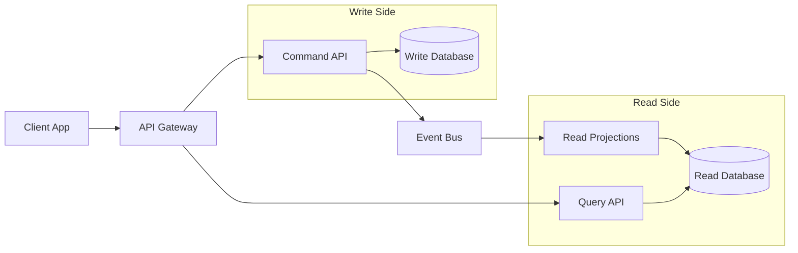

### Event Sourcing Pattern

Critical business events are stored as an immutable event log:

```java
// Event sourcing example
public class OrganizationAggregate {
    private String id;
    private String name;
    private OrganizationStatus status;
    private List<DomainEvent> events = new ArrayList<>();
    
    public void createOrganization(String name, String ownerId) {
        var event = new OrganizationCreatedEvent(id, name, ownerId);
        apply(event);
        events.add(event);
    }
    
    public void changeStatus(OrganizationStatus newStatus) {
        var event = new OrganizationStatusChangedEvent(id, status, newStatus);
        apply(event);
        events.add(event);
    }
    
    private void apply(DomainEvent event) {
        // Apply event to aggregate state
    }
}
```

## Performance Patterns

### Caching Strategy

OpenFrame implements a multi-level caching approach:

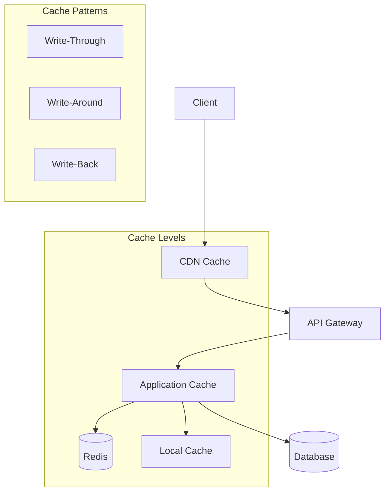

### Database Optimization

**MongoDB Optimization:**
- Compound indexes for query patterns
- Read preferences for replica sets
- Connection pooling and monitoring
- Aggregation pipeline optimization

**Kafka Optimization:**
- Partitioning strategy by tenant
- Consumer group management
- Batch processing configuration
- Compression settings

**Redis Optimization:**
- Key expiration policies  
- Memory optimization settings
- Cluster mode for scalability
- Persistent storage configuration

## Observability and Monitoring

### Distributed Tracing

OpenFrame implements distributed tracing with Spring Cloud Sleuth:

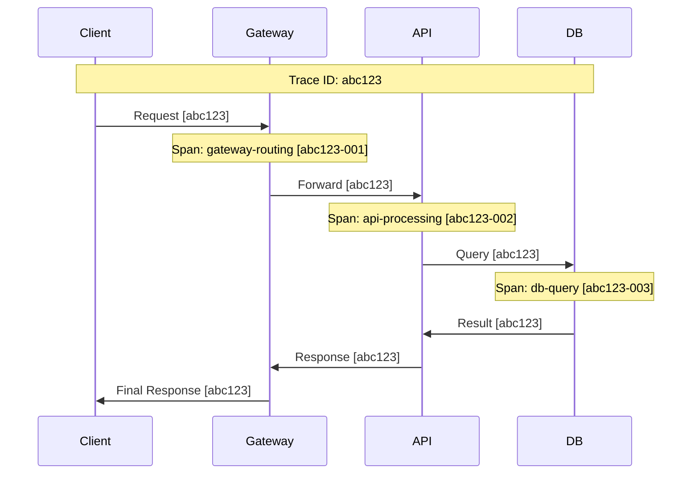

### Metrics Collection

**Application Metrics:**
- JVM performance metrics
- HTTP request/response times
- Database query performance  
- Cache hit/miss ratios
- Custom business metrics

**Infrastructure Metrics:**
- CPU and memory utilization
- Network I/O statistics
- Disk usage and IOPS
- Container resource usage

### Health Checks

```java
// Custom health check example
@Component
public class OpenFrameHealthIndicator implements HealthIndicator {
    
    @Autowired
    private MongoTemplate mongoTemplate;
    
    @Autowired
    private KafkaTemplate<String, Object> kafkaTemplate;
    
    @Override
    public Health health() {
        Health.Builder builder = Health.up();
        
        // Check MongoDB connectivity
        try {
            mongoTemplate.getCollection("test").countDocuments();
            builder.withDetail("mongodb", "UP");
        } catch (Exception e) {
            builder.down().withDetail("mongodb", "DOWN: " + e.getMessage());
        }
        
        // Check Kafka connectivity
        try {
            kafkaTemplate.send("health-check", "ping");
            builder.withDetail("kafka", "UP");
        } catch (Exception e) {
            builder.down().withDetail("kafka", "DOWN: " + e.getMessage());
        }
        
        return builder.build();
    }
}
```

## Integration Patterns

### External Tool Integration

OpenFrame integrates with MSP tools using standardized patterns:

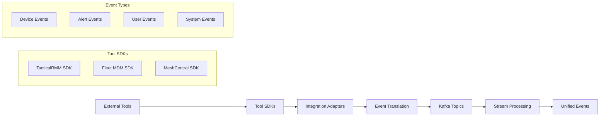

### API Gateway Patterns

**Circuit Breaker Pattern:**
```java
@Component
public class ExternalServiceClient {
    
    @CircuitBreaker(name = "external-service")
    @Retry(name = "external-service")
    @TimeLimiter(name = "external-service")
    public CompletableFuture<String> callExternalService(String request) {
        return CompletableFuture.supplyAsync(() -> {
            // External service call
            return externalService.process(request);
        });
    }
}
```

## Scalability Patterns

### Horizontal Scaling Strategy

OpenFrame services are designed for horizontal scaling:

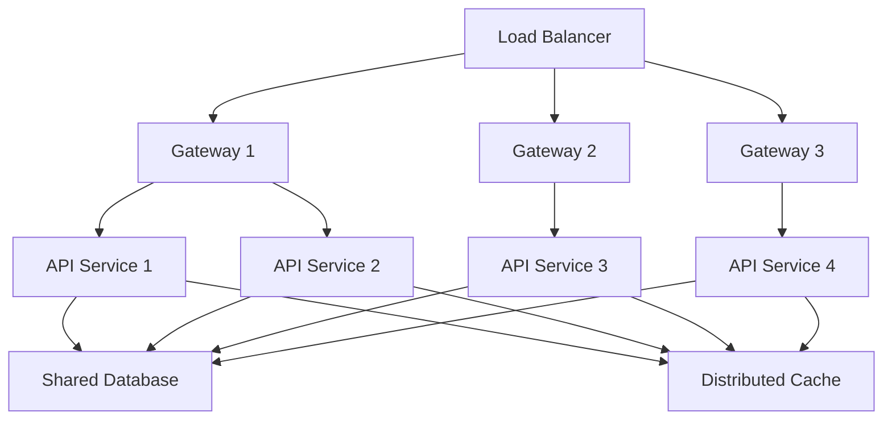

### Database Scaling Patterns

**MongoDB Scaling:**
- Replica sets for high availability
- Sharding for horizontal partitioning
- Read preferences for load distribution

**Kafka Scaling:**
- Topic partitioning for parallelism
- Consumer group scaling
- Broker cluster expansion

## Development Best Practices

### Service Development Guidelines

**1. Service Boundaries**
- Single responsibility principle
- Database per service
- Independent deployment
- Failure isolation

**2. Communication Patterns**
- Asynchronous messaging preferred
- Synchronous calls only for critical paths
- Circuit breakers for external calls
- Timeout and retry policies

**3. Data Consistency**
- Eventual consistency by default
- Strong consistency where required
- Saga pattern for distributed transactions
- Event-driven data synchronization

### Testing Strategy

**Unit Testing:**
- High coverage for business logic
- Mock external dependencies
- Test-driven development approach

**Integration Testing:**
- Test service interactions
- Use test containers for dependencies
- End-to-end API testing

**Contract Testing:**
- Consumer-driven contracts
- Schema registry validation
- API versioning strategy

## Deployment Architecture

### Container Orchestration

OpenFrame services are containerized and orchestrated with Kubernetes:

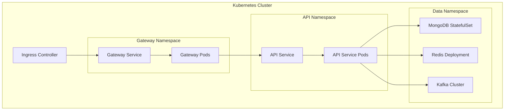

## Further Reading

For deeper dives into specific architectural aspects:

- **[Security Guidelines](../security/README.md)** - Detailed security implementation
- **[Testing Overview](../testing/README.md)** - Comprehensive testing strategies  
- **[Contributing Guidelines](../contributing/guidelines.md)** - Development workflow and standards

This architecture documentation provides the foundation for understanding and contributing to OpenFrame. As you work with the codebase, these patterns and principles will guide your development decisions and help maintain the system's quality and scalability.

## Questions or Feedback?

Architecture discussions happen in the OpenMSP Slack community:
- **Join**: https://join.slack.com/t/openmsp/shared_invite/zt-36bl7mx0h-3~U2nFH6nqHqoTPXMaHEHA
- **Website**: https://www.openmsp.ai/

We welcome questions, suggestions, and contributions to improve OpenFrame's architecture! 🚀