# Architecture Overview

This document provides a comprehensive overview of OpenFrame's architecture, component relationships, design decisions, and system structure. Understanding this architecture is essential for effective development and contribution to the platform.

## High-Level Architecture

OpenFrame follows a modern, event-driven microservices architecture designed for scalability, maintainability, and multi-tenant operation.

### System Architecture Diagram

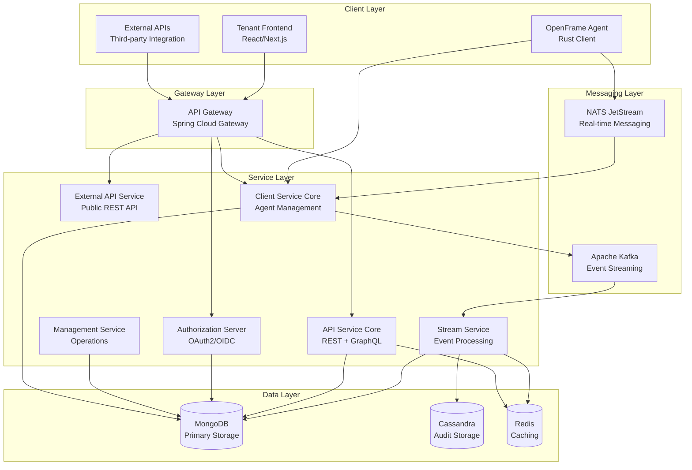

## Core Components

### 1. Frontend Application (Tenant UI)

**Technology Stack:**
- Next.js with TypeScript
- VoltAgent Core for AI functionality
- Anthropic SDK for Claude integration
- Zod for validation
- Glob for file operations

**Responsibilities:**
- Multi-tenant SaaS user interface
- Real-time updates via WebSocket connections
- AI assistant (Mingo) integration
- Device management and remote access
- User and organization management

### 2. API Gateway (Spring Cloud Gateway)

**Key Features:**
- JWT token validation
- API key authentication
- Request routing and load balancing
- CORS handling
- Rate limiting and throttling

**Architecture Pattern:**
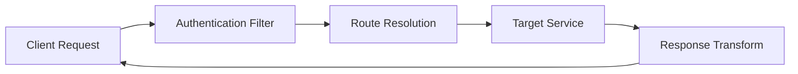

### 3. Authorization Server (OAuth2/OIDC)

**Capabilities:**
- Multi-tenant identity management
- OAuth2 authorization code flow
- JWT token issuance and validation
- SSO integration (Google, Microsoft)
- Per-tenant RSA key management

**Token Flow:**
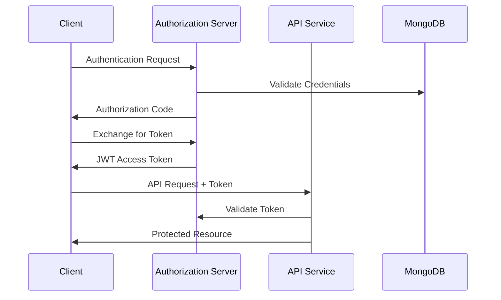

### 4. API Service Core

**Features:**
- REST endpoints for mutations/commands
- GraphQL queries via Netflix DGS
- Device and organization management
- User and permission management
- Log and event querying

**Data Access Pattern:**
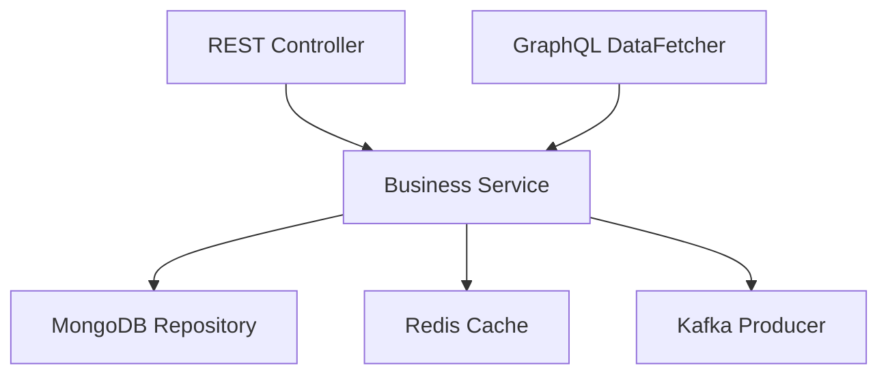

### 5. Client Service Core

**Purpose:**
- Agent registration and authentication
- Device heartbeat processing
- Tool connection management
- Agent command distribution

**Agent Communication:**
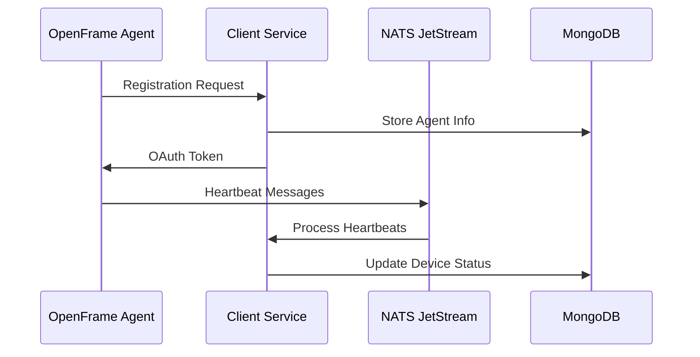

## Data Flow and Event Streaming

### Event-Driven Architecture

OpenFrame uses an event-driven approach for loose coupling and scalability:

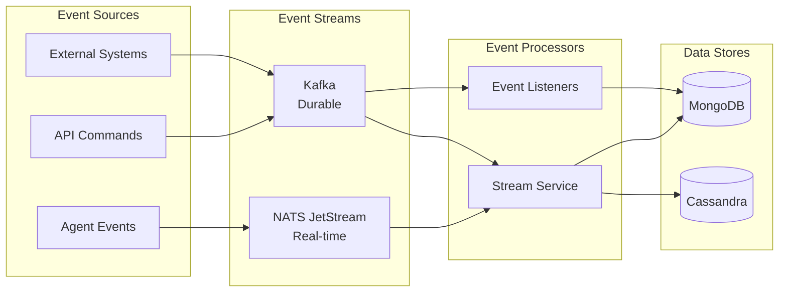

### Message Patterns

#### 1. Command Pattern (NATS)
- Agent commands and responses
- Real-time device communication
- Tool installation messages

#### 2. Event Sourcing (Kafka)
- Audit trail for compliance
- State change notifications
- Integration events

#### 3. CQRS (Command Query Responsibility Segregation)
- Commands: REST API mutations
- Queries: GraphQL and filtered endpoints
- Separate read/write optimizations

## Data Architecture

### Primary Storage (MongoDB)

**Collections Structure:**
```text
MongoDB Collections:
├── organizations           # Tenant organizations
├── users                  # User accounts and profiles
├── devices               # Managed devices/machines
├── installedAgents       # Agent registrations
├── toolConnections       # Tool integrations
├── apiKeys              # API access credentials
├── events               # System events
├── invitations          # User invitations
└── ssoConfigs           # SSO configurations
```

**Document Relationships:**
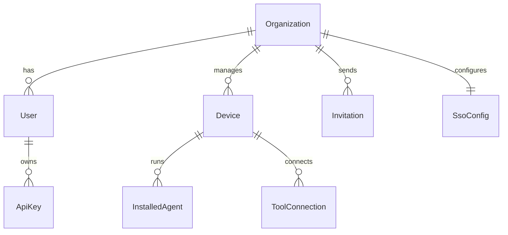

### Audit Storage (Cassandra)

**Purpose:**
- Immutable audit logs
- High-volume event storage
- Compliance and reporting data
- Time-series data for analytics

**Schema Design:**
```cql
CREATE TABLE unified_log_events (
    tenant_id UUID,
    event_date DATE,
    event_time TIMESTAMP,
    event_id UUID,
    event_type TEXT,
    source_system TEXT,
    data MAP<TEXT, TEXT>,
    PRIMARY KEY ((tenant_id, event_date), event_time, event_id)
) WITH CLUSTERING ORDER BY (event_time DESC);
```

### Caching Strategy (Redis)

**Cache Patterns:**
- **Session Storage**: User session data
- **Device Status Cache**: Real-time device states
- **API Response Cache**: Frequently accessed data
- **Rate Limiting**: API throttling counters

## Multi-Tenancy Design

### Tenant Isolation Strategies

#### 1. Database-Level Isolation
```java
// Tenant context in Spring Data MongoDB
@Document(collection = "#{tenantContext.getCollection('users')}")
public class User {
    private String tenantId;
    // ... other fields
}
```

#### 2. Service-Level Isolation
```java
@Component
@TenantScope
public class TenantAwareService {
    public List<Device> getDevices() {
        String tenantId = TenantContext.getCurrentTenant();
        return deviceRepository.findByTenantId(tenantId);
    }
}
```

#### 3. Security Context Isolation
```java
// JWT token contains tenant information
{
  "sub": "user@tenant.com",
  "tenant_id": "tenant-uuid",
  "tenant_slug": "tenant-name",
  "roles": ["ADMIN", "USER"]
}
```

### Tenant-Aware Components

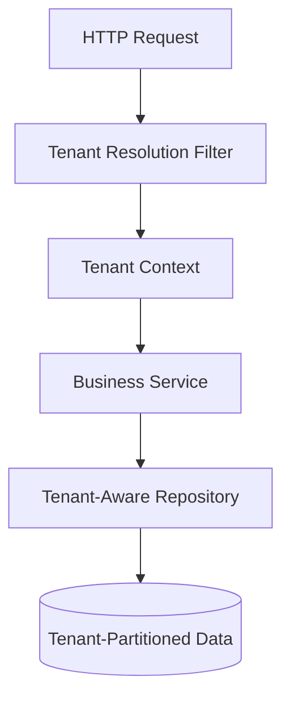

## Security Architecture

### Authentication Flow

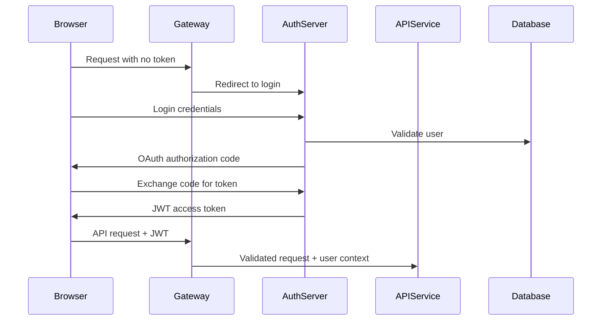

### Authorization Patterns

#### Role-Based Access Control (RBAC)
```java
@PreAuthorize("hasRole('ADMIN') or hasRole('TECHNICIAN')")
public DeviceResponse updateDevice(String deviceId, UpdateDeviceRequest request) {
    // Implementation
}
```

#### Resource-Based Authorization
```java
@PreAuthorize("@deviceSecurityService.hasAccess(authentication, #deviceId)")
public DeviceResponse getDevice(String deviceId) {
    // Implementation
}
```

## AI Integration Architecture

### Mingo AI Assistant

**Components:**
- VoltAgent Core for agent orchestration
- Anthropic SDK for Claude model access
- Context management for conversations
- Enterprise guardrails and policies

**AI Data Flow:**
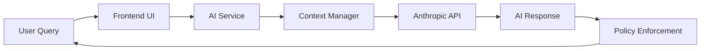

### AI Security and Governance

- **Data Privacy**: Sensitive data filtering
- **Approval Workflows**: Administrative oversight for critical operations
- **Audit Logging**: All AI interactions tracked
- **Rate Limiting**: Usage controls and billing management

## Performance and Scalability

### Horizontal Scaling Strategy

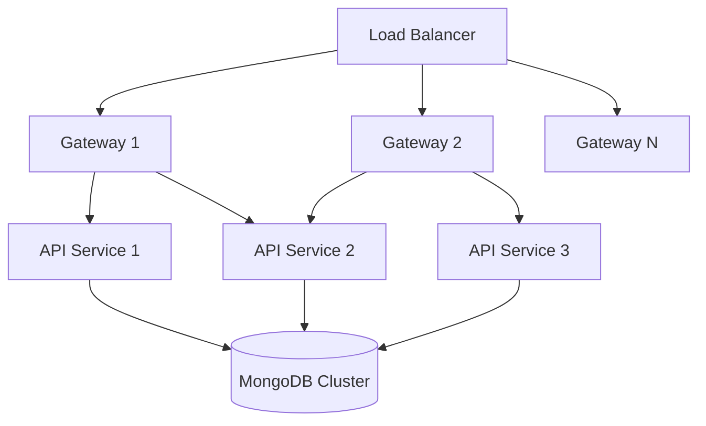

### Caching Strategies

#### 1. Application-Level Caching
```java
@Cacheable(value = "devices", key = "#tenantId + ':' + #deviceId")
public Device getDevice(String tenantId, String deviceId) {
    return deviceRepository.findById(deviceId);
}
```

#### 2. Database Query Optimization
```javascript
// MongoDB indexes for multi-tenant queries
db.devices.createIndex({ "tenantId": 1, "status": 1, "lastSeen": -1 })
db.users.createIndex({ "tenantId": 1, "email": 1 }, { unique: true })
```

### Monitoring and Observability

**Metrics Collection:**
- Spring Boot Actuator endpoints
- Micrometer with Prometheus integration
- Custom business metrics
- Real-time performance dashboards

**Logging Strategy:**
- Structured JSON logging
- Tenant-aware log correlation
- Centralized log aggregation
- Compliance audit trails

## Key Design Decisions

### 1. Microservices vs. Modular Monolith
**Decision**: Microservices architecture
**Rationale**: 
- Independent scaling of components
- Technology diversity (Java backend, Rust agents)
- Team autonomy and deployment independence
- Fault isolation

### 2. Event-Driven Communication
**Decision**: NATS for real-time, Kafka for durability
**Rationale**:
- Loose coupling between services
- Horizontal scalability
- Audit trail for compliance
- Integration with external systems

### 3. Multi-Database Strategy
**Decision**: MongoDB (operational), Cassandra (audit), Redis (cache)
**Rationale**:
- Optimal data models for each use case
- Performance optimization
- Compliance requirements
- Caching and session management

### 4. OAuth2/OIDC for Authentication
**Decision**: Custom authorization server with Spring Security
**Rationale**:
- Multi-tenant identity management
- Standard protocol compatibility
- Fine-grained access control
- Integration with external identity providers

## Development Patterns and Best Practices

### 1. Domain-Driven Design (DDD)
- Bounded contexts for each service
- Rich domain models
- Repository pattern for data access
- Domain events for inter-service communication

### 2. CQRS Implementation
```java
// Command side
@PostMapping("/devices")
public ResponseEntity<DeviceResponse> createDevice(@RequestBody CreateDeviceCommand command) {
    Device device = deviceCommandService.createDevice(command);
    return ResponseEntity.ok(deviceMapper.toResponse(device));
}

// Query side
@QueryMapping
public DeviceConnection devices(@Argument DeviceFilterInput filter) {
    return deviceQueryService.getDevices(filter);
}
```

### 3. Event Sourcing Patterns
```java
@EventHandler
public void on(DeviceCreatedEvent event) {
    // Update read model
    DeviceReadModel readModel = new DeviceReadModel(event);
    readModelRepository.save(readModel);
    
    // Publish integration event
    integrationEventPublisher.publish(new DeviceIntegrationEvent(event));
}
```

This architecture overview provides the foundation for understanding OpenFrame's design and implementation. The next sections dive deeper into specific aspects like security, testing, and contributing guidelines.