# System Architecture Overview

OpenFrame follows a modern microservices architecture designed for scalability, maintainability, and multi-tenant operation. This document provides a comprehensive overview of the system design, architectural patterns, and key design decisions.

> **Reference**: For detailed implementation specifics, see the [Architecture Documentation](../../architecture/README.md) generated from the source code.

## High-Level Architecture

OpenFrame is built as a distributed system with clear separation of concerns across multiple architectural layers:

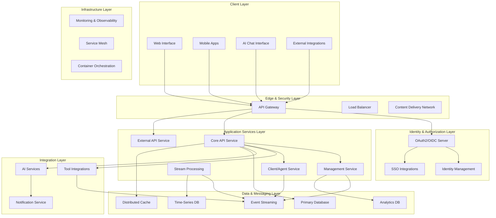

## Core Components

### API Gateway (Gateway Service Core)

The API Gateway serves as the single entry point for all external traffic and provides:

#### Responsibilities
- **Routing**: Intelligent request routing to appropriate backend services
- **Authentication**: JWT validation and API key authentication  
- **Authorization**: Request-level access control
- **Rate Limiting**: Protection against abuse and DoS attacks
- **CORS Handling**: Cross-origin resource sharing policies
- **WebSocket Proxying**: Real-time communication support

#### Key Features
```yaml
Capabilities:
  - Multi-issuer JWT validation
  - API key-based authentication
  - Tenant-aware routing
  - Request/response transformation
  - Circuit breaker pattern
  - Metrics collection and monitoring
```

#### Implementation Details
- Built on **Spring Cloud Gateway**
- **Reactive** architecture (WebFlux)
- **Multi-tenant** issuer resolution
- **Redis-backed** rate limiting
- **WebSocket** proxy support for real-time features

### OAuth2 Authorization Server (Authorization Server Core)

Provides enterprise-grade identity and access management:

#### Core Features
- **OAuth2 Authorization Server** implementation
- **OpenID Connect (OIDC)** provider
- **Multi-tenant** identity isolation
- **Dynamic SSO** registration and management
- **JWT token** issuance and validation

#### Tenant Isolation Model
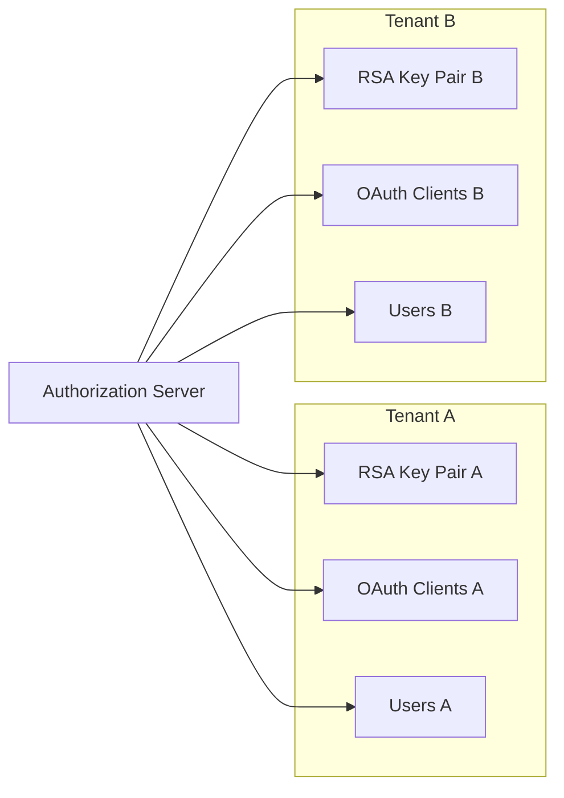

Each tenant maintains:
- **Unique RSA key pairs** for JWT signing
- **Isolated OAuth clients** and configurations
- **Separate user stores** and authentication flows
- **Independent SSO** integrations

### Core API Service (API Service Core)

The heart of the OpenFrame platform, providing business logic and data access:

#### GraphQL API
- **Netflix DGS Framework** for GraphQL implementation
- **DataLoader pattern** for efficient batch loading
- **Cursor-based pagination** for scalable data access
- **Real-time subscriptions** for live updates

#### REST API Endpoints
- **Device management** and monitoring
- **Organization** and user administration  
- **Tool integration** configuration
- **Event and log** querying
- **Invitation** and onboarding workflows

#### Data Access Patterns
```yaml
Patterns:
  - Repository pattern for data access
  - Command Query Responsibility Segregation (CQRS)
  - Event sourcing for audit trails
  - Optimistic locking for concurrency
  - Multi-level caching strategy
```

### Stream Processing Service (Stream Service Core)

Handles real-time event processing and data transformation:

#### Event Processing Pipeline
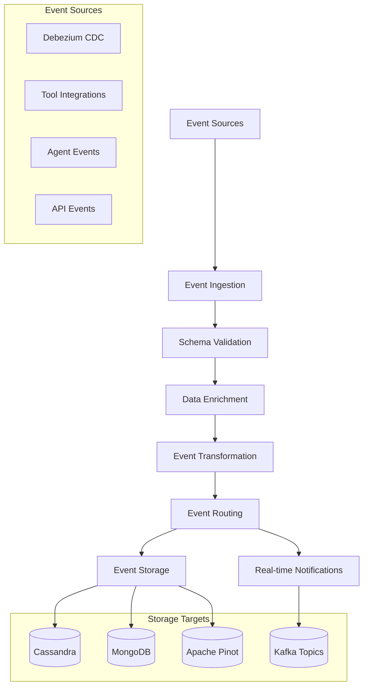

#### Key Capabilities
- **Change Data Capture (CDC)** processing via Debezium
- **Event normalization** across different tool formats
- **Real-time analytics** and aggregation
- **Kafka Streams** for complex event processing
- **Cassandra** time-series data storage

### Client/Agent Service (Client Service Core)

Manages device agents and client communications:

#### Agent Lifecycle Management
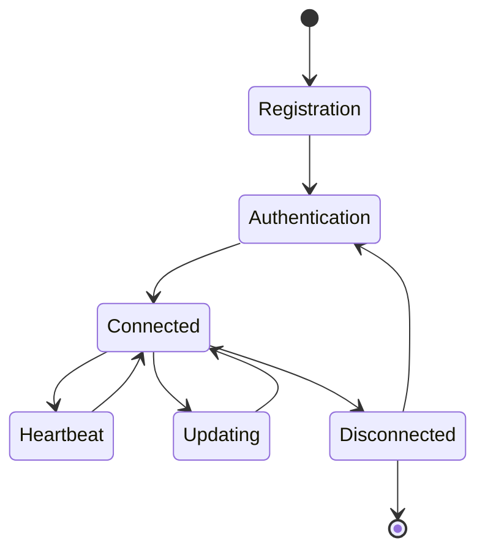

#### Responsibilities
- **Agent registration** and authentication
- **File exchange** with tool agents
- **Tool installation** and updates
- **Machine heartbeat** monitoring
- **Connection management** and health tracking

## Data Architecture

### Multi-Database Strategy

OpenFrame uses different databases optimized for specific use cases:

| Database | Use Case | Data Types |
|----------|----------|------------|
| **MongoDB** | Primary operational data | Users, Organizations, Devices, Configurations |
| **Apache Cassandra** | Time-series and log data | Events, Metrics, Audit logs |
| **Apache Pinot** | Analytics and reporting | Aggregated metrics, Historical data |
| **Redis** | Caching and sessions | Session data, API responses, Rate limits |

### Data Flow Architecture

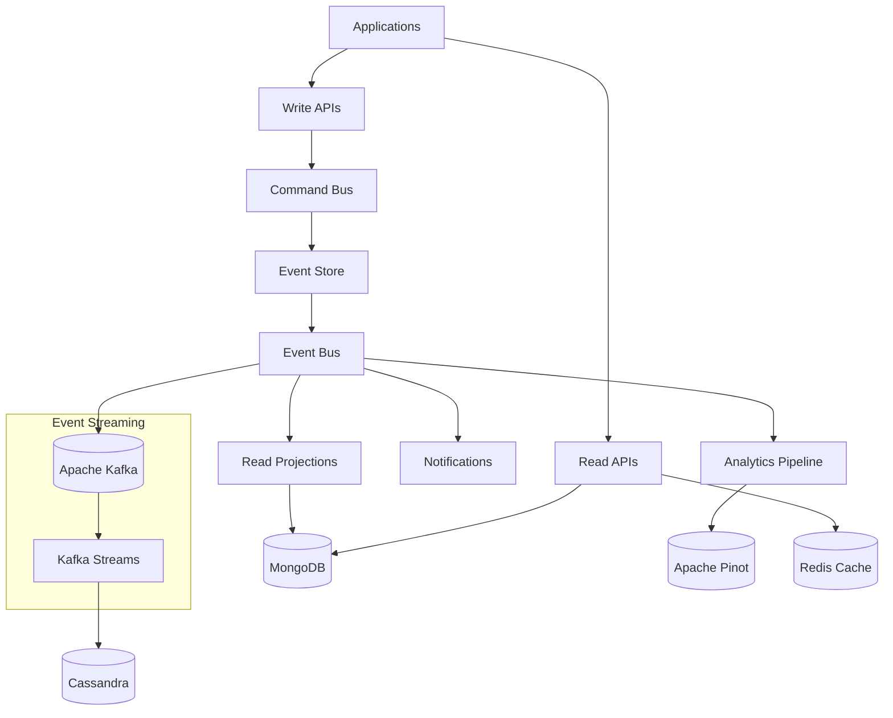

### Multi-Tenant Data Isolation

Data isolation is implemented at multiple levels:

#### Database Level
- **Logical separation** using tenant identifiers
- **Row-level security** policies
- **Encrypted tenant data** with tenant-specific keys
- **Backup isolation** per tenant

#### Application Level
- **Tenant context** propagation through request lifecycle
- **Data access filters** automatically applied
- **API responses** filtered by tenant scope
- **Audit logging** with tenant attribution

## Communication Patterns

### Synchronous Communication

**HTTP/REST APIs:**
- Service-to-service communication
- Client-to-service requests
- External integrations

**GraphQL:**
- Complex query requirements
- Real-time subscriptions
- Efficient data fetching

### Asynchronous Communication

**Event-Driven Messaging:**
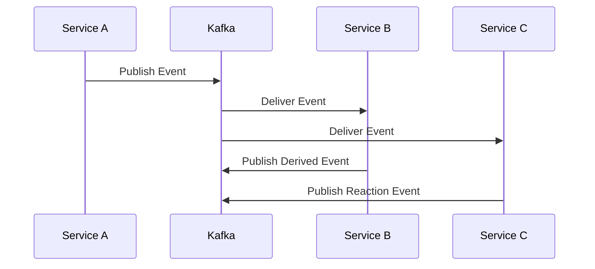

**Benefits:**
- **Loose coupling** between services
- **Scalability** through async processing
- **Reliability** with message persistence
- **Event replay** capability for recovery

## Security Architecture

### Multi-Layered Security Model

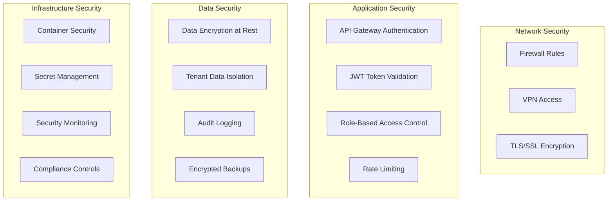

### Authentication & Authorization Flow

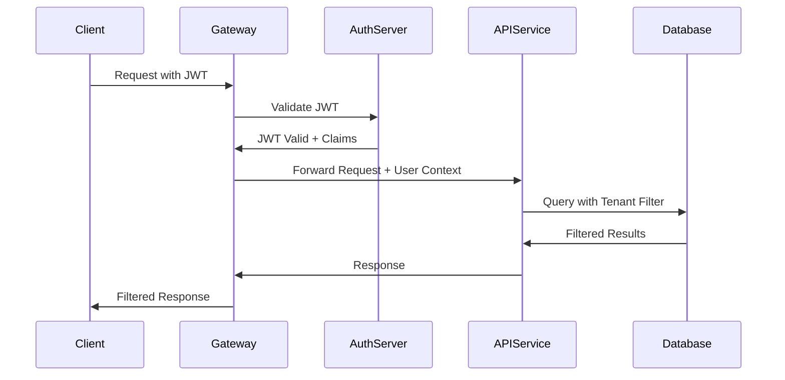

## Scalability & Performance

### Horizontal Scaling Strategy

| Component | Scaling Approach | Considerations |
|-----------|------------------|----------------|
| **API Gateway** | Load balancer with multiple instances | Session-less design |
| **API Services** | Auto-scaling based on CPU/memory | Database connection pooling |
| **Stream Processing** | Kafka partitioning and consumer groups | Event ordering requirements |
| **Databases** | Read replicas and sharding | Data consistency requirements |

### Performance Optimization

#### Caching Strategy
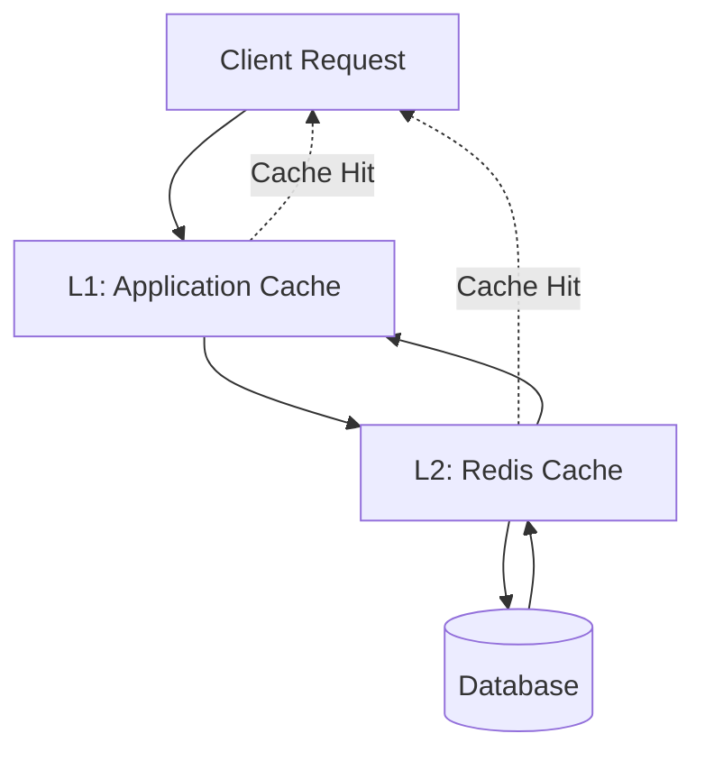

#### Query Optimization
- **Index strategies** for MongoDB queries
- **Query batching** with DataLoader
- **Cursor pagination** for large datasets
- **Projection optimization** to minimize data transfer

## Deployment Architecture

### Container-Based Deployment

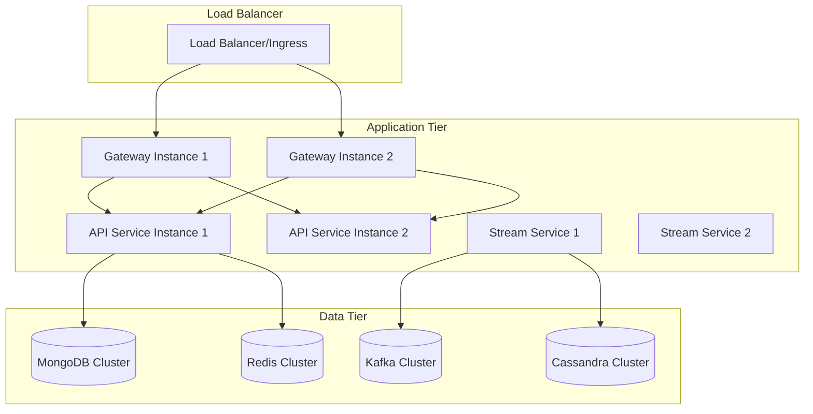

### Environment Strategy

| Environment | Purpose | Configuration |
|-------------|---------|---------------|
| **Development** | Local development and testing | Single-instance services, embedded databases |
| **Staging** | Pre-production testing | Multi-instance services, external databases |
| **Production** | Live system | Highly available, auto-scaling, monitoring |

## Monitoring & Observability

### Observability Stack

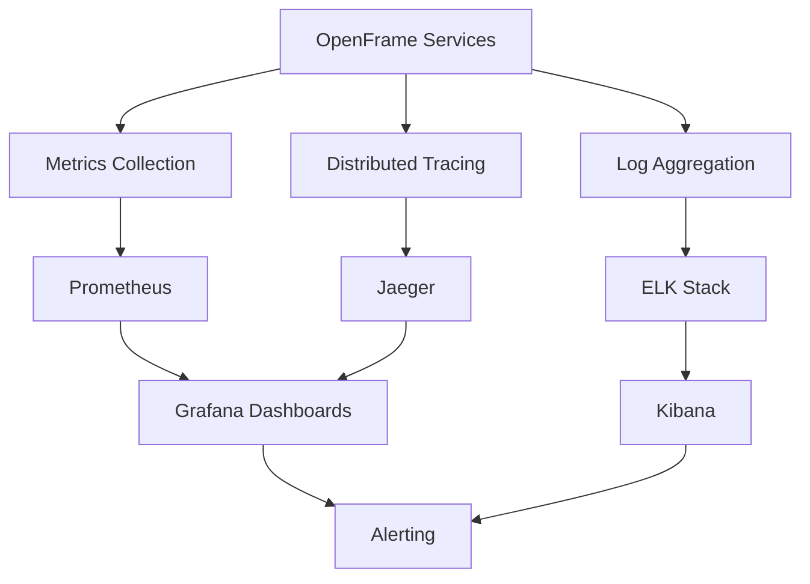

### Key Metrics

#### Application Metrics
- Request throughput and latency
- Error rates and types
- Database query performance
- Cache hit rates

#### Business Metrics
- Active tenant count
- Device connection rates
- Event processing volumes
- API usage patterns

## Technology Decisions & Rationale

### Framework Choices

| Technology | Rationale |
|------------|-----------|
| **Spring Boot 3.3** | Mature ecosystem, excellent monitoring, reactive support |
| **Netflix DGS** | GraphQL with Spring Boot integration, strong typing |
| **Apache Kafka** | Industry standard for event streaming, excellent scaling |
| **MongoDB** | Document flexibility, strong consistency, horizontal scaling |
| **Redis** | High-performance caching, pub/sub, data structures |

### Architectural Patterns

| Pattern | Application | Benefits |
|---------|-------------|----------|
| **Microservices** | Service decomposition | Scalability, technology diversity, fault isolation |
| **Event Sourcing** | Audit trails, state reconstruction | Complete audit history, replay capability |
| **CQRS** | Read/write separation | Performance optimization, scaling flexibility |
| **Saga Pattern** | Distributed transactions | Consistency across services without 2PC |

## Future Architecture Evolution

### Planned Enhancements

1. **Service Mesh Integration**
   - Implement Istio for advanced traffic management
   - Enhanced security with mTLS
   - Advanced observability and policy enforcement

2. **Multi-Region Deployment**
   - Geographic distribution for performance
   - Disaster recovery capabilities
   - Data sovereignty compliance

3. **Event Store Optimization**
   - Dedicated event store for better performance
   - Event snapshots for faster replay
   - Event schema evolution support

4. **AI/ML Integration Enhancement**
   - Real-time model inference
   - Feature store integration
   - A/B testing framework for AI features

## Best Practices for Contributors

### Development Guidelines

1. **Service Design**
   - Keep services focused and cohesive
   - Design for failure and resilience
   - Implement comprehensive health checks

2. **Data Design**
   - Design for multi-tenancy from the start
   - Implement proper indexing strategies
   - Plan for data migration and evolution

3. **Security**
   - Never trust input data
   - Implement defense in depth
   - Audit all security-relevant actions

4. **Testing**
   - Write tests at multiple levels
   - Test failure scenarios
   - Include performance tests

## Getting Deeper

To dive deeper into specific aspects of the architecture:

1. **[Security Architecture](../security/README.md)** - Detailed security patterns and implementations
2. **[Testing Strategies](../testing/README.md)** - Comprehensive testing approaches
3. **[Contributing Guidelines](../contributing/guidelines.md)** - Development workflow and standards

The OpenFrame architecture is designed to be both powerful and approachable, enabling teams to build scalable MSP solutions while maintaining code quality and operational excellence.