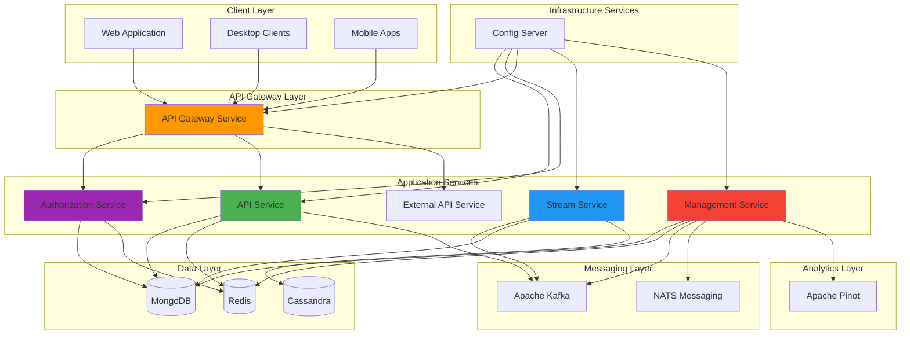
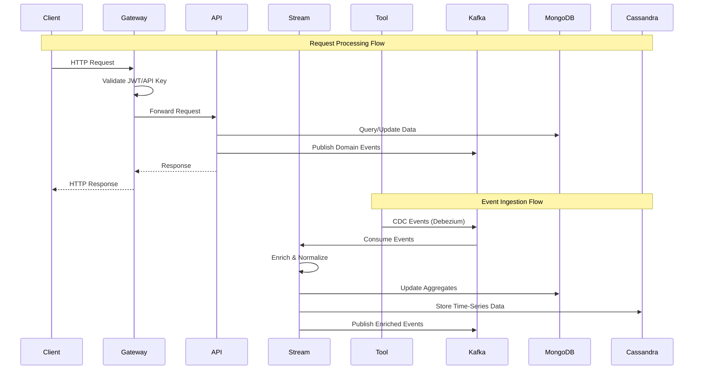
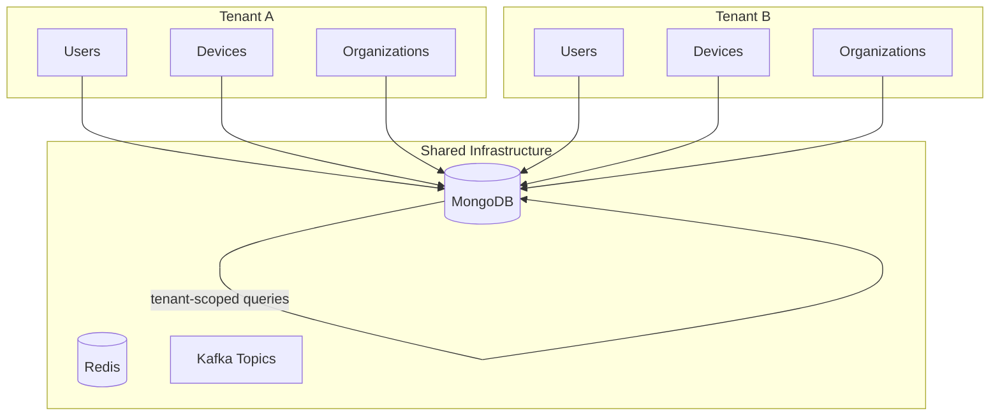
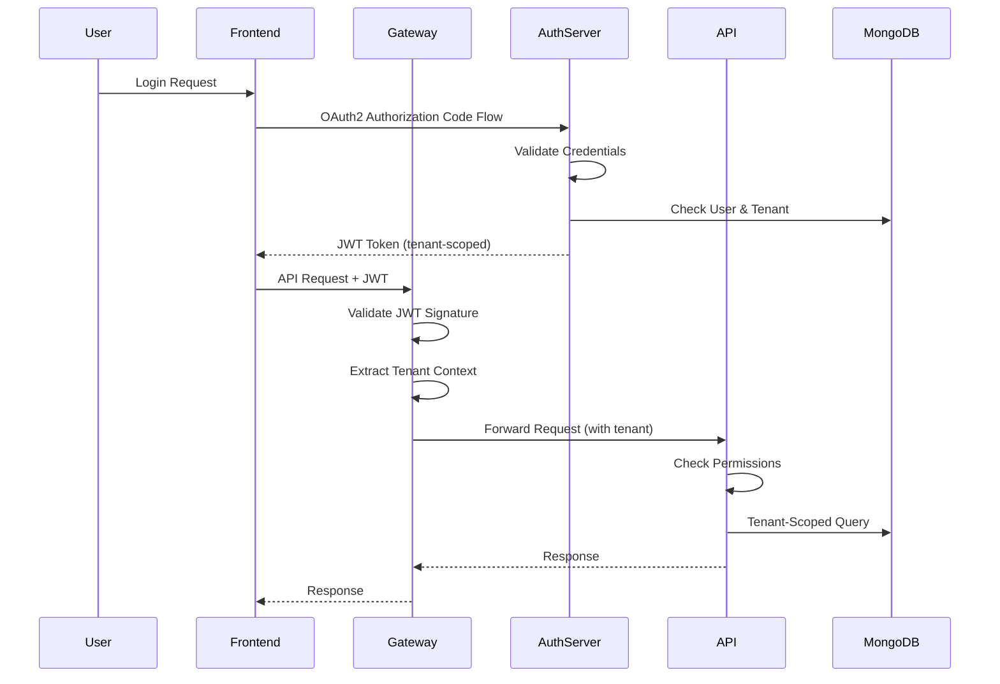
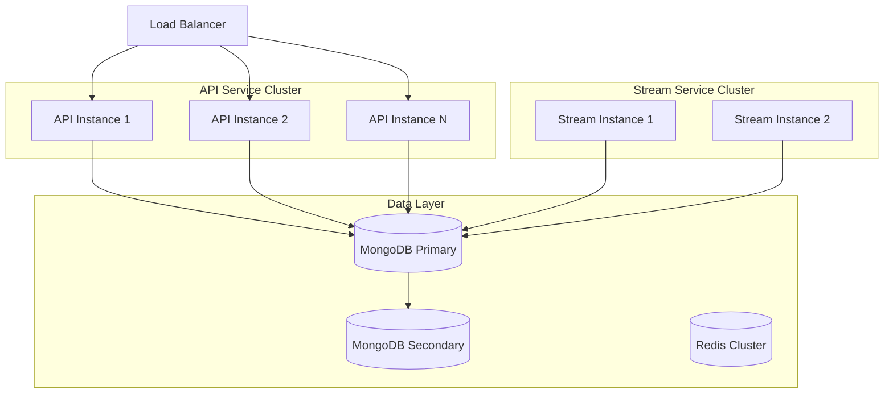

# Architecture Overview

OpenFrame OSS Tenant is a sophisticated multi-tenant, event-driven microservices platform designed to provide a complete MSP (Managed Service Provider) solution. This document provides a comprehensive overview of the system architecture, design patterns, and key architectural decisions.

## High-Level Architecture

The platform follows a modern microservices architecture with clean separation of concerns, event-driven communication, and multi-tenant isolation.



## Core Components

### 1. API Gateway Service

The API Gateway serves as the single entry point for all client requests, providing:

**Responsibilities:**
- JWT token validation and tenant extraction
- API key authentication for external clients
- Request routing to appropriate services
- Rate limiting and throttling
- WebSocket proxy for real-time features
- CORS handling and security headers

**Key Features:**
- Multi-issuer JWT validation with caching
- Per-tenant rate limiting
- Circuit breaker patterns for resilience
- Comprehensive request/response logging

**Technology Stack:**
- Spring Cloud Gateway (Reactive)
- Spring Security OAuth2 Resource Server
- Redis for caching and rate limiting

### 2. Authorization Service

OAuth2/OIDC compliant authorization server providing multi-tenant identity management:

**Responsibilities:**
- OAuth2 authorization code and client credentials flows
- Per-tenant RSA signing key management
- SSO integration (Google, Microsoft)
- User registration and invitation workflows
- Password reset and account recovery
- Tenant discovery and onboarding

**Key Features:**
- Isolated tenant authentication contexts
- Dynamic client registration
- SSO provider abstraction
- Comprehensive audit logging

**Technology Stack:**
- Spring Authorization Server
- Spring Security
- MongoDB for persistence
- Redis for session management

### 3. API Service

The core business logic service exposing REST and GraphQL APIs:

**Responsibilities:**
- Domain entity management (Users, Organizations, Devices)
- Business rule enforcement
- Multi-tenant data isolation
- Event publishing for downstream processing
- Integration with external MSP tools

**Key Features:**
- GraphQL API with Netflix DGS framework
- REST API with OpenAPI documentation
- DataLoaders for N+1 query prevention
- Cursor-based pagination
- Comprehensive input validation

**Technology Stack:**
- Spring Boot with Spring Data MongoDB
- Netflix DGS (Domain Graph Service)
- Spring Security for method-level security
- Kafka for event publishing

### 4. Stream Service

Event processing service handling real-time data ingestion and enrichment:

**Responsibilities:**
- Kafka event consumption and processing
- CDC (Change Data Capture) from external tools
- Data enrichment and normalization
- Time-series data storage
- Event correlation and pattern detection

**Key Features:**
- Debezium integration for CDC
- Schema registry for event versioning
- Fault-tolerant stream processing
- Multi-tenant event isolation

**Technology Stack:**
- Spring Kafka with Kafka Streams
- Apache Cassandra for time-series data
- Debezium for CDC
- Apache Avro for schema management

### 5. Management Service

Operational management service for infrastructure automation:

**Responsibilities:**
- Service health monitoring and orchestration
- Debezium connector management
- NATS stream provisioning
- Agent version distribution
- Scheduled maintenance tasks
- Infrastructure bootstrapping

**Key Features:**
- Distributed scheduling with ShedLock
- Circuit breakers for external dependencies
- Infrastructure as code patterns
- Comprehensive health checks

**Technology Stack:**
- Spring Boot with Spring Scheduler
- ShedLock for distributed locking
- NATS for messaging
- Apache Pinot for analytics

### 6. External API Service

Public API service for third-party integrations:

**Responsibilities:**
- API key-based authentication
- Public REST API endpoints
- Tool integration proxying
- Rate limiting and quotas
- Developer documentation

**Key Features:**
- OpenAPI 3.0 specification
- Comprehensive rate limiting
- Tool-agnostic REST proxying
- API analytics and usage tracking

**Technology Stack:**
- Spring Boot with Spring Web
- OpenAPI 3.0 with Swagger UI
- Redis for rate limiting
- Micrometer for metrics

## Data Flow Architecture

The platform implements an event-driven architecture with multiple data flow patterns:



### Event-Driven Patterns

**1. Command Query Responsibility Segregation (CQRS)**
- Write operations through API Service
- Read operations optimized with materialized views
- Event sourcing for audit trails

**2. Event Sourcing**
- Domain events captured for all state changes
- Comprehensive audit logging
- Replay capabilities for debugging

**3. Saga Pattern**
- Distributed transaction coordination
- Compensation patterns for failure handling
- Process manager for complex workflows

## Multi-Tenancy Architecture

OpenFrame implements a comprehensive multi-tenancy model:

### Tenant Isolation Strategies

**1. Data Isolation**


**2. Security Isolation**
- Per-tenant RSA signing keys
- Tenant-scoped JWT tokens
- Database-level tenant filtering
- API-level tenant validation

**3. Configuration Isolation**
- Tenant-specific configuration overrides
- Environment-specific settings
- Feature flag management per tenant

### Tenant Context Propagation

```java
// Example tenant context implementation
@Component
public class TenantContextHolder {
    private static final ThreadLocal<String> tenantContext = new ThreadLocal<>();
    
    public static void setTenant(String tenantId) {
        tenantContext.set(tenantId);
    }
    
    public static String getCurrentTenant() {
        return tenantContext.get();
    }
    
    public static void clear() {
        tenantContext.remove();
    }
}
```

## Security Architecture

### Authentication & Authorization Flow



### Security Layers

**1. Transport Security**
- TLS 1.3 for all communications
- Certificate pinning for mobile clients
- HSTS headers and security policies

**2. Application Security**
- JWT tokens with short expiration
- API key rotation and management
- Input validation and sanitization
- SQL/NoSQL injection prevention

**3. Data Security**
- Encryption at rest for sensitive data
- Field-level encryption for PII
- Audit logging for all data access
- GDPR compliance features

## Performance & Scalability

### Scaling Strategies

**1. Horizontal Scaling**


**2. Caching Strategy**
- Redis for session and tenant data
- Application-level caching with TTL
- CDN for static assets
- GraphQL query result caching

**3. Database Optimization**
- MongoDB sharding by tenant
- Read replicas for query distribution
- Index optimization for multi-tenant queries
- Connection pooling and management

### Performance Monitoring

**Key Metrics:**
- Request latency (p50, p95, p99)
- Throughput (requests/second)
- Error rates and failure modes
- Database query performance
- Memory and CPU utilization

**Monitoring Stack:**
- Micrometer for application metrics
- Prometheus for metrics collection
- Grafana for visualization
- Distributed tracing with Zipkin

## Technology Decisions

### Framework Choices

| Component | Technology | Rationale |
|-----------|------------|-----------|
| **Backend Framework** | Spring Boot 3.3.0 | Mature ecosystem, excellent security, reactive support |
| **Authorization** | Spring Authorization Server | OAuth2/OIDC compliance, per-tenant customization |
| **API Gateway** | Spring Cloud Gateway | Reactive, Spring ecosystem integration |
| **Database** | MongoDB | Document model, multi-tenancy, horizontal scaling |
| **Caching** | Redis | High performance, distributed caching, pub/sub |
| **Messaging** | Apache Kafka | Event streaming, durability, scalability |
| **GraphQL** | Netflix DGS | Type-safe, efficient querying, Spring integration |

### Architecture Patterns

**1. Microservices Benefits:**
- Independent deployment and scaling
- Technology diversity where appropriate
- Fault isolation and resilience
- Team autonomy and ownership

**2. Event-Driven Benefits:**
- Loose coupling between services
- Eventual consistency model
- Audit trail and replay capabilities
- Real-time data processing

**3. Multi-Tenancy Benefits:**
- Resource sharing and cost efficiency
- Centralized management and updates
- Compliance and data isolation
- Scalable tenant onboarding

## Key Design Decisions

### 1. Per-Tenant JWT Signing Keys

**Decision:** Each tenant has unique RSA key pairs for JWT signing
**Rationale:** Enhanced security, tenant isolation, key rotation flexibility
**Trade-offs:** Increased complexity in key management

### 2. Event Sourcing for Audit

**Decision:** Domain events stored for comprehensive audit trails
**Rationale:** Compliance requirements, debugging capabilities, analytics
**Trade-offs:** Storage overhead, eventual consistency challenges

### 3. GraphQL + REST Hybrid

**Decision:** GraphQL for internal APIs, REST for external integrations
**Rationale:** GraphQL efficiency for complex UIs, REST simplicity for third parties
**Trade-offs:** Dual API maintenance, learning curve

### 4. Reactive Programming Model

**Decision:** Reactive streams where appropriate (Gateway, Stream Service)
**Rationale:** Better resource utilization, backpressure handling
**Trade-offs:** Learning curve, debugging complexity

## Extension Points

The architecture provides several extension points for customization:

### 1. Custom Integrations

```java
@Component
public interface ToolIntegration {
    String getToolType();
    void processEvent(IntegratedToolEvent event);
    Optional<ToolConnection> validateConnection(ToolCredentials credentials);
}
```

### 2. Event Processors

```java
@Component
public interface EventProcessor {
    boolean supports(DomainEvent event);
    void process(DomainEvent event, TenantContext context);
}
```

### 3. Authentication Providers

```java
@Component
public interface AuthenticationProvider {
    String getProviderType();
    AuthenticationResult authenticate(AuthenticationRequest request);
}
```

## Best Practices

### Development Guidelines

**1. Service Design**
- Keep services focused on single business capabilities
- Design APIs contract-first with clear boundaries
- Implement comprehensive health checks
- Use correlation IDs for tracing

**2. Data Management**
- Always include tenant context in data operations
- Use optimistic locking for concurrent updates
- Implement proper data validation
- Consider data retention policies

**3. Event Design**
- Events should be immutable and self-contained
- Include sufficient context for processing
- Version events for backward compatibility
- Use idempotent event processing

**4. Security Implementation**
- Validate tenant context at every layer
- Use method-level security annotations
- Implement proper input sanitization
- Log security-relevant events

## Troubleshooting Guide

### Common Architecture Issues

**1. Tenant Context Loss**
- Ensure tenant propagation through all layers
- Check ThreadLocal cleanup in async operations
- Validate JWT tenant claims

**2. Event Processing Delays**
- Monitor Kafka consumer lag
- Check for processing bottlenecks
- Implement circuit breakers for external calls

**3. Performance Degradation**
- Monitor database query performance
- Check cache hit rates
- Analyze garbage collection metrics

## Future Architecture Considerations

### Planned Enhancements

**1. Service Mesh Integration**
- Istio/Linkerd for service communication
- Enhanced observability and security
- Traffic management and policies

**2. Cloud-Native Features**
- Kubernetes-native deployment
- Auto-scaling based on metrics
- Cloud storage integration

**3. Advanced Analytics**
- Real-time stream processing
- Machine learning integration
- Predictive analytics capabilities

---

This architecture provides a solid foundation for a scalable, secure, and maintainable MSP platform. The modular design allows for independent evolution of components while maintaining system coherence and tenant isolation.