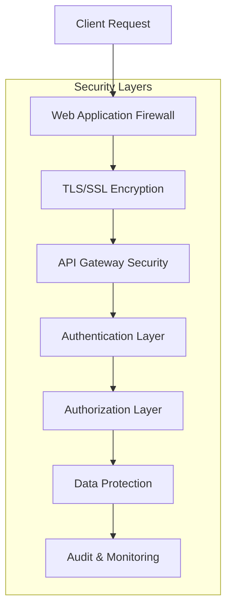
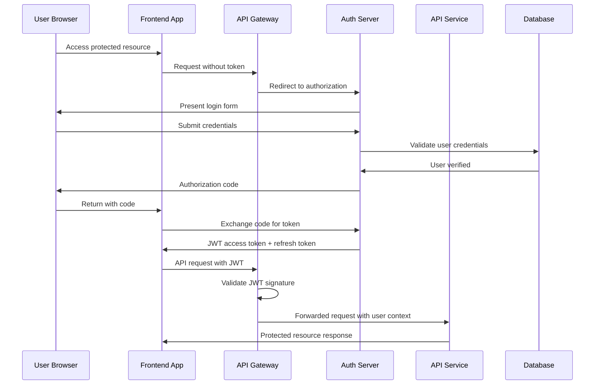

# Security Best Practices

This comprehensive guide covers OpenFrame's security architecture, authentication patterns, authorization mechanisms, data protection strategies, and security best practices for development and production deployment.

## Security Architecture Overview

OpenFrame implements a defense-in-depth security model with multiple layers of protection:



## Authentication and Authorization Patterns

### OAuth2/OIDC Authentication Flow

OpenFrame uses industry-standard OAuth2 with OIDC extensions for secure authentication:



### Multi-Tenant Authentication

#### Tenant Resolution Strategy

```java
@Component
public class TenantResolver {
    
    public String resolveTenant(HttpServletRequest request, Authentication auth) {
        // 1. Check JWT claims first
        if (auth instanceof JwtAuthenticationToken jwt) {
            return jwt.getToken().getClaimAsString("tenant_id");
        }
        
        // 2. Check subdomain
        String host = request.getHeader("Host");
        if (host != null && host.contains(".")) {
            String subdomain = host.split("\\.")[0];
            return tenantService.findBySubdomain(subdomain);
        }
        
        // 3. Check path parameter
        String tenantSlug = request.getHeader("X-Tenant-Slug");
        if (tenantSlug != null) {
            return tenantService.findBySlug(tenantSlug);
        }
        
        throw new TenantResolutionException("Cannot resolve tenant");
    }
}
```

#### Per-Tenant JWT Keys

```java
@Service
public class TenantKeyService {
    
    @Cacheable("tenant-keys")
    public RSAKey getTenantSigningKey(String tenantId) {
        TenantKey tenantKey = tenantKeyRepository.findByTenantId(tenantId)
            .orElseGet(() -> generateNewTenantKey(tenantId));
            
        return RSAKey.parse(tenantKey.getPublicKey());
    }
    
    private TenantKey generateNewTenantKey(String tenantId) {
        KeyPair keyPair = rsaKeyGenerator.generate();
        
        TenantKey tenantKey = new TenantKey();
        tenantKey.setTenantId(tenantId);
        tenantKey.setPublicKey(keyPair.getPublic().getEncoded());
        tenantKey.setPrivateKey(keyPair.getPrivate().getEncoded());
        tenantKey.setAlgorithm("RS256");
        
        return tenantKeyRepository.save(tenantKey);
    }
}
```

### Role-Based Access Control (RBAC)

#### Permission Framework

```java
@Entity
@Document(collection = "permissions")
public class Permission {
    private String id;
    private String name;
    private String resource;
    private String action;
    private String scope; // GLOBAL, ORGANIZATION, PERSONAL
}

@Entity
@Document(collection = "roles")
public class Role {
    private String id;
    private String name;
    private String tenantId;
    private List<String> permissionIds;
    private boolean systemRole; // Built-in vs custom roles
}

@Entity
@Document(collection = "user_roles")
public class UserRole {
    private String userId;
    private String roleId;
    private String tenantId;
    private String scope; // What this role applies to
    private LocalDateTime expiresAt;
}
```

#### Method-Level Security

```java
@RestController
@PreAuthorize("hasRole('USER')")
public class DeviceController {
    
    @GetMapping("/devices/{deviceId}")
    @PreAuthorize("@deviceSecurityService.canView(authentication, #deviceId)")
    public DeviceResponse getDevice(@PathVariable String deviceId) {
        return deviceService.getDevice(deviceId);
    }
    
    @PutMapping("/devices/{deviceId}")
    @PreAuthorize("hasRole('TECHNICIAN') and @deviceSecurityService.canModify(authentication, #deviceId)")
    public DeviceResponse updateDevice(
            @PathVariable String deviceId, 
            @RequestBody UpdateDeviceRequest request) {
        return deviceService.updateDevice(deviceId, request);
    }
    
    @DeleteMapping("/devices/{deviceId}")
    @PreAuthorize("hasRole('ADMIN')")
    public void deleteDevice(@PathVariable String deviceId) {
        deviceService.deleteDevice(deviceId);
    }
}
```

#### Custom Security Service

```java
@Service
public class DeviceSecurityService {
    
    public boolean canView(Authentication auth, String deviceId) {
        UserPrincipal user = (UserPrincipal) auth.getPrincipal();
        Device device = deviceRepository.findById(deviceId);
        
        if (device == null) {
            return false;
        }
        
        // Same tenant check
        if (!device.getTenantId().equals(user.getTenantId())) {
            return false;
        }
        
        // Organization-level access
        if (hasRole(user, "ADMIN", "MANAGER")) {
            return true;
        }
        
        // Device-level access
        if (hasRole(user, "TECHNICIAN")) {
            return deviceAssignmentService.isAssigned(user.getId(), deviceId);
        }
        
        return false;
    }
    
    public boolean canModify(Authentication auth, String deviceId) {
        return canView(auth, deviceId) && 
               hasAnyRole(auth, "ADMIN", "TECHNICIAN");
    }
}
```

## Data Encryption and Secure Storage

### Encryption at Rest

#### Database Encryption

**MongoDB Configuration:**
```yaml
# MongoDB encryption at rest
storage:
  engine: wiredTiger
  wiredTiger:
    engineConfig:
      configString: "encryption=(name=AES256-CBC,keyid=master-key)"

# Application-level field encryption
spring:
  data:
    mongodb:
      field-encryption:
        auto-encryption-settings:
          key-vault-namespace: "encryption.__keyVault"
          schema-map:
            "openframe.users":
              properties:
                ssn:
                  encrypt:
                    algorithm: "AEAD_AES_256_CBC_HMAC_SHA_512-Deterministic"
                    keyId: "user-data-key"
```

#### Sensitive Data Encryption Service

```java
@Service
public class EncryptionService {
    
    private final AESUtil aesUtil;
    private final String masterKey;
    
    @EventListener
    @TransactionalEventListener
    public void encryptSensitiveFields(BeforeSaveEvent<Object> event) {
        Object source = event.getSource();
        
        Field[] fields = source.getClass().getDeclaredFields();
        for (Field field : fields) {
            if (field.isAnnotationPresent(Encrypted.class)) {
                try {
                    field.setAccessible(true);
                    String value = (String) field.get(source);
                    if (value != null && !isAlreadyEncrypted(value)) {
                        String encrypted = aesUtil.encrypt(value, masterKey);
                        field.set(source, encrypted);
                    }
                } catch (Exception e) {
                    throw new EncryptionException("Failed to encrypt field: " + field.getName(), e);
                }
            }
        }
    }
    
    @PostLoad
    public void decryptSensitiveFields(AfterLoadEvent<Object> event) {
        // Similar decryption logic
    }
}

@Retention(RetentionPolicy.RUNTIME)
@Target(ElementType.FIELD)
public @interface Encrypted {
    String algorithm() default "AES";
}
```

### Encryption in Transit

#### TLS Configuration

**Application Properties:**
```yaml
server:
  ssl:
    enabled: true
    key-store: classpath:keystore.p12
    key-store-password: ${SSL_KEYSTORE_PASSWORD}
    key-store-type: PKCS12
    key-alias: openframe
  port: 8443

# Force HTTPS redirect
security:
  require-ssl: true
  
# HSTS headers
management:
  server:
    ssl:
      enabled: true
```

#### Inter-Service Communication

```java
@Configuration
public class WebClientSecurityConfig {
    
    @Bean
    public WebClient secureWebClient() {
        SslContext sslContext = SslContextBuilder
            .forClient()
            .trustManager(InsecureTrustManagerFactory.INSTANCE)
            .build();
            
        HttpClient httpClient = HttpClient.create()
            .secure(sslContextSpec -> sslContextSpec.sslContext(sslContext))
            .headers(headers -> headers
                .add("X-Service-Token", serviceToken)
                .add("X-Request-ID", UUID.randomUUID().toString()));
                
        return WebClient.builder()
            .clientConnector(new ReactorClientHttpConnector(httpClient))
            .build();
    }
}
```

## Input Validation and Sanitization

### Request Validation

```java
@RestController
@Validated
public class UserController {
    
    @PostMapping("/users")
    public ResponseEntity<UserResponse> createUser(
            @Valid @RequestBody CreateUserRequest request,
            BindingResult bindingResult) {
        
        if (bindingResult.hasErrors()) {
            List<String> errors = bindingResult.getAllErrors().stream()
                .map(DefaultMessageSourceResolvable::getDefaultMessage)
                .collect(Collectors.toList());
            throw new ValidationException("Validation failed", errors);
        }
        
        return ResponseEntity.ok(userService.createUser(request));
    }
}

// Request DTO with validation
public class CreateUserRequest {
    
    @NotBlank(message = "Email is required")
    @Email(message = "Invalid email format")
    @Size(max = 255, message = "Email too long")
    private String email;
    
    @NotBlank(message = "First name is required")
    @Size(min = 1, max = 50, message = "First name must be 1-50 characters")
    @Pattern(regexp = "^[a-zA-Z\\s]+$", message = "First name contains invalid characters")
    private String firstName;
    
    @NotBlank(message = "Password is required")
    @Size(min = 8, max = 128, message = "Password must be 8-128 characters")
    @Pattern(regexp = "^(?=.*[a-z])(?=.*[A-Z])(?=.*\\d)(?=.*[@$!%*?&])[A-Za-z\\d@$!%*?&].*$", 
             message = "Password must contain uppercase, lowercase, digit, and special character")
    private String password;
    
    @Valid
    @NotNull(message = "Organization is required")
    private OrganizationRequest organization;
}
```

### SQL Injection Prevention

```java
@Repository
public class CustomUserRepositoryImpl implements CustomUserRepository {
    
    private final MongoTemplate mongoTemplate;
    
    // Using parameterized queries with Spring Data MongoDB
    public List<User> findByEmailPattern(String emailPattern) {
        // Escape special regex characters
        String escapedPattern = Pattern.quote(emailPattern);
        
        Query query = new Query(
            Criteria.where("email").regex(escapedPattern, "i")
        );
        
        return mongoTemplate.find(query, User.class);
    }
    
    // Using aggregation pipeline for complex queries
    public List<DeviceStats> getDeviceStatsByOrganization(String organizationId) {
        Aggregation aggregation = Aggregation.newAggregation(
            Aggregation.match(Criteria.where("organizationId").is(organizationId)),
            Aggregation.group("status").count().as("count"),
            Aggregation.sort(Direction.DESC, "count")
        );
        
        return mongoTemplate.aggregate(aggregation, "devices", DeviceStats.class)
            .getMappedResults();
    }
}
```

### XSS Prevention

```java
@Component
public class XSSRequestWrapper extends HttpServletRequestWrapper {
    
    private static final Pattern[] XSS_PATTERNS = {
        Pattern.compile("<script>(.*?)</script>", Pattern.CASE_INSENSITIVE),
        Pattern.compile("src[\r\n]*=[\r\n]*\\\'(.*?)\\\'", Pattern.CASE_INSENSITIVE | Pattern.MULTILINE | Pattern.DOTALL),
        Pattern.compile("</script>", Pattern.CASE_INSENSITIVE),
        Pattern.compile("<script(.*?)>", Pattern.CASE_INSENSITIVE | Pattern.MULTILINE | Pattern.DOTALL),
        Pattern.compile("eval\\((.*?)\\)", Pattern.CASE_INSENSITIVE | Pattern.MULTILINE | Pattern.DOTALL),
        Pattern.compile("expression\\((.*?)\\)", Pattern.CASE_INSENSITIVE | Pattern.MULTILINE | Pattern.DOTALL),
        Pattern.compile("javascript:", Pattern.CASE_INSENSITIVE),
        Pattern.compile("vbscript:", Pattern.CASE_INSENSITIVE),
        Pattern.compile("onload(.*?)=", Pattern.CASE_INSENSITIVE | Pattern.MULTILINE | Pattern.DOTALL)
    };
    
    public XSSRequestWrapper(HttpServletRequest request) {
        super(request);
    }
    
    @Override
    public String[] getParameterValues(String parameter) {
        String[] values = super.getParameterValues(parameter);
        if (values == null) {
            return null;
        }
        
        int count = values.length;
        String[] encodedValues = new String[count];
        for (int i = 0; i < count; i++) {
            encodedValues[i] = stripXSS(values[i]);
        }
        
        return encodedValues;
    }
    
    private String stripXSS(String value) {
        if (value != null) {
            // HTML encode
            value = StringEscapeUtils.escapeHtml4(value);
            
            // Remove XSS patterns
            for (Pattern pattern : XSS_PATTERNS) {
                value = pattern.matcher(value).replaceAll("");
            }
        }
        return value;
    }
}
```

## Common Security Vulnerabilities and Mitigations

### 1. Broken Authentication

**Vulnerability**: Weak password policies, session management issues

**Mitigation**:
```java
@Configuration
public class PasswordSecurityConfig {
    
    @Bean
    public PasswordEncoder passwordEncoder() {
        return new BCryptPasswordEncoder(12); // Strong cost factor
    }
    
    @Bean
    public PasswordPolicy passwordPolicy() {
        return new PasswordPolicy(
            // Minimum 8 characters
            new LengthRule(8, 128),
            // At least one uppercase letter
            new CharacterRule(EnglishCharacterData.UpperCase, 1),
            // At least one lowercase letter
            new CharacterRule(EnglishCharacterData.LowerCase, 1),
            // At least one digit
            new CharacterRule(EnglishCharacterData.Digit, 1),
            // At least one special character
            new CharacterRule(EnglishCharacterData.Special, 1),
            // No whitespace
            new WhitespaceRule(),
            // No common passwords
            new DictionaryRule(new WordListDictionary(commonPasswords))
        );
    }
}

@Component
public class AccountLockoutService {
    
    private static final int MAX_ATTEMPTS = 5;
    private static final Duration LOCKOUT_DURATION = Duration.ofMinutes(30);
    
    public void recordFailedLogin(String email) {
        String key = "login_attempts:" + email;
        String attemptsStr = redisTemplate.opsForValue().get(key);
        int attempts = attemptsStr != null ? Integer.parseInt(attemptsStr) : 0;
        
        attempts++;
        if (attempts >= MAX_ATTEMPTS) {
            lockAccount(email);
        } else {
            redisTemplate.opsForValue().set(key, String.valueOf(attempts), 
                Duration.ofMinutes(15));
        }
    }
    
    private void lockAccount(String email) {
        String lockKey = "account_locked:" + email;
        redisTemplate.opsForValue().set(lockKey, "true", LOCKOUT_DURATION);
        
        // Send security notification
        securityNotificationService.sendAccountLockoutNotification(email);
    }
}
```

### 2. Sensitive Data Exposure

**Vulnerability**: Storing sensitive data in plaintext, inadequate encryption

**Mitigation**:
```java
@Entity
@Document(collection = "api_keys")
public class ApiKey {
    
    @Id
    private String id;
    
    @Encrypted
    private String keyValue; // Encrypted at field level
    
    @JsonIgnore
    private String hashedKey; // For lookups without decryption
    
    private String name;
    private String tenantId;
    private LocalDateTime createdAt;
    private LocalDateTime expiresAt;
    private boolean active;
    
    // Never expose the actual key value in responses
    @JsonIgnore
    public String getKeyValue() {
        return keyValue;
    }
    
    public void setKeyValue(String keyValue) {
        this.keyValue = keyValue;
        this.hashedKey = BCrypt.hashpw(keyValue, BCrypt.gensalt());
    }
}

@Service
public class ApiKeyService {
    
    public ApiKeyResponse createApiKey(CreateApiKeyRequest request) {
        String keyValue = generateSecureKey();
        
        ApiKey apiKey = new ApiKey();
        apiKey.setKeyValue(keyValue); // Will be encrypted
        apiKey.setName(request.getName());
        apiKey.setTenantId(getCurrentTenantId());
        
        ApiKey saved = apiKeyRepository.save(apiKey);
        
        // Return the key value only once, on creation
        return ApiKeyResponse.builder()
            .id(saved.getId())
            .name(saved.getName())
            .keyValue(keyValue) // Only shown once
            .createdAt(saved.getCreatedAt())
            .build();
    }
}
```

### 3. XML External Entity (XXE) Attacks

**Mitigation**:
```java
@Configuration
public class XmlSecurityConfig {
    
    @Bean
    public DocumentBuilderFactory documentBuilderFactory() throws ParserConfigurationException {
        DocumentBuilderFactory factory = DocumentBuilderFactory.newInstance();
        
        // Disable external entities
        factory.setFeature("http://xml.org/sax/features/external-general-entities", false);
        factory.setFeature("http://xml.org/sax/features/external-parameter-entities", false);
        factory.setFeature("http://apache.org/xml/features/disallow-doctype-decl", true);
        factory.setFeature("http://apache.org/xml/features/nonvalidating/load-dtd-grammar", false);
        factory.setFeature("http://apache.org/xml/features/nonvalidating/load-external-dtd", false);
        
        return factory;
    }
}
```

### 4. Security Misconfigurations

**Mitigation**:
```yaml
# Secure application configuration
server:
  error:
    include-exception: false
    include-stacktrace: never
    include-message: never

spring:
  jpa:
    show-sql: false
    
management:
  endpoints:
    web:
      exposure:
        include: health,metrics
      base-path: /internal/actuator
  endpoint:
    health:
      show-details: when_authorized

logging:
  level:
    org.springframework.security: WARN
    org.springframework.web: WARN
```

## Security Testing and Code Review Guidelines

### 1. Security Unit Tests

```java
@SpringBootTest
@ActiveProfiles("test")
class SecurityIntegrationTest {
    
    @Autowired
    private MockMvc mockMvc;
    
    @Test
    void shouldRejectUnauthorizedAccess() throws Exception {
        mockMvc.perform(get("/api/devices"))
            .andExpect(status().isUnauthorized());
    }
    
    @Test
    void shouldEnforceRoleBasedAccess() throws Exception {
        String userToken = generateTokenWithRole("USER");
        
        mockMvc.perform(delete("/api/devices/123")
            .header("Authorization", "Bearer " + userToken))
            .andExpect(status().isForbidden());
    }
    
    @Test
    void shouldValidateInputProperly() throws Exception {
        String maliciousInput = "<script>alert('xss')</script>";
        
        mockMvc.perform(post("/api/users")
            .contentType(MediaType.APPLICATION_JSON)
            .content("{\"firstName\":\"" + maliciousInput + "\"}"))
            .andExpect(status().isBadRequest());
    }
    
    @Test
    void shouldPreventSqlInjection() throws Exception {
        String sqlInjection = "'; DROP TABLE users; --";
        
        mockMvc.perform(get("/api/users")
            .param("search", sqlInjection))
            .andExpect(status().isOk())
            .andExpect(jsonPath("$.data").isEmpty());
    }
}
```

### 2. Security Code Review Checklist

#### Authentication & Authorization
- [ ] JWT tokens are properly validated and contain required claims
- [ ] Role-based access control is implemented correctly
- [ ] Sensitive endpoints require appropriate permissions
- [ ] Session management follows security best practices
- [ ] Password policies are enforced

#### Input Validation
- [ ] All user inputs are validated and sanitized
- [ ] SQL injection prevention measures are in place
- [ ] XSS protection is implemented
- [ ] File upload security is properly handled
- [ ] Request size limits are enforced

#### Data Protection  
- [ ] Sensitive data is encrypted at rest and in transit
- [ ] PII is properly handled and protected
- [ ] Database connections use encrypted channels
- [ ] Secrets are not hardcoded in source code
- [ ] Proper key management practices are followed

#### Error Handling
- [ ] Error messages don't expose sensitive information
- [ ] Stack traces are not returned to clients
- [ ] Logging doesn't include sensitive data
- [ ] Rate limiting is implemented for API endpoints
- [ ] Security events are properly audited

## Environment Variables and Secrets Management

### Development Environment
```bash
# .env.local (development only)
JWT_SIGNING_KEY=development-key-change-in-production
DATABASE_PASSWORD=dev-password
REDIS_PASSWORD=dev-redis-password

# Never commit these to version control
ANTHROPIC_API_KEY=sk-ant-xxxxx
OPENAI_API_KEY=sk-xxxxx
```

### Production Environment
```bash
# Use proper secrets management
JWT_SIGNING_KEY=${VAULT_JWT_KEY}
DATABASE_PASSWORD=${AWS_RDS_PASSWORD}
REDIS_PASSWORD=${AZURE_REDIS_KEY}

# Rotate keys regularly
ENCRYPTION_KEY_ID=key-rotation-v2
ENCRYPTION_PROVIDER=aws-kms
```

### Secrets Management Service
```java
@Service
public class SecretsService {
    
    private final VaultTemplate vaultTemplate;
    
    public String getSecret(String path, String key) {
        VaultResponseSupport<Map<String, Object>> response = 
            vaultTemplate.read(path, Map.class);
            
        if (response != null && response.getData() != null) {
            return (String) response.getData().get(key);
        }
        
        throw new SecretNotFoundException("Secret not found: " + path + ":" + key);
    }
    
    @EventListener
    public void rotateKeys(KeyRotationEvent event) {
        // Implement key rotation logic
        String newKey = generateNewKey();
        vaultTemplate.write("secret/keys/" + event.getKeyId(), 
            Map.of("key", newKey, "version", event.getVersion()));
    }
}
```

This security guide provides comprehensive coverage of OpenFrame's security implementation. Following these practices ensures robust protection of user data, system integrity, and compliance with security standards.