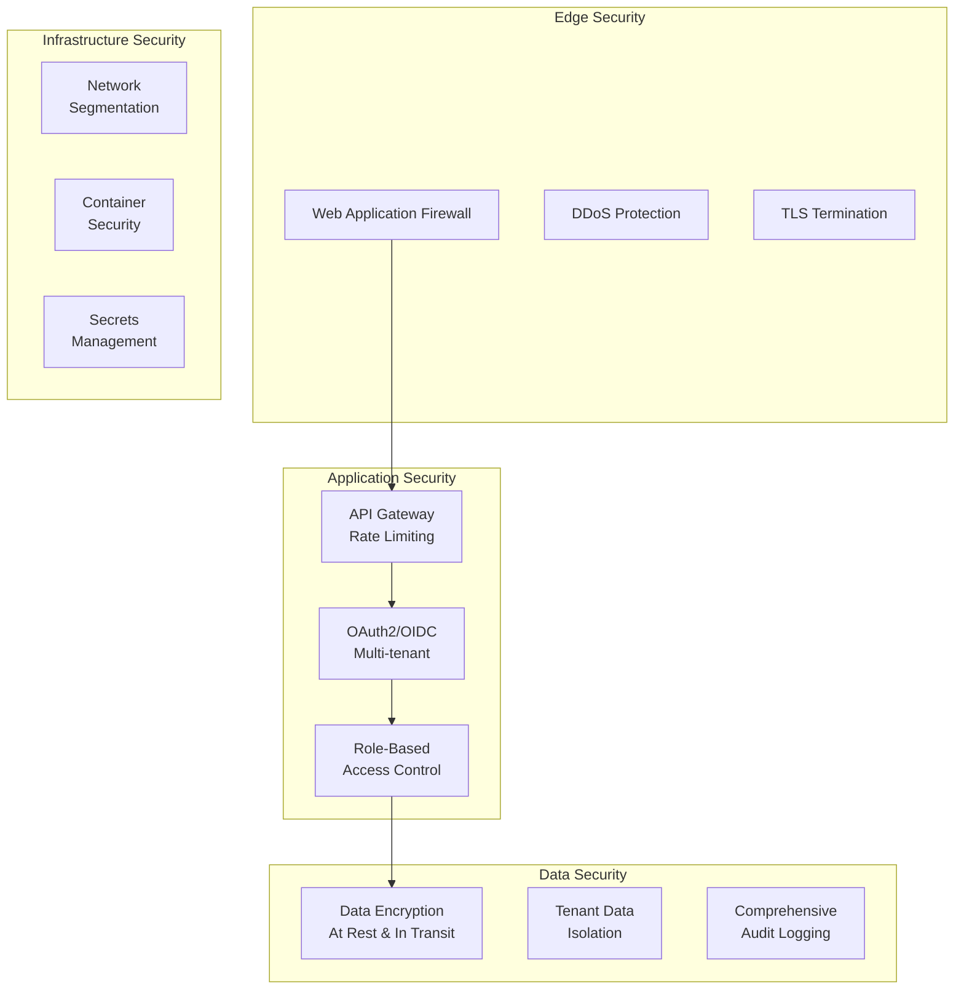

# Security Best Practices

This guide covers security best practices for developing, deploying, and maintaining the OpenFrame platform. Security is integrated into every aspect of the system architecture and development process.

## Security Architecture Overview

OpenFrame implements defense-in-depth security with multiple layers of protection:



## Authentication and Authorization

### OAuth2/OIDC Implementation

OpenFrame uses **Spring Authorization Server** for standards-compliant authentication:

```yaml
# Authorization Server Configuration
spring:
  security:
    oauth2:
      authorizationserver:
        issuer: https://auth.yourdomain.com
        jwks-uri: https://auth.yourdomain.com/.well-known/jwks.json
        authorization-endpoint: /oauth2/authorize
        token-endpoint: /oauth2/token
```

**Key Features:**
- **Multi-tenant JWT signing** with per-tenant RSA keys
- **PKCE support** for secure public clients
- **Dynamic client registration** for tenant onboarding
- **Refresh token rotation** for enhanced security

### JWT Token Security

**Token Structure and Validation:**

```java
@Component
public class JwtSecurityService {
    
    @Value("${security.jwt.expiration:3600}")
    private Long jwtExpiration;
    
    public String generateToken(UserDetails userDetails, String tenantId) {
        return Jwts.builder()
            .setSubject(userDetails.getUsername())
            .claim("tenantId", tenantId)
            .claim("roles", userDetails.getAuthorities())
            .claim("organizationId", getCurrentOrganizationId())
            .setIssuedAt(new Date())
            .setExpiration(new Date(System.currentTimeMillis() + jwtExpiration * 1000))
            .signWith(getTenantSigningKey(tenantId), SignatureAlgorithm.RS256)
            .compact();
    }
    
    public boolean validateToken(String token, String tenantId) {
        try {
            Jwts.parserBuilder()
                .setSigningKey(getTenantPublicKey(tenantId))
                .build()
                .parseClaimsJws(token);
            return true;
        } catch (JwtException | IllegalArgumentException e) {
            logger.warn("Invalid JWT token: {}", e.getMessage());
            return false;
        }
    }
}
```

**Security Best Practices:**
- ✅ **Short expiration times** (1 hour for access tokens)
- ✅ **Refresh token rotation** on each use
- ✅ **Tenant-specific signing keys** for isolation
- ✅ **Secure token storage** (httpOnly cookies)
- ✅ **Token revocation** capabilities

### Role-Based Access Control (RBAC)

**Permission Model:**

```java
public enum Permission {
    // Device Management
    DEVICE_READ("device:read"),
    DEVICE_WRITE("device:write"),
    DEVICE_DELETE("device:delete"),
    
    // Organization Management
    ORGANIZATION_READ("organization:read"),
    ORGANIZATION_WRITE("organization:write"),
    ORGANIZATION_DELETE("organization:delete"),
    
    // User Management
    USER_READ("user:read"),
    USER_WRITE("user:write"),
    USER_INVITE("user:invite"),
    
    // System Administration
    SYSTEM_CONFIG("system:config"),
    TENANT_ADMIN("tenant:admin"),
    
    // API Access
    API_ACCESS("api:access"),
    EXTERNAL_API_ACCESS("external_api:access");
}
```

**Role Hierarchy:**

```text
SUPER_ADMIN
└── TENANT_ADMIN
    ├── ORGANIZATION_ADMIN
    │   ├── TECHNICIAN
    │   │   └── VIEWER
    │   └── ANALYST
    └── SYSTEM_ADMIN
```

**Implementation Example:**

```java
@RestController
@RequestMapping("/api/devices")
@PreAuthorize("hasPermission('DEVICE_READ')")
public class DeviceController {
    
    @PostMapping
    @PreAuthorize("hasPermission('DEVICE_WRITE')")
    public ResponseEntity<Device> createDevice(@Valid @RequestBody CreateDeviceRequest request) {
        // Only users with DEVICE_WRITE permission can create devices
    }
    
    @DeleteMapping("/{deviceId}")
    @PreAuthorize("hasPermission('DEVICE_DELETE') and @deviceSecurityService.canDeleteDevice(#deviceId)")
    public ResponseEntity<Void> deleteDevice(@PathVariable String deviceId) {
        // Additional business logic security check
    }
}
```

## Data Protection

### Encryption at Rest

**Database Encryption:**

```yaml
# MongoDB encryption configuration
security:
  encryptionAtRest:
    enabled: true
    encryptionCipherMode: AES256-CBC
    keyRotationDays: 90
```

**Application-Level Encryption:**

```java
@Component
public class FieldEncryptionService {
    
    @Autowired
    private AESUtil aesUtil;
    
    // Encrypt sensitive fields before database storage
    public String encryptSensitiveData(String data, String tenantId) {
        String tenantKey = getTenantEncryptionKey(tenantId);
        return aesUtil.encrypt(data, tenantKey);
    }
    
    public String decryptSensitiveData(String encryptedData, String tenantId) {
        String tenantKey = getTenantEncryptionKey(tenantId);
        return aesUtil.decrypt(encryptedData, tenantKey);
    }
}
```

**Sensitive Field Annotation:**

```java
@Document(collection = "users")
public class User {
    
    @Id
    private String id;
    
    private String email;
    
    @Encrypted  // Custom annotation for automatic encryption
    private String socialSecurityNumber;
    
    @Encrypted
    private String phoneNumber;
    
    @Encrypted
    private Address homeAddress;
}
```

### Encryption in Transit

**TLS Configuration:**

```yaml
# Application TLS settings
server:
  port: 8443
  ssl:
    enabled: true
    protocol: TLS
    enabled-protocols: TLSv1.2,TLSv1.3
    ciphers: 
      - TLS_ECDHE_RSA_WITH_AES_256_GCM_SHA384
      - TLS_ECDHE_RSA_WITH_AES_128_GCM_SHA256
      - TLS_ECDHE_RSA_WITH_CHACHA20_POLY1305
    key-store: classpath:certificates/openframe.p12
    key-store-password: ${SSL_KEYSTORE_PASSWORD}
    key-store-type: PKCS12
```

**Internal Service Communication:**

```java
@Configuration
public class RestTemplateConfig {
    
    @Bean
    public RestTemplate secureRestTemplate() throws Exception {
        TrustStrategy acceptingTrustStrategy = (X509Certificate[] chain, String authType) -> true;
        
        SSLContext sslContext = org.apache.http.ssl.SSLContexts.custom()
                .loadTrustMaterial(null, acceptingTrustStrategy)
                .build();
                
        SSLConnectionSocketFactory csf = new SSLConnectionSocketFactory(sslContext);
        
        CloseableHttpClient httpClient = HttpClients.custom()
                .setSSLSocketFactory(csf)
                .build();
                
        HttpComponentsClientHttpRequestFactory requestFactory = 
                new HttpComponentsClientHttpRequestFactory();
        requestFactory.setHttpClient(httpClient);
        
        return new RestTemplate(requestFactory);
    }
}
```

### Data Isolation and Multi-Tenancy

**Tenant Context Security:**

```java
@Component
public class TenantContextFilter implements Filter {
    
    @Override
    public void doFilter(ServletRequest request, ServletResponse response, 
                        FilterChain chain) throws IOException, ServletException {
        
        HttpServletRequest httpRequest = (HttpServletRequest) request;
        String tenantId = extractTenantId(httpRequest);
        
        // Validate tenant access
        if (!isValidTenantAccess(tenantId, httpRequest)) {
            throw new UnauthorizedTenantAccessException("Invalid tenant access");
        }
        
        // Set tenant context
        TenantContext.setCurrentTenant(tenantId);
        
        try {
            chain.doFilter(request, response);
        } finally {
            TenantContext.clear();
        }
    }
    
    private boolean isValidTenantAccess(String tenantId, HttpServletRequest request) {
        String jwtToken = extractJwtToken(request);
        Claims claims = jwtService.parseToken(jwtToken);
        String tokenTenantId = claims.get("tenantId", String.class);
        
        return tenantId.equals(tokenTenantId);
    }
}
```

**Database Query Filtering:**

```java
@Repository
public class SecureDeviceRepository {
    
    @Autowired
    private MongoTemplate mongoTemplate;
    
    public List<Device> findDevicesByOrganization(String organizationId) {
        String currentTenantId = TenantContext.getCurrentTenant();
        
        Criteria criteria = Criteria.where("tenantId").is(currentTenantId)
                                  .and("organizationId").is(organizationId);
        
        Query query = new Query(criteria);
        return mongoTemplate.find(query, Device.class);
    }
    
    // Prevent cross-tenant data access
    @PreAuthorize("@securityService.canAccessDevice(#deviceId)")
    public Device findById(String deviceId) {
        return mongoTemplate.findById(deviceId, Device.class);
    }
}
```

## Input Validation and Sanitization

### Request Validation

**Bean Validation with Custom Constraints:**

```java
// Custom validation annotation
@Target({ElementType.FIELD})
@Retention(RetentionPolicy.RUNTIME)
@Constraint(validatedBy = TenantAwareValidator.class)
public @interface TenantAware {
    String message() default "Invalid tenant context";
    Class<?>[] groups() default {};
    Class<? extends Payload>[] payload() default {};
}

// Request DTO with validation
public class CreateDeviceRequest {
    
    @NotBlank(message = "Device name is required")
    @Pattern(regexp = "^[a-zA-Z0-9\\s\\-_.]+$", message = "Invalid device name format")
    @Length(min = 2, max = 100)
    private String deviceName;
    
    @NotNull
    @TenantAware
    private String organizationId;
    
    @Valid
    private DeviceConfiguration configuration;
    
    @Email(message = "Invalid email format")
    private String contactEmail;
}
```

**Global Exception Handler:**

```java
@RestControllerAdvice
public class SecurityExceptionHandler {
    
    @ExceptionHandler(ValidationException.class)
    public ResponseEntity<ErrorResponse> handleValidationException(ValidationException e) {
        logger.warn("Validation error: {}", e.getMessage());
        return ResponseEntity.badRequest()
                .body(new ErrorResponse("VALIDATION_ERROR", sanitize(e.getMessage())));
    }
    
    @ExceptionHandler(UnauthorizedTenantAccessException.class)
    public ResponseEntity<ErrorResponse> handleUnauthorizedAccess(UnauthorizedTenantAccessException e) {
        logger.warn("Unauthorized tenant access attempt: {}", e.getMessage());
        auditService.logSecurityViolation("UNAUTHORIZED_TENANT_ACCESS", e);
        return ResponseEntity.status(HttpStatus.FORBIDDEN)
                .body(new ErrorResponse("FORBIDDEN", "Access denied"));
    }
    
    private String sanitize(String message) {
        // Remove sensitive information from error messages
        return message.replaceAll("\\b\\d{4}[\\s\\-]?\\d{4}[\\s\\-]?\\d{4}[\\s\\-]?\\d{4}\\b", "****");
    }
}
```

### SQL and NoSQL Injection Prevention

**Safe MongoDB Query Construction:**

```java
@Service
public class SecureQueryService {
    
    public List<Device> searchDevices(String searchTerm, String organizationId) {
        // Use Criteria builder to prevent injection
        Criteria criteria = Criteria.where("tenantId").is(TenantContext.getCurrentTenant())
                                  .and("organizationId").is(organizationId);
        
        if (StringUtils.hasText(searchTerm)) {
            // Escape special regex characters
            String escapedTerm = Pattern.quote(searchTerm);
            criteria = criteria.and("deviceName").regex(escapedTerm, "i");
        }
        
        Query query = new Query(criteria);
        return mongoTemplate.find(query, Device.class);
    }
    
    // NEVER do this - vulnerable to injection
    // db.devices.find({"$where": "this.deviceName.includes('" + searchTerm + "')"})
}
```

## API Security

### Rate Limiting

**Redis-based Rate Limiting:**

```java
@Component
public class RateLimitingService {
    
    @Autowired
    private StringRedisTemplate redisTemplate;
    
    public boolean isAllowed(String identifier, String endpoint, int limit, Duration window) {
        String key = String.format("rate_limit:%s:%s", identifier, endpoint);
        String currentWindow = String.valueOf(System.currentTimeMillis() / window.toMillis());
        String redisKey = key + ":" + currentWindow;
        
        Long currentCount = redisTemplate.opsForValue().increment(redisKey);
        if (currentCount == 1) {
            redisTemplate.expire(redisKey, window);
        }
        
        return currentCount <= limit;
    }
}

@RestControllerAdvice
public class RateLimitingInterceptor implements HandlerInterceptor {
    
    @Override
    public boolean preHandle(HttpServletRequest request, HttpServletResponse response, 
                           Object handler) throws Exception {
        
        String apiKey = request.getHeader("X-API-Key");
        String endpoint = request.getRequestURI();
        
        RateLimitConfig config = getRateLimitConfig(apiKey, endpoint);
        
        if (!rateLimitingService.isAllowed(apiKey, endpoint, config.getLimit(), config.getWindow())) {
            response.setStatus(HttpStatus.TOO_MANY_REQUESTS.value());
            response.getWriter().write("{\"error\":\"Rate limit exceeded\"}");
            return false;
        }
        
        return true;
    }
}
```

### API Key Management

**Secure API Key Generation:**

```java
@Service
public class ApiKeyService {
    
    private static final SecureRandom SECURE_RANDOM = new SecureRandom();
    private static final String API_KEY_PREFIX = "ak_";
    private static final String SECRET_KEY_PREFIX = "sk_";
    
    public ApiKeyPair generateApiKeyPair(String tenantId, String description) {
        // Generate cryptographically secure API key
        byte[] keyBytes = new byte[32];
        SECURE_RANDOM.nextBytes(keyBytes);
        String publicKey = API_KEY_PREFIX + Base64.getUrlEncoder()
                                                  .withoutPadding()
                                                  .encodeToString(keyBytes);
        
        // Generate secret key
        byte[] secretBytes = new byte[64];
        SECURE_RANDOM.nextBytes(secretBytes);
        String secretKey = SECRET_KEY_PREFIX + Base64.getUrlEncoder()
                                                    .withoutPadding()
                                                    .encodeToString(secretBytes);
        
        // Hash secret key for storage (never store plain text)
        String hashedSecret = BCrypt.hashpw(secretKey, BCrypt.gensalt(12));
        
        ApiKey apiKey = ApiKey.builder()
            .id(UUID.randomUUID().toString())
            .tenantId(tenantId)
            .publicKey(publicKey)
            .secretKeyHash(hashedSecret)
            .description(description)
            .createdAt(Instant.now())
            .lastUsedAt(null)
            .revokedAt(null)
            .permissions(getDefaultPermissions())
            .build();
            
        apiKeyRepository.save(apiKey);
        
        // Return secret key only once
        return new ApiKeyPair(publicKey, secretKey);
    }
    
    public boolean validateApiKey(String publicKey, String secretKey) {
        Optional<ApiKey> apiKeyOpt = apiKeyRepository.findByPublicKey(publicKey);
        
        if (apiKeyOpt.isEmpty() || apiKeyOpt.get().getRevokedAt() != null) {
            return false;
        }
        
        ApiKey apiKey = apiKeyOpt.get();
        boolean isValid = BCrypt.checkpw(secretKey, apiKey.getSecretKeyHash());
        
        if (isValid) {
            // Update last used timestamp
            apiKey.setLastUsedAt(Instant.now());
            apiKeyRepository.save(apiKey);
            
            // Set tenant context
            TenantContext.setCurrentTenant(apiKey.getTenantId());
        }
        
        return isValid;
    }
}
```

## Security Testing

### Automated Security Testing

**OWASP Dependency Check Integration:**

```xml
<!-- pom.xml -->
<plugin>
    <groupId>org.owasp</groupId>
    <artifactId>dependency-check-maven</artifactId>
    <version>8.4.0</version>
    <executions>
        <execution>
            <goals>
                <goal>check</goal>
            </goals>
        </execution>
    </executions>
    <configuration>
        <failBuildOnCVSS>7</failBuildOnCVSS>
        <outputDirectory>target/dependency-check</outputDirectory>
    </configuration>
</plugin>
```

**Security Test Cases:**

```java
@SpringBootTest(webEnvironment = SpringBootTest.WebEnvironment.RANDOM_PORT)
public class SecurityTests {
    
    @Autowired
    private TestRestTemplate restTemplate;
    
    @Test
    public void testUnauthorizedAccessReturns401() {
        ResponseEntity<String> response = restTemplate.getForEntity("/api/devices", String.class);
        assertEquals(HttpStatus.UNAUTHORIZED, response.getStatusCode());
    }
    
    @Test
    public void testCrossTenantAccessIsPrevented() {
        String tenant1Token = generateTokenForTenant("tenant1");
        String tenant2DeviceId = createDeviceForTenant("tenant2");
        
        HttpHeaders headers = new HttpHeaders();
        headers.setBearerAuth(tenant1Token);
        HttpEntity<?> entity = new HttpEntity<>(headers);
        
        ResponseEntity<String> response = restTemplate.exchange(
            "/api/devices/" + tenant2DeviceId, 
            HttpMethod.GET, 
            entity, 
            String.class
        );
        
        assertEquals(HttpStatus.FORBIDDEN, response.getStatusCode());
    }
    
    @Test
    public void testSqlInjectionPrevention() {
        String maliciousInput = "'; DROP TABLE devices; --";
        
        ResponseEntity<String> response = restTemplate.getForEntity(
            "/api/devices/search?q=" + URLEncoder.encode(maliciousInput, StandardCharsets.UTF_8),
            String.class
        );
        
        // Should return safe results, not execute malicious SQL
        assertEquals(HttpStatus.OK, response.getStatusCode());
        assertFalse(response.getBody().contains("error"));
    }
}
```

### Penetration Testing

**Security Testing Checklist:**

```text
Authentication & Authorization
├── ✅ JWT token validation
├── ✅ Token expiration handling
├── ✅ Refresh token rotation
├── ✅ Cross-tenant access prevention
├── ✅ Role-based access control
└── ✅ API key validation

Input Validation
├── ✅ SQL/NoSQL injection prevention
├── ✅ XSS prevention
├── ✅ Command injection prevention
├── ✅ Path traversal prevention
├── ✅ File upload validation
└── ✅ Request size limits

Data Protection
├── ✅ Encryption at rest
├── ✅ Encryption in transit
├── ✅ Sensitive data masking
├── ✅ Secure key management
├── ✅ Data retention policies
└── ✅ Tenant data isolation

API Security
├── ✅ Rate limiting
├── ✅ CORS configuration
├── ✅ Security headers
├── ✅ API versioning
├── ✅ Error message sanitization
└── ✅ Audit logging
```

## Compliance and Audit

### Audit Logging

**Comprehensive Audit Trail:**

```java
@Component
@Slf4j
public class AuditService {
    
    @Autowired
    private AuditEventRepository auditRepository;
    
    @EventListener
    public void handleAuthenticationSuccess(AuthenticationSuccessEvent event) {
        AuditEvent auditEvent = AuditEvent.builder()
            .eventType("AUTHENTICATION_SUCCESS")
            .tenantId(TenantContext.getCurrentTenant())
            .userId(event.getAuthentication().getName())
            .timestamp(Instant.now())
            .sourceIp(getCurrentRequestIp())
            .userAgent(getCurrentRequestUserAgent())
            .details(Map.of(
                "authMethod", event.getAuthentication().getClass().getSimpleName(),
                "authorities", event.getAuthentication().getAuthorities()
            ))
            .build();
            
        auditRepository.save(auditEvent);
    }
    
    public void logDataAccess(String resource, String action, String resourceId) {
        AuditEvent auditEvent = AuditEvent.builder()
            .eventType("DATA_ACCESS")
            .tenantId(TenantContext.getCurrentTenant())
            .userId(SecurityContextHolder.getContext().getAuthentication().getName())
            .timestamp(Instant.now())
            .sourceIp(getCurrentRequestIp())
            .details(Map.of(
                "resource", resource,
                "action", action,
                "resourceId", resourceId
            ))
            .build();
            
        auditRepository.save(auditEvent);
    }
    
    public void logSecurityViolation(String violationType, Exception exception) {
        AuditEvent auditEvent = AuditEvent.builder()
            .eventType("SECURITY_VIOLATION")
            .tenantId(TenantContext.getCurrentTenant())
            .timestamp(Instant.now())
            .sourceIp(getCurrentRequestIp())
            .severity("HIGH")
            .details(Map.of(
                "violationType", violationType,
                "errorMessage", exception.getMessage(),
                "stackTrace", ExceptionUtils.getStackTrace(exception)
            ))
            .build();
            
        auditRepository.save(auditEvent);
        
        // Send immediate security alert
        securityAlertService.sendAlert(auditEvent);
    }
}
```

### GDPR and Privacy Compliance

**Data Privacy Implementation:**

```java
@Service
public class DataPrivacyService {
    
    public void anonymizeUserData(String userId) {
        User user = userRepository.findById(userId)
            .orElseThrow(() -> new UserNotFoundException(userId));
            
        // Anonymize personal data
        user.setEmail("anonymized@domain.com");
        user.setFirstName("Anonymized");
        user.setLastName("User");
        user.setPhoneNumber(null);
        user.setAddress(null);
        user.setDateOfBirth(null);
        
        // Keep operational data for business continuity
        user.setAnonymizedAt(Instant.now());
        user.setStatus(UserStatus.ANONYMIZED);
        
        userRepository.save(user);
        
        // Log privacy action
        auditService.logPrivacyAction("USER_ANONYMIZATION", userId);
    }
    
    public void exportUserData(String userId) {
        // Export all user data for GDPR compliance
        Map<String, Object> userData = new HashMap<>();
        userData.put("user", userRepository.findById(userId));
        userData.put("devices", deviceRepository.findByUserId(userId));
        userData.put("auditLogs", auditRepository.findByUserId(userId));
        userData.put("preferences", preferencesRepository.findByUserId(userId));
        
        // Generate secure download link
        String exportId = UUID.randomUUID().toString();
        dataExportRepository.save(new DataExport(exportId, userId, userData));
        
        // Send secure download link to user
        emailService.sendDataExportLink(userId, exportId);
    }
}
```

## Security Configuration

### Production Security Checklist

**Application Security:**
```yaml
# application-production.yml
spring:
  security:
    require-ssl: true
    headers:
      frame-options: DENY
      content-type-options: nosniff
      xss-protection: 1; mode=block
      referrer-policy: strict-origin-when-cross-origin
    
server:
  error:
    include-stacktrace: never
    include-message: never
  
management:
  endpoints:
    web:
      exposure:
        include: health,info,metrics
  endpoint:
    health:
      show-details: when-authorized

logging:
  level:
    org.springframework.security: INFO
    com.openframe.security: DEBUG
```

**Security Headers Configuration:**

```java
@Configuration
@EnableWebSecurity
public class SecurityConfig {
    
    @Bean
    public SecurityFilterChain filterChain(HttpSecurity http) throws Exception {
        return http
            .headers(headers -> headers
                .frameOptions().deny()
                .contentTypeOptions().and()
                .httpStrictTransportSecurity(hstsConfig -> hstsConfig
                    .maxAgeInSeconds(31536000)
                    .includeSubdomains(true)
                    .preload(true)
                )
                .and()
            )
            .sessionManagement(session -> session
                .sessionCreationPolicy(SessionCreationPolicy.STATELESS)
                .maximumSessions(1)
                .maxSessionsPreventsLogin(false)
            )
            .csrf().disable()  // Using JWT tokens instead
            .cors(cors -> cors.configurationSource(corsConfigurationSource()))
            .oauth2ResourceServer(OAuth2ResourceServerConfigurer::jwt)
            .build();
    }
    
    @Bean
    public CorsConfigurationSource corsConfigurationSource() {
        CorsConfiguration configuration = new CorsConfiguration();
        configuration.setAllowedOriginPatterns(Arrays.asList("https://*.yourdomain.com"));
        configuration.setAllowedMethods(Arrays.asList("GET", "POST", "PUT", "DELETE", "OPTIONS"));
        configuration.setAllowedHeaders(Arrays.asList("*"));
        configuration.setAllowCredentials(true);
        configuration.setMaxAge(3600L);
        
        UrlBasedCorsConfigurationSource source = new UrlBasedCorsConfigurationSource();
        source.registerCorsConfiguration("/api/**", configuration);
        return source;
    }
}
```

### Environment-Specific Security

**Development Environment:**
- Use development certificates
- Enable detailed error messages for debugging
- Allow broader CORS origins
- Enable security debug logging

**Production Environment:**
- Use valid SSL certificates
- Minimal error information exposure
- Strict CORS policy
- Comprehensive audit logging
- Rate limiting enabled
- Security monitoring and alerting

## Incident Response

### Security Incident Handling

**Incident Response Plan:**

```java
@Service
public class SecurityIncidentService {
    
    public void handleSecurityIncident(SecurityIncident incident) {
        // Immediate containment
        if (incident.getSeverity() == Severity.CRITICAL) {
            containThreat(incident);
        }
        
        // Log incident
        auditService.logSecurityIncident(incident);
        
        // Notify security team
        notificationService.notifySecurityTeam(incident);
        
        // Begin automated response
        initiateAutomatedResponse(incident);
        
        // Create incident ticket
        createIncidentTicket(incident);
    }
    
    private void containThreat(SecurityIncident incident) {
        switch (incident.getType()) {
            case BRUTE_FORCE_ATTACK:
                blockSuspiciousIPs(incident.getSourceIPs());
                break;
            case DATA_BREACH_ATTEMPT:
                suspendAffectedAccounts(incident.getAffectedAccounts());
                break;
            case PRIVILEGE_ESCALATION:
                revokeElevatedPermissions(incident.getAffectedUsers());
                break;
        }
    }
}
```

## Regular Security Maintenance

### Security Updates and Patches

**Automated Dependency Updates:**
```yaml
# GitHub Dependabot configuration
version: 2
updates:
  - package-ecosystem: "maven"
    directory: "/"
    schedule:
      interval: "weekly"
    reviewers:
      - "security-team"
    labels:
      - "security"
      - "dependencies"
```

**Security Monitoring:**
- **OWASP Top 10** compliance monitoring
- **CVE database** scanning for known vulnerabilities
- **Penetration testing** quarterly
- **Security code review** for all changes
- **Access review** monthly for all user permissions

## Next Steps

To implement comprehensive security:

1. **[Testing Guide](../testing/README.md)** - Security testing strategies
2. **[Contributing Guidelines](../contributing/guidelines.md)** - Secure development practices
3. **[Deployment Security](../deployment/security.md)** - Production security hardening

## Security Resources

- **OWASP Security Guidelines**: https://owasp.org/
- **Spring Security Documentation**: https://spring.io/projects/spring-security
- **JWT Best Practices**: https://tools.ietf.org/html/rfc8725
- **OAuth 2.0 Security Best Practices**: https://tools.ietf.org/html/draft-ietf-oauth-security-topics

Join our [OpenMSP Slack community](https://join.slack.com/t/openmsp/shared_invite/zt-36bl7mx0h-3~U2nFH6nqHqoTPXMaHEHA) to discuss security best practices and stay updated on security-related topics.