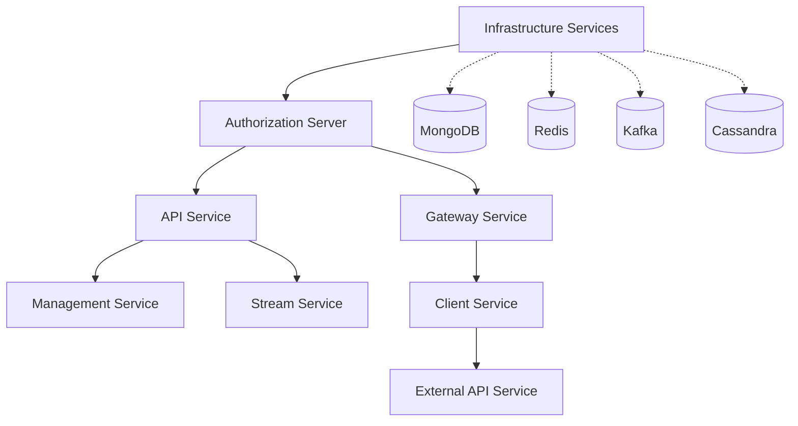

# Local Development Guide

This guide covers advanced local development workflows, debugging techniques, hot reloading, and development optimizations for the OpenFrame platform.

> **Prerequisites**: Complete the [Environment Setup](environment.md) guide before proceeding.

## Development Workflow Overview

OpenFrame uses a microservices architecture that requires coordinated development across multiple services. This guide will help you work efficiently in this distributed environment.

### Service Startup Order

Services must be started in a specific order due to dependencies:



## Hot Reloading & Live Development

### Spring Boot DevTools

Enable automatic restart and live reload for faster development cycles.

#### Configure DevTools in each service

Add to each service's `pom.xml`:

```xml
<dependency>
    <groupId>org.springframework.boot</groupId>
    <artifactId>spring-boot-devtools</artifactId>
    <optional>true</optional>
</dependency>
```

#### IDE Configuration for Hot Reload

**IntelliJ IDEA:**
```text
File → Settings → Build, Execution, Deployment → Compiler
- Build project automatically: ✓

File → Settings → Advanced Settings  
- Allow auto-make to start even if developed application is currently running: ✓
```

**VS Code:**
Add to `.vscode/settings.json`:
```json
{
  "spring-boot.ls.java.vmargs": "-Dspring.devtools.restart.enabled=true",
  "java.compile.nullAnalysis.mode": "automatic",
  "java.autobuild.enabled": true
}
```

### File Watching Configuration

Configure Spring Boot DevTools for optimal performance:

**`application-development.yml`:**
```yaml
spring:
  devtools:
    restart:
      enabled: true
      additional-paths: src/main/java
      exclude: static/**,public/**,templates/**
      poll-interval: 1000
      quiet-period: 400
    livereload:
      enabled: true
      port: 35729
```

## Advanced Development Setup

### Multi-Service Development with Foreman

Use Foreman to manage multiple services from a single terminal.

#### Install Foreman

```bash
# macOS
brew install foreman

# Linux (Ruby required)
gem install foreman

# Windows
choco install foreman
```

#### Create Procfile

Create `Procfile` in your project root:

```procfile
# Infrastructure (run separately with docker-compose)
# infrastructure: docker-compose up -d

# Core Services (in dependency order)
auth: cd openframe/services/openframe-authorization-server && mvn spring-boot:run -Dspring-boot.run.profiles=development,local -Dspring-boot.run.jvmArguments="-Xmx1g"
api: sleep 15 && cd openframe/services/openframe-api && mvn spring-boot:run -Dspring-boot.run.profiles=development,local -Dspring-boot.run.jvmArguments="-Xmx1g"
gateway: sleep 20 && cd openframe/services/openframe-gateway && mvn spring-boot:run -Dspring-boot.run.profiles=development,local -Dspring-boot.run.jvmArguments="-Xmx1g"
management: sleep 25 && cd openframe/services/openframe-management && mvn spring-boot:run -Dspring-boot.run.profiles=development,local -Dspring-boot.run.jvmArguments="-Xmx1g"
stream: sleep 30 && cd openframe/services/openframe-stream && mvn spring-boot:run -Dspring-boot.run.profiles=development,local -Dspring-boot.run.jvmArguments="-Xmx1g"
client: sleep 35 && cd openframe/services/openframe-client && mvn spring-boot:run -Dspring-boot.run.profiles=development,local -Dspring-boot.run.jvmArguments="-Xmx1g"
external: sleep 40 && cd openframe/services/openframe-external-api && mvn spring-boot:run -Dspring-boot.run.profiles=development,local -Dspring-boot.run.jvmArguments="-Xmx1g"

# Frontend (if applicable)
frontend: sleep 45 && cd openframe/services/openframe-frontend && npm run dev
```

#### Run All Services

```bash
# Start infrastructure first
docker-compose up -d

# Wait for infrastructure to be ready
sleep 30

# Start all application services
foreman start
```

### Development with Docker Compose

For a more isolated development environment, use Docker Compose profiles.

#### Create Development Docker Compose

**`docker-compose.dev.yml`:**
```yaml
version: '3.8'

services:
  # Extend base services with development overrides
  openframe-api:
    extends:
      file: docker-compose.yml
      service: openframe-api
    environment:
      SPRING_PROFILES_ACTIVE: development,docker
      SPRING_DEVTOOLS_RESTART_ENABLED: true
    volumes:
      - ./openframe/services/openframe-api/src:/app/src
      - ./openframe/services/openframe-api/target/classes:/app/target/classes
    command: ["mvn", "spring-boot:run", "-Dspring-boot.run.profiles=development,docker"]
    ports:
      - "8080:8080"
      - "5005:5005"  # Debug port

  openframe-gateway:
    extends:
      file: docker-compose.yml
      service: openframe-gateway
    environment:
      SPRING_PROFILES_ACTIVE: development,docker
    volumes:
      - ./openframe/services/openframe-gateway/src:/app/src
      - ./openframe/services/openframe-gateway/target/classes:/app/target/classes
    ports:
      - "8081:8081"
      - "5006:5005"  # Debug port
```

#### Run Development Environment

```bash
# Start with development overrides
docker-compose -f docker-compose.yml -f docker-compose.dev.yml up -d
```

## Debugging Configuration

### Remote Debugging with IntelliJ IDEA

#### Configure Debug Settings

1. **Create Remote Debug Configuration:**
   ```text
   Run → Edit Configurations → + → Remote JVM Debug
   
   Configuration:
   - Name: OpenFrame API Debug
   - Host: localhost
   - Port: 5005
   - Command line arguments: -agentlib:jdwp=transport=dt_socket,server=y,suspend=n,address=*:5005
   ```

2. **Start Service with Debug Options:**
   ```bash
   cd openframe/services/openframe-api
   mvn spring-boot:run \
     -Dspring-boot.run.profiles=development,local \
     -Dspring-boot.run.jvmArguments="-agentlib:jdwp=transport=dt_socket,server=y,suspend=n,address=*:5005"
   ```

3. **Attach Debugger:**
   - Set breakpoints in your code
   - Run the remote debug configuration
   - IntelliJ will connect to the running service

#### Debug Multiple Services

Configure different debug ports for each service:

```bash
# Authorization Server (port 5005)
mvn spring-boot:run -Dspring-boot.run.jvmArguments="-agentlib:jdwp=transport=dt_socket,server=y,suspend=n,address=*:5005"

# API Service (port 5006)  
mvn spring-boot:run -Dspring-boot.run.jvmArguments="-agentlib:jdwp=transport=dt_socket,server=y,suspend=n,address=*:5006"

# Gateway Service (port 5007)
mvn spring-boot:run -Dspring-boot.run.jvmArguments="-agentlib:jdwp=transport=dt_socket,server=y,suspend=n,address=*:5007"
```

### VS Code Debugging

#### Configure Launch Settings

**`.vscode/launch.json`:**
```json
{
  "version": "0.2.0",
  "configurations": [
    {
      "type": "java",
      "name": "Debug API Service",
      "request": "attach",
      "hostName": "localhost",
      "port": 5005,
      "projectName": "openframe-api"
    },
    {
      "type": "java", 
      "name": "Debug Gateway Service",
      "request": "attach",
      "hostName": "localhost", 
      "port": 5007,
      "projectName": "openframe-gateway"
    }
  ]
}
```

### Distributed Debugging

When debugging across multiple services, use correlation IDs to trace requests:

#### Enable Request Tracing

**`application-development.yml`:**
```yaml
logging:
  level:
    com.openframe: DEBUG
    org.springframework.web: DEBUG
    org.springframework.security: DEBUG
  pattern:
    console: "%d{HH:mm:ss.SSS} [%thread] [%X{traceId}] %-5level %logger{36} - %msg%n"

management:
  tracing:
    sampling:
      probability: 1.0
```

#### Add Correlation ID Filter

```java
@Component
@Order(1)
public class CorrelationIdFilter implements Filter {
    
    private static final String CORRELATION_ID_HEADER = "X-Correlation-ID";
    private static final String CORRELATION_ID_MDC = "correlationId";
    
    @Override
    public void doFilter(ServletRequest request, ServletResponse response, 
                        FilterChain chain) throws IOException, ServletException {
        HttpServletRequest httpRequest = (HttpServletRequest) request;
        HttpServletResponse httpResponse = (HttpServletResponse) response;
        
        String correlationId = httpRequest.getHeader(CORRELATION_ID_HEADER);
        if (correlationId == null) {
            correlationId = UUID.randomUUID().toString();
        }
        
        MDC.put(CORRELATION_ID_MDC, correlationId);
        httpResponse.setHeader(CORRELATION_ID_HEADER, correlationId);
        
        try {
            chain.doFilter(request, response);
        } finally {
            MDC.remove(CORRELATION_ID_MDC);
        }
    }
}
```

## Database Development Workflow

### MongoDB Development

#### Use MongoDB Compass for Development

```bash
# Connection string
mongodb://localhost:27017

# Switch to development database
use openframe-dev

# Common development queries
db.users.find().pretty()
db.organizations.find().pretty()  
db.devices.find().pretty()
```

#### Database Seeding Script

Create `scripts/seed-dev-data.js`:

```javascript
// MongoDB seed script for development
use openframe-dev;

// Create test organization
db.organizations.insertOne({
  _id: ObjectId(),
  name: "Dev Test Organization",
  domain: "dev-test.local",
  contactEmail: "admin@dev-test.local",
  status: "ACTIVE",
  createdAt: new Date(),
  updatedAt: new Date()
});

// Create test user
db.users.insertOne({
  _id: ObjectId(),
  email: "developer@openframe.local",
  firstName: "Dev",
  lastName: "User",
  status: "ACTIVE",
  roles: ["ADMIN"],
  organizationId: db.organizations.findOne()._id,
  createdAt: new Date()
});

print("Development data seeded successfully!");
```

Run the seed script:
```bash
docker exec -i openframe-mongodb mongosh < scripts/seed-dev-data.js
```

### Redis Development

Use Redis CLI for cache debugging:

```bash
# Connect to Redis
docker exec -it openframe-redis redis-cli

# Common development commands
KEYS *
GET "session:*"
FLUSHDB  # Clear all keys (development only!)
MONITOR  # Watch all Redis commands in real-time
```

## Testing During Development

### Continuous Testing

Set up continuous testing to run tests automatically:

```bash
# Install entr for file watching (macOS)
brew install entr

# Watch for changes and run tests
find src/main/java src/test/java -name "*.java" | entr -c mvn test
```

### Quick Test Feedback

Create aliases for fast test execution:

```bash
# Add to shell profile
alias test-api='cd openframe/services/openframe-api && mvn test -Dtest=*Test'
alias test-gateway='cd openframe/services/openframe-gateway && mvn test -Dtest=*Test' 
alias test-auth='cd openframe/services/openframe-authorization-server && mvn test -Dtest=*Test'

# Run specific test class
alias test-class='mvn test -Dtest='

# Example usage
test-class UserServiceTest
```

### Integration Testing in Development

#### Test with Real Services

```bash
# Start infrastructure
docker-compose up -d mongodb redis kafka

# Start minimal service set for integration testing
./scripts/run-service.sh auth test &
./scripts/run-service.sh api test &
./scripts/run-service.sh gateway test &

# Run integration tests
mvn verify -P integration-tests -Dspring.profiles.active=test
```

## Development Monitoring & Observability

### Application Metrics Dashboard

Access development metrics:

| Service | Health Check | Metrics | Info |
|---------|-------------|---------|------|
| **API Service** | http://localhost:8080/actuator/health | http://localhost:8080/actuator/metrics | http://localhost:8080/actuator/info |
| **Gateway** | http://localhost:8081/actuator/health | http://localhost:8081/actuator/metrics | http://localhost:8081/actuator/info |
| **Auth Server** | http://localhost:8082/actuator/health | http://localhost:8082/actuator/metrics | http://localhost:8082/actuator/info |

### Custom Development Endpoints

Add development-only endpoints for debugging:

```java
@RestController
@RequestMapping("/dev")
@Profile("development")
public class DevController {
    
    @GetMapping("/cache/clear")
    public ResponseEntity<String> clearCache() {
        cacheManager.getCacheNames().forEach(name -> 
            Objects.requireNonNull(cacheManager.getCache(name)).clear());
        return ResponseEntity.ok("Cache cleared");
    }
    
    @GetMapping("/db/seed")
    public ResponseEntity<String> seedDatabase() {
        // Seed development data
        return ResponseEntity.ok("Database seeded");
    }
    
    @GetMapping("/tokens/generate")
    public ResponseEntity<String> generateTestToken() {
        // Generate test JWT token
        return ResponseEntity.ok(jwtService.generateTestToken());
    }
}
```

## Performance Optimization for Development

### JVM Tuning for Development

Add to your service startup scripts:

```bash
export JAVA_OPTS="\
  -Xmx2g \
  -Xms512m \
  -XX:+UseG1GC \
  -XX:+UseStringDeduplication \
  -XX:MaxGCPauseMillis=200 \
  -Dspring.devtools.restart.enabled=true \
  -Dspring.devtools.livereload.enabled=true"
```

### Maven Build Optimization

**`.mvn/maven.config`:**
```
-T 1C
-Dmaven.artifact.threads=8
-Dorg.slf4j.simpleLogger.log.org.apache.maven.cli.transfer.Slf4jMavenTransferListener=warn
```

### Selective Service Development

When working on specific features, you may not need all services running:

#### Frontend Development Only
```bash
# Minimal backend for frontend work
docker-compose up -d mongodb redis
./scripts/run-service.sh auth &
./scripts/run-service.sh api &
./scripts/run-service.sh gateway &

# Start frontend
cd openframe/services/openframe-frontend
npm run dev
```

#### API Development Only
```bash
# Backend services without frontend
docker-compose up -d mongodb redis kafka
./scripts/run-service.sh auth &
./scripts/run-service.sh api &

# Test API directly
curl -k https://localhost:8080/actuator/health
```

## Troubleshooting Common Development Issues

### Service Startup Problems

**Issue: Services fail to start due to port conflicts**
```bash
# Kill processes on OpenFrame ports
pkill -f "spring-boot:run"
lsof -ti :8080,8081,8082 | xargs kill -9
```

**Issue: Database connection failures**
```bash
# Check database containers
docker-compose ps
docker-compose logs mongodb

# Reset databases if needed
docker-compose down -v
docker-compose up -d mongodb redis kafka
```

### Maven Build Issues

**Issue: Compilation failures after git pull**
```bash
# Clean and rebuild everything
mvn clean install -DskipTests -T 1C

# If that fails, clear local repository
rm -rf ~/.m2/repository/com/openframe
mvn clean install -DskipTests
```

**Issue: Test failures in development**
```bash
# Run tests with clean slate
mvn clean test -Dspring.profiles.active=test

# Skip integration tests during development
mvn clean test -DexcludeGroups=integration
```

### Development Environment Reset

When your development environment gets into a bad state:

```bash
#!/bin/bash
# Reset development environment script

echo "Stopping all services..."
pkill -f spring-boot:run
docker-compose down -v

echo "Cleaning Maven artifacts..."
mvn clean -q

echo "Starting fresh infrastructure..."
docker-compose up -d

echo "Waiting for infrastructure..."
sleep 30

echo "Environment reset complete!"
echo "You can now start services with: foreman start"
```

## Next Steps

With your local development environment fully optimized, explore:

1. **[Architecture Overview](../architecture/README.md)** - Deep dive into system design
2. **[Security Best Practices](../security/README.md)** - Understand security patterns
3. **[Testing Strategies](../testing/README.md)** - Master testing approaches  
4. **[Contributing Guidelines](../contributing/guidelines.md)** - Learn the contribution process

You now have a powerful, efficient OpenFrame development workflow! 🚀