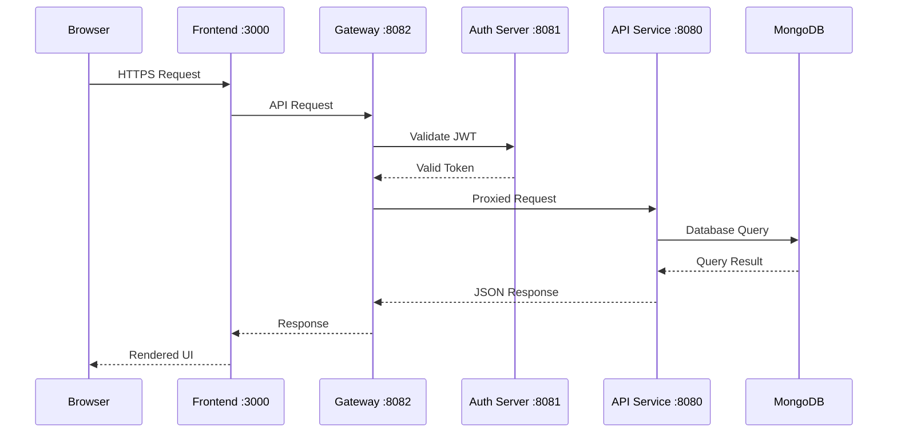

# Local Development Guide

This guide covers cloning the OpenFrame repository, building the project, and running all services locally for development.

## Prerequisites

Before starting, ensure you have completed:

1. ✅ **[Prerequisites](../../getting-started/prerequisites.md)** - System requirements and software installation
2. ✅ **[Environment Setup](environment.md)** - IDE and development tools configuration

## Project Structure Overview

```text
openframe-oss-tenant/
├── openframe/
│   └── services/                    # Spring Boot microservices
│       ├── openframe-api/          # Core API service
│       ├── openframe-authorization-server/  # OAuth2/OIDC server
│       ├── openframe-gateway/      # API Gateway
│       ├── openframe-frontend/     # Next.js frontend app
│       ├── openframe-client/       # Agent communication
│       ├── openframe-stream/       # Event processing
│       └── openframe-management/   # System management
├── clients/
│   ├── openframe-client/           # Rust agent client
│   └── openframe-chat/            # Tauri chat client
├── integrated-tools/               # Tool integrations
├── manifests/                      # Deployment manifests
├── pom.xml                        # Parent Maven POM
└── README.md
```

## Step 1: Clone Repository

```bash
# Clone the repository
git clone https://github.com/your-org/openframe-oss-tenant.git
cd openframe-oss-tenant

# Verify repository structure
ls -la
```

## Step 2: Environment Configuration

### Set Development Environment Variables

Create a development environment configuration:

```bash
# Create environment file
cat > .env.development << 'EOF'
# Database Configuration
MONGO_URI=mongodb://localhost:27017
MONGO_DATABASE=openframe_dev

# Application URLs
OPENFRAME_BASE_URL=https://localhost:3000
API_BASE_URL=https://localhost:8080
AUTHORIZATION_SERVER_URL=https://localhost:8081
GATEWAY_URL=https://localhost:8082

# Security  
JWT_SECRET=development-secret-key-change-in-production

# Spring Profiles
SPRING_PROFILES_ACTIVE=dev

# Node.js Environment
NODE_ENV=development

# Debug Settings
DEBUG=true
LOGGING_LEVEL_COM_OPENFRAME=DEBUG
EOF

# Load environment variables
export $(cat .env.development | xargs)
```

### Validate Environment

```bash
# Run environment validation
./scripts/validate-env.sh

# Expected output:
# ✅ MongoDB connection successful
# ✅ All required environment variables set
# Environment validation complete!
```

## Step 3: Initialize Development Database

### Start MongoDB

```bash
# Ubuntu/Debian
sudo systemctl start mongod

# macOS
brew services start mongodb/brew/mongodb-community

# Verify MongoDB is running
mongosh --eval "db.version()"
```

### Initialize Database Schema

```bash
# Run database initialization script
./scripts/init-dev-database.sh

# This script will:
# - Create development database
# - Initialize collections
# - Insert default test data
# - Create indexes
```

## Step 4: Backend Services Setup

### Build All Services

```bash
# Clean and build all Maven modules
mvn clean install -DskipTests

# Expected output:
# [INFO] OpenFrame Platform .......................... SUCCESS
# [INFO] ------------------------------------------------------------------------
# [INFO] BUILD SUCCESS
```

### Start Backend Services

Open separate terminal windows/tabs for each service:

**Terminal 1 - Authorization Server:**
```bash
cd openframe-oss-tenant

# Start authorization server
mvn spring-boot:run \
  -pl openframe/services/openframe-authorization-server \
  -Dspring-boot.run.profiles=dev \
  -Dserver.port=8081

# Wait for startup message:
# Started OpenFrameAuthorizationServerApplication in X seconds
```

**Terminal 2 - API Service:**
```bash
cd openframe-oss-tenant

# Start API service
mvn spring-boot:run \
  -pl openframe/services/openframe-api \
  -Dspring-boot.run.profiles=dev \
  -Dserver.port=8080

# Wait for startup message:
# Started ApiApplication in X seconds
```

**Terminal 3 - Gateway Service:**
```bash
cd openframe-oss-tenant

# Start gateway service
mvn spring-boot:run \
  -pl openframe/services/openframe-gateway \
  -Dspring-boot.run.profiles=dev \
  -Dserver.port=8082

# Wait for startup message:  
# Started GatewayApplication in X seconds
```

### Verify Backend Services

```bash
# Check service health endpoints
curl -k https://localhost:8081/actuator/health  # Authorization Server
curl -k https://localhost:8080/actuator/health  # API Service  
curl -k https://localhost:8082/actuator/health  # Gateway

# Expected response for each:
# {"status":"UP"}
```

## Step 5: Frontend Setup

### Install Dependencies

```bash
# Navigate to frontend directory
cd openframe/services/openframe-frontend

# Install npm dependencies
npm install

# Expected output:
# added XXX packages in Xs
```

### Configure Frontend Environment

```bash
# Create frontend-specific environment file
cat > .env.local << 'EOF'
# Next.js Configuration
NODE_ENV=development
PORT=3000

# API URLs
NEXT_PUBLIC_API_URL=https://localhost:8082
NEXT_PUBLIC_AUTH_URL=https://localhost:8081

# WebSocket URL
NEXT_PUBLIC_WEBSOCKET_URL=wss://localhost:8082

# Feature Flags
NEXT_PUBLIC_ENABLE_MINGO=true
NEXT_PUBLIC_ENABLE_DEBUG=true

# Development Settings
NEXT_PUBLIC_SHOW_DEBUG_INFO=true
NEXT_PUBLIC_DISABLE_SSR=false
EOF
```

### Start Frontend Development Server

**Terminal 4 - Frontend:**
```bash
cd openframe/services/openframe-frontend

# Start Next.js development server
npm run dev

# Expected output:
# Local:        https://localhost:3000
# ready - started server on 0.0.0.0:3000
```

## Step 6: Verification and Testing

### Access the Application

1. **Open browser** and navigate to: `https://localhost:3000`
2. **Accept SSL certificate** (for development certificate)
3. **Login with default credentials**:
   - Email: `admin@example.com`
   - Password: `admin123`

### Test Core Functionality

**Dashboard Test:**
```bash
# API test - Get dashboard stats
curl -k -H "Authorization: Bearer YOUR_TOKEN" \
  https://localhost:8082/api/dashboard/stats

# Expected: JSON response with dashboard statistics
```

**GraphQL Test:**
```bash
# GraphQL introspection query
curl -k -X POST \
  -H "Content-Type: application/json" \
  -H "Authorization: Bearer YOUR_TOKEN" \
  -d '{"query":"query IntrospectionQuery{__schema{queryType{name}}}"}' \
  https://localhost:8082/graphql

# Expected: GraphQL schema information
```

**WebSocket Test:**
```javascript
// Test in browser console
const ws = new WebSocket('wss://localhost:8082/ws');
ws.onopen = () => console.log('WebSocket connected');
ws.onmessage = (msg) => console.log('Message:', msg.data);
```

## Step 7: Optional Services

### Stream Service (for Event Processing)

**Terminal 5 - Stream Service:**
```bash
# Start Kafka first (if using event streaming)
cd kafka_2.13-3.6.0
bin/zookeeper-server-start.sh config/zookeeper.properties &
bin/kafka-server-start.sh config/server.properties &

# Start Stream Service
cd openframe-oss-tenant
mvn spring-boot:run \
  -pl openframe/services/openframe-stream \
  -Dspring-boot.run.profiles=dev \
  -Dserver.port=8084
```

### Management Service (for System Tasks)

**Terminal 6 - Management Service:**
```bash
mvn spring-boot:run \
  -pl openframe/services/openframe-management \
  -Dspring-boot.run.profiles=dev \
  -Dserver.port=8085
```

### Client Service (for Agent Communication)

**Terminal 7 - Client Service:**
```bash
# Start NATS server first
nats-server &

# Start Client Service
mvn spring-boot:run \
  -pl openframe/services/openframe-client \
  -Dspring-boot.run.profiles=dev \
  -Dserver.port=8083
```

## Development Workflow

### Hot Reload Configuration

**Backend Hot Reload:**
Spring Boot DevTools enables automatic restarts when classpath changes are detected.

```xml
<!-- Already included in parent POM -->
<dependency>
    <groupId>org.springframework.boot</groupId>
    <artifactId>spring-boot-devtools</artifactId>
    <scope>runtime</scope>
    <optional>true</optional>
</dependency>
```

**Frontend Hot Reload:**
Next.js Fast Refresh automatically updates the UI when files change.

```bash
# Hot reload is enabled by default
npm run dev
```

### Watch Mode for Development

**Continuous Backend Testing:**
```bash
# Run tests in watch mode
mvn test -Dspring-boot.run.profiles=test -Dtest.watch=true
```

**Frontend Watch Mode:**
```bash
# TypeScript compilation in watch mode
cd openframe/services/openframe-frontend
npx tsc --watch

# ESLint watch mode  
npx eslint --watch src/
```

### Database Development Tools

**MongoDB Compass GUI:**
```bash
# Connect to development database
mongodb-compass mongodb://localhost:27017/openframe_dev
```

**MongoDB Shell Commands:**
```bash
# Connect to development database
mongosh openframe_dev

# Show collections
show collections

# Query users
db.users.find().pretty()

# Query devices
db.devices.find({status: "ONLINE"}).pretty()
```

## Service Communication Flow



## Development Scripts

Create helpful development scripts in `scripts/dev/`:

**`scripts/dev/start-backend.sh`:**
```bash
#!/bin/bash
set -e

echo "Starting backend services..."

# Start services in background
mvn spring-boot:run -pl openframe/services/openframe-authorization-server -Dspring-boot.run.profiles=dev -Dserver.port=8081 &
sleep 10

mvn spring-boot:run -pl openframe/services/openframe-api -Dspring-boot.run.profiles=dev -Dserver.port=8080 &
sleep 10

mvn spring-boot:run -pl openframe/services/openframe-gateway -Dspring-boot.run.profiles=dev -Dserver.port=8082 &

echo "Backend services started!"
echo "Authorization Server: https://localhost:8081"
echo "API Service: https://localhost:8080"  
echo "Gateway: https://localhost:8082"
```

**`scripts/dev/stop-backend.sh`:**
```bash
#!/bin/bash
echo "Stopping backend services..."

# Find and kill Spring Boot processes
pkill -f "spring-boot:run"

echo "Backend services stopped!"
```

**`scripts/dev/logs.sh`:**
```bash
#!/bin/bash
# Tail logs from all services
tail -f logs/openframe-*.log
```

## IDE Integration

### IntelliJ IDEA Run Configurations

Create run configurations for each service:

1. **Go to Run** → **Edit Configurations**
2. **Add New** → **Maven**
3. **Configure each service**:

| Name | Working Directory | Command Line |
|------|------------------|--------------|
| Auth Server | `$PROJECT_DIR$` | `spring-boot:run -pl openframe/services/openframe-authorization-server -Dspring-boot.run.profiles=dev` |
| API Service | `$PROJECT_DIR$` | `spring-boot:run -pl openframe/services/openframe-api -Dspring-boot.run.profiles=dev` |
| Gateway | `$PROJECT_DIR$` | `spring-boot:run -pl openframe/services/openframe-gateway -Dspring-boot.run.profiles=dev` |

### VS Code Tasks

Create `.vscode/tasks.json`:
```json
{
  "version": "2.0.0",
  "tasks": [
    {
      "label": "Start Backend Services",
      "type": "shell",
      "command": "./scripts/dev/start-backend.sh",
      "group": "build",
      "presentation": {
        "echo": true,
        "reveal": "always",
        "focus": false,
        "panel": "shared"
      }
    },
    {
      "label": "Start Frontend",
      "type": "shell",
      "command": "npm run dev",
      "options": {
        "cwd": "${workspaceFolder}/openframe/services/openframe-frontend"
      },
      "group": "build"
    }
  ]
}
```

## Troubleshooting Local Development

### Common Issues and Solutions

**Port conflicts:**
```bash
# Check what's using a port
sudo lsof -i :8080

# Kill specific process
kill -9 <PID>

# Or kill all Java processes
pkill -f java
```

**MongoDB connection issues:**
```bash
# Check MongoDB status
sudo systemctl status mongod

# Restart MongoDB
sudo systemctl restart mongod

# Check MongoDB logs
sudo tail -f /var/log/mongodb/mongod.log
```

**SSL certificate errors:**
```bash
# Trust development certificates
mkcert -install

# Regenerate certificates
rm localhost*.pem
mkcert localhost 127.0.0.1 ::1
```

**Build failures:**
```bash
# Clean everything and rebuild
mvn clean install -DskipTests

# Clear Node.js cache
cd openframe/services/openframe-frontend
rm -rf node_modules package-lock.json
npm cache clean --force
npm install
```

**Memory issues:**
```bash
# Increase Maven memory
export MAVEN_OPTS="-Xmx2G -XX:MaxMetaspaceSize=512m"

# Increase Node.js memory
export NODE_OPTIONS="--max-old-space-size=4096"
```

### Performance Optimization

**Backend JVM tuning:**
```bash
export JAVA_OPTS="
  -Xmx2G 
  -Xms1G 
  -XX:+UseG1GC 
  -XX:+UseStringDeduplication
  -Dspring.jmx.enabled=false
"
```

**Frontend optimization:**
```bash
# Use turbo mode for faster builds
npm run dev:turbo
```

### Debugging

**Backend debugging:**
```bash
# Enable remote debugging on port 5005
mvn spring-boot:run -pl openframe/services/openframe-api \
  -Dspring-boot.run.jvmArguments="-agentlib:jdwp=transport=dt_socket,server=y,suspend=n,address=5005"
```

**Frontend debugging:**
```bash
# Enable React dev tools
export NODE_ENV=development
npm run dev
```

## Next Steps

With local development running:

1. **[Testing Guide](../testing/README.md)** - Learn how to run and write tests
2. **[Architecture Overview](../architecture/README.md)** - Understand system design
3. **[Contributing Guidelines](../contributing/guidelines.md)** - Start contributing
4. **[Security Best Practices](../security/README.md)** - Secure development practices

## Quick Reference Commands

```bash
# Start everything
./scripts/dev/start-all.sh

# Stop everything  
./scripts/dev/stop-all.sh

# Rebuild and restart
./scripts/dev/rebuild-restart.sh

# View all logs
./scripts/dev/tail-logs.sh

# Database shell
mongosh openframe_dev

# Health check all services
./scripts/dev/health-check.sh
```

Happy developing! 🚀 Join our [OpenMSP Slack community](https://join.slack.com/t/openmsp/shared_invite/zt-36bl7mx0h-3~U2nFH6nqHqoTPXMaHEHA) for development support.