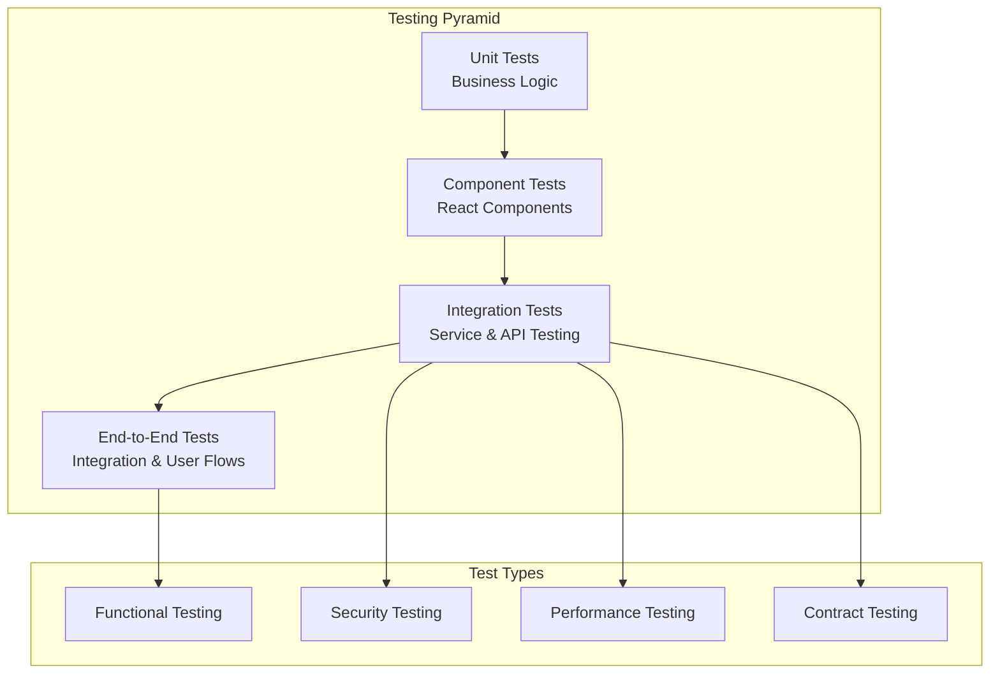

# Testing Guide

This comprehensive guide covers testing strategies, frameworks, and best practices for the OpenFrame platform. Testing is integrated into every aspect of the development lifecycle to ensure reliability, security, and performance.

## Testing Philosophy

OpenFrame follows a **test-driven development (TDD)** approach with comprehensive coverage across all layers:



## Test Structure and Organization

### Backend Testing Structure

```text
src/test/java/
├── unit/                           # Unit tests
│   ├── service/                   # Service layer tests
│   ├── repository/                # Repository tests
│   ├── mapper/                    # Mapping logic tests
│   └── util/                      # Utility class tests
├── integration/                    # Integration tests
│   ├── api/                      # REST API tests
│   ├── graphql/                  # GraphQL tests
│   ├── database/                 # Database integration
│   └── security/                 # Security integration tests
├── e2e/                           # End-to-end tests
│   ├── scenarios/                # User workflow tests
│   └── performance/              # Performance tests
└── testcontainers/                # Container-based tests
    ├── mongodb/                  # MongoDB test containers
    ├── kafka/                    # Kafka test containers
    └── redis/                    # Redis test containers
```

### Frontend Testing Structure

```text
src/
├── __tests__/                     # Test files
│   ├── components/               # Component tests
│   ├── pages/                    # Page tests
│   ├── hooks/                    # Custom hook tests
│   ├── utils/                    # Utility function tests
│   └── integration/              # Integration tests
├── __mocks__/                     # Manual mocks
│   ├── __mocks__/               # Module mocks
│   └── fixtures/                 # Test data fixtures
└── cypress/                       # E2E tests
    ├── e2e/                     # End-to-end test specs
    ├── fixtures/                 # Test data
    └── support/                  # Support files
```

## Unit Testing

### Backend Unit Tests (Java)

**Service Layer Testing:**

```java
@ExtendWith(MockitoExtension.class)
class DeviceServiceTest {
    
    @Mock
    private DeviceRepository deviceRepository;
    
    @Mock
    private OrganizationService organizationService;
    
    @Mock
    private AuditService auditService;
    
    @InjectMocks
    private DeviceService deviceService;
    
    @Test
    @DisplayName("Should create device successfully")
    void shouldCreateDeviceSuccessfully() {
        // Given
        String tenantId = "tenant-123";
        String organizationId = "org-456";
        CreateDeviceRequest request = CreateDeviceRequest.builder()
            .deviceName("Test Device")
            .deviceType(DeviceType.DESKTOP)
            .organizationId(organizationId)
            .build();
            
        Organization organization = Organization.builder()
            .id(organizationId)
            .tenantId(tenantId)
            .name("Test Organization")
            .build();
            
        Device savedDevice = Device.builder()
            .id("device-789")
            .tenantId(tenantId)
            .organizationId(organizationId)
            .deviceName("Test Device")
            .deviceType(DeviceType.DESKTOP)
            .status(DeviceStatus.PENDING)
            .build();
        
        when(organizationService.findById(organizationId)).thenReturn(organization);
        when(deviceRepository.save(any(Device.class))).thenReturn(savedDevice);
        
        // When
        Device result = deviceService.createDevice(request);
        
        // Then
        assertThat(result).isNotNull();
        assertThat(result.getId()).isEqualTo("device-789");
        assertThat(result.getDeviceName()).isEqualTo("Test Device");
        assertThat(result.getStatus()).isEqualTo(DeviceStatus.PENDING);
        
        verify(deviceRepository).save(argThat(device -> 
            device.getTenantId().equals(tenantId) &&
            device.getOrganizationId().equals(organizationId) &&
            device.getDeviceName().equals("Test Device")
        ));
        
        verify(auditService).logDeviceCreation(savedDevice);
    }
    
    @Test
    @DisplayName("Should throw exception when organization not found")
    void shouldThrowExceptionWhenOrganizationNotFound() {
        // Given
        CreateDeviceRequest request = CreateDeviceRequest.builder()
            .organizationId("non-existent-org")
            .build();
            
        when(organizationService.findById("non-existent-org"))
            .thenThrow(new OrganizationNotFoundException("non-existent-org"));
        
        // When & Then
        assertThatThrownBy(() -> deviceService.createDevice(request))
            .isInstanceOf(OrganizationNotFoundException.class)
            .hasMessage("Organization not found: non-existent-org");
            
        verify(deviceRepository, never()).save(any(Device.class));
    }
}
```

**Repository Testing with TestContainers:**

```java
@DataMongoTest
@TestPropertySource(properties = {
    "spring.mongodb.embedded.version=6.0.0"
})
class DeviceRepositoryTest {
    
    @Autowired
    private TestEntityManager entityManager;
    
    @Autowired
    private DeviceRepository deviceRepository;
    
    private static final String TENANT_ID = "test-tenant";
    private static final String ORG_ID = "test-org";
    
    @Test
    @DisplayName("Should find devices by organization and status")
    void shouldFindDevicesByOrganizationAndStatus() {
        // Given
        Device onlineDevice = createTestDevice("device-1", DeviceStatus.ONLINE);
        Device offlineDevice = createTestDevice("device-2", DeviceStatus.OFFLINE);
        Device pendingDevice = createTestDevice("device-3", DeviceStatus.PENDING);
        
        entityManager.persist(onlineDevice);
        entityManager.persist(offlineDevice);
        entityManager.persist(pendingDevice);
        entityManager.flush();
        
        // When
        List<Device> onlineDevices = deviceRepository
            .findByTenantIdAndOrganizationIdAndStatus(TENANT_ID, ORG_ID, DeviceStatus.ONLINE);
        
        // Then
        assertThat(onlineDevices).hasSize(1);
        assertThat(onlineDevices.get(0).getId()).isEqualTo("device-1");
        assertThat(onlineDevices.get(0).getStatus()).isEqualTo(DeviceStatus.ONLINE);
    }
    
    @Test
    @DisplayName("Should respect tenant isolation in queries")
    void shouldRespectTenantIsolation() {
        // Given
        Device tenant1Device = Device.builder()
            .id("device-tenant1")
            .tenantId("tenant-1")
            .organizationId(ORG_ID)
            .deviceName("Tenant 1 Device")
            .status(DeviceStatus.ONLINE)
            .build();
            
        Device tenant2Device = Device.builder()
            .id("device-tenant2")
            .tenantId("tenant-2")
            .organizationId(ORG_ID)
            .deviceName("Tenant 2 Device")
            .status(DeviceStatus.ONLINE)
            .build();
            
        entityManager.persist(tenant1Device);
        entityManager.persist(tenant2Device);
        entityManager.flush();
        
        // When
        List<Device> tenant1Devices = deviceRepository
            .findByTenantIdAndOrganizationId("tenant-1", ORG_ID);
        
        // Then
        assertThat(tenant1Devices).hasSize(1);
        assertThat(tenant1Devices.get(0).getTenantId()).isEqualTo("tenant-1");
        assertThat(tenant1Devices.get(0).getDeviceName()).isEqualTo("Tenant 1 Device");
    }
    
    private Device createTestDevice(String deviceId, DeviceStatus status) {
        return Device.builder()
            .id(deviceId)
            .tenantId(TENANT_ID)
            .organizationId(ORG_ID)
            .deviceName("Test Device " + deviceId)
            .deviceType(DeviceType.DESKTOP)
            .status(status)
            .createdAt(Instant.now())
            .build();
    }
}
```

### Frontend Unit Tests (React/TypeScript)

**Component Testing with React Testing Library:**

```typescript
// DeviceCard.test.tsx
import { render, screen, fireEvent, waitFor } from '@testing-library/react';
import userEvent from '@testing-library/user-event';
import { QueryClient, QueryClientProvider } from '@tanstack/react-query';
import { DeviceCard } from '../DeviceCard';
import { Device, DeviceStatus } from '@/types/device';

const mockDevice: Device = {
  id: 'device-123',
  deviceName: 'Test Device',
  deviceType: 'DESKTOP',
  status: DeviceStatus.ONLINE,
  organizationId: 'org-456',
  lastSeen: new Date('2024-01-01T10:00:00Z'),
  ipAddress: '192.168.1.100',
  operatingSystem: 'Windows 11',
};

const renderWithQueryClient = (component: React.ReactElement) => {
  const queryClient = new QueryClient({
    defaultOptions: {
      queries: { retry: false },
      mutations: { retry: false },
    },
  });
  
  return render(
    <QueryClientProvider client={queryClient}>
      {component}
    </QueryClientProvider>
  );
};

describe('DeviceCard', () => {
  test('should render device information correctly', () => {
    renderWithQueryClient(<DeviceCard device={mockDevice} />);
    
    expect(screen.getByText('Test Device')).toBeInTheDocument();
    expect(screen.getByText('DESKTOP')).toBeInTheDocument();
    expect(screen.getByText('192.168.1.100')).toBeInTheDocument();
    expect(screen.getByText('Windows 11')).toBeInTheDocument();
  });
  
  test('should display online status with correct styling', () => {
    renderWithQueryClient(<DeviceCard device={mockDevice} />);
    
    const statusBadge = screen.getByTestId('device-status');
    expect(statusBadge).toHaveTextContent('ONLINE');
    expect(statusBadge).toHaveClass('bg-green-100', 'text-green-800');
  });
  
  test('should handle device action menu', async () => {
    const user = userEvent.setup();
    renderWithQueryClient(<DeviceCard device={mockDevice} />);
    
    const actionButton = screen.getByRole('button', { name: /device actions/i });
    await user.click(actionButton);
    
    expect(screen.getByRole('menuitem', { name: /restart/i })).toBeInTheDocument();
    expect(screen.getByRole('menuitem', { name: /update/i })).toBeInTheDocument();
    expect(screen.getByRole('menuitem', { name: /remove/i })).toBeInTheDocument();
  });
  
  test('should call onDeviceUpdate when restart action is clicked', async () => {
    const onDeviceUpdate = jest.fn();
    const user = userEvent.setup();
    
    renderWithQueryClient(
      <DeviceCard device={mockDevice} onDeviceUpdate={onDeviceUpdate} />
    );
    
    const actionButton = screen.getByRole('button', { name: /device actions/i });
    await user.click(actionButton);
    
    const restartButton = screen.getByRole('menuitem', { name: /restart/i });
    await user.click(restartButton);
    
    await waitFor(() => {
      expect(onDeviceUpdate).toHaveBeenCalledWith(mockDevice.id, 'restart');
    });
  });
});
```

**Custom Hook Testing:**

```typescript
// useDevices.test.ts
import { renderHook, waitFor } from '@testing-library/react';
import { QueryClient, QueryClientProvider } from '@tanstack/react-query';
import { useDevices } from '../useDevices';
import { DeviceFilters } from '@/types/device';
import { devicesApi } from '@/services/devicesApi';

jest.mock('@/services/devicesApi');
const mockDevicesApi = devicesApi as jest.Mocked<typeof devicesApi>;

const createWrapper = () => {
  const queryClient = new QueryClient({
    defaultOptions: {
      queries: { retry: false },
      mutations: { retry: false },
    },
  });
  
  return ({ children }: { children: React.ReactNode }) => (
    <QueryClientProvider client={queryClient}>
      {children}
    </QueryClientProvider>
  );
};

describe('useDevices', () => {
  beforeEach(() => {
    jest.clearAllMocks();
  });
  
  test('should fetch devices successfully', async () => {
    const mockDevices = [
      { id: '1', deviceName: 'Device 1', status: 'ONLINE' },
      { id: '2', deviceName: 'Device 2', status: 'OFFLINE' },
    ];
    
    mockDevicesApi.getDevices.mockResolvedValue({
      devices: mockDevices,
      totalCount: 2,
      hasNextPage: false,
    });
    
    const { result } = renderHook(
      () => useDevices({ organizationId: 'org-123' }),
      { wrapper: createWrapper() }
    );
    
    await waitFor(() => {
      expect(result.current.isSuccess).toBe(true);
    });
    
    expect(result.current.devices).toEqual(mockDevices);
    expect(result.current.totalCount).toBe(2);
    expect(mockDevicesApi.getDevices).toHaveBeenCalledWith({
      organizationId: 'org-123',
      cursor: undefined,
      limit: 20,
      filters: undefined,
    });
  });
  
  test('should handle API errors gracefully', async () => {
    const mockError = new Error('API Error');
    mockDevicesApi.getDevices.mockRejectedValue(mockError);
    
    const { result } = renderHook(
      () => useDevices({ organizationId: 'org-123' }),
      { wrapper: createWrapper() }
    );
    
    await waitFor(() => {
      expect(result.current.isError).toBe(true);
    });
    
    expect(result.current.error).toBe(mockError);
  });
});
```

## Integration Testing

### API Integration Tests

```java
@SpringBootTest(webEnvironment = SpringBootTest.WebEnvironment.RANDOM_PORT)
@TestPropertySource(properties = {
    "spring.datasource.url=jdbc:h2:mem:testdb",
    "spring.profiles.active=test"
})
class DeviceControllerIntegrationTest {
    
    @Autowired
    private TestRestTemplate restTemplate;
    
    @Autowired
    private DeviceRepository deviceRepository;
    
    @Autowired
    private JwtService jwtService;
    
    private String authToken;
    private String tenantId = "test-tenant";
    private String organizationId = "test-org";
    
    @BeforeEach
    void setUp() {
        // Generate test JWT token
        authToken = jwtService.generateToken(
            User.builder()
                .id("user-123")
                .email("test@example.com")
                .tenantId(tenantId)
                .organizationId(organizationId)
                .roles(Set.of(Role.ORGANIZATION_ADMIN))
                .build()
        );
    }
    
    @Test
    @DisplayName("Should create device via REST API")
    void shouldCreateDeviceViaRestApi() {
        // Given
        CreateDeviceRequest request = CreateDeviceRequest.builder()
            .deviceName("Integration Test Device")
            .deviceType(DeviceType.LAPTOP)
            .organizationId(organizationId)
            .ipAddress("192.168.1.200")
            .build();
        
        HttpHeaders headers = new HttpHeaders();
        headers.setBearerAuth(authToken);
        headers.setContentType(MediaType.APPLICATION_JSON);
        
        HttpEntity<CreateDeviceRequest> entity = new HttpEntity<>(request, headers);
        
        // When
        ResponseEntity<DeviceResponse> response = restTemplate.postForEntity(
            "/api/devices",
            entity,
            DeviceResponse.class
        );
        
        // Then
        assertThat(response.getStatusCode()).isEqualTo(HttpStatus.CREATED);
        assertThat(response.getBody()).isNotNull();
        assertThat(response.getBody().getDeviceName()).isEqualTo("Integration Test Device");
        assertThat(response.getBody().getTenantId()).isEqualTo(tenantId);
        
        // Verify database persistence
        Optional<Device> savedDevice = deviceRepository.findById(response.getBody().getId());
        assertThat(savedDevice).isPresent();
        assertThat(savedDevice.get().getDeviceName()).isEqualTo("Integration Test Device");
    }
    
    @Test
    @DisplayName("Should return 401 for unauthenticated requests")
    void shouldReturn401ForUnauthenticatedRequests() {
        // Given
        CreateDeviceRequest request = CreateDeviceRequest.builder()
            .deviceName("Unauthorized Device")
            .build();
        
        // When
        ResponseEntity<String> response = restTemplate.postForEntity(
            "/api/devices",
            request,
            String.class
        );
        
        // Then
        assertThat(response.getStatusCode()).isEqualTo(HttpStatus.UNAUTHORIZED);
    }
    
    @Test
    @DisplayName("Should prevent cross-tenant access")
    void shouldPreventCrossTenantAccess() {
        // Given - Create device for different tenant
        Device otherTenantDevice = Device.builder()
            .id("other-device")
            .tenantId("other-tenant")
            .organizationId("other-org")
            .deviceName("Other Tenant Device")
            .build();
        deviceRepository.save(otherTenantDevice);
        
        HttpHeaders headers = new HttpHeaders();
        headers.setBearerAuth(authToken);
        
        HttpEntity<?> entity = new HttpEntity<>(headers);
        
        // When
        ResponseEntity<String> response = restTemplate.exchange(
            "/api/devices/other-device",
            HttpMethod.GET,
            entity,
            String.class
        );
        
        // Then
        assertThat(response.getStatusCode()).isEqualTo(HttpStatus.FORBIDDEN);
    }
}
```

### GraphQL Integration Tests

```java
@SpringBootTest
@AutoConfigureTestDatabase(replace = AutoConfigureTestDatabase.Replace.NONE)
@TestPropertySource(properties = {
    "spring.profiles.active=test"
})
class DeviceGraphQLIntegrationTest {
    
    @Autowired
    private DgsQueryExecutor queryExecutor;
    
    @MockBean
    private DeviceService deviceService;
    
    @Test
    @DisplayName("Should execute devices query successfully")
    void shouldExecuteDevicesQuerySuccessfully() {
        // Given
        List<Device> mockDevices = Arrays.asList(
            Device.builder().id("1").deviceName("Device 1").build(),
            Device.builder().id("2").deviceName("Device 2").build()
        );
        
        DeviceConnection mockConnection = DeviceConnection.builder()
            .devices(mockDevices)
            .totalCount(2)
            .hasNextPage(false)
            .build();
        
        when(deviceService.getDevices(any(DeviceFilters.class), any(PaginationCriteria.class)))
            .thenReturn(mockConnection);
        
        // When
        ExecutionResult result = queryExecutor.execute("""
            query GetDevices($organizationId: ID!, $first: Int) {
                devices(organizationId: $organizationId, first: $first) {
                    devices {
                        id
                        deviceName
                    }
                    totalCount
                    hasNextPage
                }
            }
        """, Map.of("organizationId", "org-123", "first", 10));
        
        // Then
        assertThat(result.getErrors()).isEmpty();
        
        Map<String, Object> data = result.getData();
        Map<String, Object> devicesData = (Map<String, Object>) data.get("devices");
        
        assertThat(devicesData.get("totalCount")).isEqualTo(2);
        assertThat(devicesData.get("hasNextPage")).isEqualTo(false);
        
        List<Map<String, Object>> devices = (List<Map<String, Object>>) devicesData.get("devices");
        assertThat(devices).hasSize(2);
        assertThat(devices.get(0).get("deviceName")).isEqualTo("Device 1");
        assertThat(devices.get(1).get("deviceName")).isEqualTo("Device 2");
    }
}
```

## End-to-End Testing

### Cypress E2E Tests

```typescript
// cypress/e2e/device-management.cy.ts
describe('Device Management', () => {
  beforeEach(() => {
    // Login before each test
    cy.login('admin@example.com', 'admin123');
    
    // Intercept API calls
    cy.intercept('GET', '/api/devices*', {
      fixture: 'devices.json'
    }).as('getDevices');
    
    cy.intercept('POST', '/api/devices', {
      statusCode: 201,
      fixture: 'device-created.json'
    }).as('createDevice');
  });
  
  it('should display devices list', () => {
    cy.visit('/devices');
    
    cy.wait('@getDevices');
    
    cy.get('[data-testid="devices-table"]').should('be.visible');
    cy.get('[data-testid="device-row"]').should('have.length.at.least', 1);
    
    // Verify device information is displayed
    cy.get('[data-testid="device-row"]').first().within(() => {
      cy.get('[data-testid="device-name"]').should('contain', 'Test Device 1');
      cy.get('[data-testid="device-status"]').should('contain', 'ONLINE');
      cy.get('[data-testid="device-ip"]').should('contain', '192.168.1.100');
    });
  });
  
  it('should create a new device', () => {
    cy.visit('/devices');
    
    // Click add device button
    cy.get('[data-testid="add-device-button"]').click();
    
    // Fill device form
    cy.get('[data-testid="device-name-input"]').type('New Test Device');
    cy.get('[data-testid="device-type-select"]').select('DESKTOP');
    cy.get('[data-testid="organization-select"]').select('Test Organization');
    cy.get('[data-testid="ip-address-input"]').type('192.168.1.201');
    
    // Submit form
    cy.get('[data-testid="create-device-button"]').click();
    
    cy.wait('@createDevice');
    
    // Verify success message
    cy.get('[data-testid="success-toast"]')
      .should('be.visible')
      .and('contain', 'Device created successfully');
    
    // Verify redirect to devices list
    cy.url().should('include', '/devices');
  });
  
  it('should handle device actions', () => {
    cy.visit('/devices');
    cy.wait('@getDevices');
    
    // Open device actions menu
    cy.get('[data-testid="device-row"]').first().within(() => {
      cy.get('[data-testid="device-actions-button"]').click();
    });
    
    // Verify menu options
    cy.get('[data-testid="device-actions-menu"]').should('be.visible');
    cy.get('[data-testid="restart-device-action"]').should('be.visible');
    cy.get('[data-testid="update-device-action"]').should('be.visible');
    cy.get('[data-testid="remove-device-action"]').should('be.visible');
    
    // Click restart action
    cy.intercept('POST', '/api/devices/*/restart', {
      statusCode: 200,
      body: { success: true }
    }).as('restartDevice');
    
    cy.get('[data-testid="restart-device-action"]').click();
    
    // Confirm restart in modal
    cy.get('[data-testid="confirm-restart-button"]').click();
    
    cy.wait('@restartDevice');
    
    // Verify success message
    cy.get('[data-testid="success-toast"]')
      .should('be.visible')
      .and('contain', 'Device restart initiated');
  });
  
  it('should filter devices by status', () => {
    cy.visit('/devices');
    cy.wait('@getDevices');
    
    // Apply status filter
    cy.get('[data-testid="status-filter"]').select('OFFLINE');
    
    cy.intercept('GET', '/api/devices*status=OFFLINE*', {
      fixture: 'devices-offline.json'
    }).as('getOfflineDevices');
    
    cy.wait('@getOfflineDevices');
    
    // Verify filtered results
    cy.get('[data-testid="device-row"]').each(($row) => {
      cy.wrap($row).find('[data-testid="device-status"]')
        .should('contain', 'OFFLINE');
    });
  });
});
```

### Cypress Custom Commands

```typescript
// cypress/support/commands.ts
declare global {
  namespace Cypress {
    interface Chainable {
      login(email: string, password: string): Chainable<void>;
      createDevice(deviceData: any): Chainable<void>;
      interceptDevicesAPI(): Chainable<void>;
    }
  }
}

Cypress.Commands.add('login', (email: string, password: string) => {
  cy.session([email, password], () => {
    cy.visit('/auth/login');
    
    cy.get('[data-testid="email-input"]').type(email);
    cy.get('[data-testid="password-input"]').type(password);
    cy.get('[data-testid="login-button"]').click();
    
    // Wait for successful login
    cy.url().should('not.include', '/auth/login');
    cy.window().its('localStorage.access_token').should('exist');
  });
});

Cypress.Commands.add('createDevice', (deviceData) => {
  cy.request({
    method: 'POST',
    url: '/api/devices',
    headers: {
      'Authorization': `Bearer ${window.localStorage.getItem('access_token')}`
    },
    body: deviceData
  });
});

Cypress.Commands.add('interceptDevicesAPI', () => {
  cy.intercept('GET', '/api/devices*', { fixture: 'devices.json' }).as('getDevices');
  cy.intercept('POST', '/api/devices', { fixture: 'device-created.json' }).as('createDevice');
  cy.intercept('PUT', '/api/devices/*', { fixture: 'device-updated.json' }).as('updateDevice');
  cy.intercept('DELETE', '/api/devices/*', { statusCode: 204 }).as('deleteDevice');
});
```

## Performance Testing

### Load Testing with K6

```javascript
// k6/load-test.js
import http from 'k6/http';
import { check, sleep } from 'k6';
import { Rate } from 'k6/metrics';

const errorRate = new Rate('errors');

export const options = {
  stages: [
    { duration: '2m', target: 100 },   // Ramp up to 100 users
    { duration: '5m', target: 100 },   // Stay at 100 users
    { duration: '2m', target: 200 },   // Ramp up to 200 users
    { duration: '5m', target: 200 },   // Stay at 200 users
    { duration: '2m', target: 0 },     // Ramp down to 0 users
  ],
  thresholds: {
    http_req_duration: ['p(95)<500'],  // 95% of requests under 500ms
    http_req_failed: ['rate<0.1'],     // Error rate under 10%
    errors: ['rate<0.1'],              // Custom error rate under 10%
  },
};

const BASE_URL = 'https://localhost:8080';
const API_TOKEN = 'your-test-api-token';

export function setup() {
  // Login and get access token
  const loginResponse = http.post(`${BASE_URL}/auth/login`, {
    email: 'test@example.com',
    password: 'testpassword123'
  });
  
  const accessToken = JSON.parse(loginResponse.body).accessToken;
  return { accessToken };
}

export default function (data) {
  const headers = {
    'Authorization': `Bearer ${data.accessToken}`,
    'Content-Type': 'application/json',
  };
  
  // Test device listing endpoint
  const devicesResponse = http.get(`${BASE_URL}/api/devices`, { headers });
  
  check(devicesResponse, {
    'devices API status is 200': (r) => r.status === 200,
    'devices API response time < 500ms': (r) => r.timings.duration < 500,
    'devices API returns valid JSON': (r) => {
      try {
        JSON.parse(r.body);
        return true;
      } catch (e) {
        return false;
      }
    },
  }) || errorRate.add(1);
  
  // Test device creation endpoint
  const createDevicePayload = {
    deviceName: `Load Test Device ${Math.random()}`,
    deviceType: 'DESKTOP',
    organizationId: 'org-123',
    ipAddress: `192.168.1.${Math.floor(Math.random() * 254) + 1}`,
  };
  
  const createResponse = http.post(
    `${BASE_URL}/api/devices`,
    JSON.stringify(createDevicePayload),
    { headers }
  );
  
  check(createResponse, {
    'create device status is 201': (r) => r.status === 201,
    'create device response time < 1000ms': (r) => r.timings.duration < 1000,
  }) || errorRate.add(1);
  
  sleep(1); // Wait 1 second between iterations
}

export function teardown(data) {
  // Cleanup test data if needed
}
```

### JMeter Performance Tests

```xml
<!-- devices-performance-test.jmx -->
<?xml version="1.0" encoding="UTF-8"?>
<jmeterTestPlan version="1.2" properties="5.0" jmeter="5.4.1">
  <hashTree>
    <TestPlan guiclass="TestPlanGui" testclass="TestPlan" testname="OpenFrame API Performance Test">
      <boolProp name="TestPlan.serialize_threadgroups">false</boolProp>
      <elementProp name="TestPlan.arguments" elementType="Arguments" guiclass="ArgumentsPanel" testclass="Arguments" testname="User Defined Variables">
        <collectionProp name="Arguments.arguments"/>
      </elementProp>
      <stringProp name="TestPlan.user_define_classpath"></stringProp>
    </TestPlan>
    <hashTree>
      <!-- Thread Group for API Load Testing -->
      <ThreadGroup guiclass="ThreadGroupGui" testclass="ThreadGroup" testname="API Load Test">
        <stringProp name="ThreadGroup.on_sample_error">continue</stringProp>
        <elementProp name="ThreadGroup.main_controller" elementType="LoopController" guiclass="LoopControlGui" testclass="LoopController" testname="Loop Controller">
          <boolProp name="LoopController.continue_forever">false</boolProp>
          <stringProp name="LoopController.loops">100</stringProp>
        </elementProp>
        <stringProp name="ThreadGroup.num_threads">50</stringProp>
        <stringProp name="ThreadGroup.ramp_time">60</stringProp>
      </ThreadGroup>
      <hashTree>
        <!-- HTTP Request for Device API -->
        <HTTPSamplerProxy guiclass="HttpTestSampleGui" testclass="HTTPSamplerProxy" testname="Get Devices API">
          <elementProp name="HTTPsampler.Arguments" elementType="Arguments" guiclass="HTTPArgumentsPanel" testclass="Arguments" testname="User Defined Variables">
            <collectionProp name="Arguments.arguments"/>
          </elementProp>
          <stringProp name="HTTPSampler.domain">localhost</stringProp>
          <stringProp name="HTTPSampler.port">8080</stringProp>
          <stringProp name="HTTPSampler.protocol">https</stringProp>
          <stringProp name="HTTPSampler.contentEncoding"></stringProp>
          <stringProp name="HTTPSampler.path">/api/devices</stringProp>
          <stringProp name="HTTPSampler.method">GET</stringProp>
          <boolProp name="HTTPSampler.follow_redirects">true</boolProp>
          <boolProp name="HTTPSampler.auto_redirects">false</boolProp>
          <boolProp name="HTTPSampler.use_keepalive">true</boolProp>
        </HTTPSamplerProxy>
      </hashTree>
    </hashTree>
  </hashTree>
</jmeterTestPlan>
```

## Test Coverage and Quality

### Coverage Requirements

**Backend Coverage Targets:**
- **Unit Tests**: Minimum 80% line coverage, 70% branch coverage
- **Integration Tests**: Critical business paths 100% covered
- **Service Layer**: 90% method coverage
- **Repository Layer**: 85% method coverage

**Frontend Coverage Targets:**
- **Component Tests**: 80% line coverage
- **Hook Tests**: 90% line coverage
- **Utility Functions**: 95% line coverage
- **Critical User Flows**: 100% covered

### Coverage Configuration

**Backend (JaCoCo):**

```xml
<plugin>
    <groupId>org.jacoco</groupId>
    <artifactId>jacoco-maven-plugin</artifactId>
    <version>0.8.8</version>
    <executions>
        <execution>
            <goals>
                <goal>prepare-agent</goal>
            </goals>
        </execution>
        <execution>
            <id>report</id>
            <phase>test</phase>
            <goals>
                <goal>report</goal>
            </goals>
        </execution>
        <execution>
            <id>check</id>
            <goals>
                <goal>check</goal>
            </goals>
            <configuration>
                <rules>
                    <rule>
                        <element>BUNDLE</element>
                        <limits>
                            <limit>
                                <counter>LINE</counter>
                                <value>COVEREDRATIO</value>
                                <minimum>0.80</minimum>
                            </limit>
                            <limit>
                                <counter>BRANCH</counter>
                                <value>COVEREDRATIO</value>
                                <minimum>0.70</minimum>
                            </limit>
                        </limits>
                    </rule>
                </rules>
            </configuration>
        </execution>
    </executions>
</plugin>
```

**Frontend (Jest Coverage):**

```javascript
// jest.config.js
module.exports = {
  collectCoverageFrom: [
    'src/**/*.{ts,tsx}',
    '!src/**/*.d.ts',
    '!src/**/*.stories.{ts,tsx}',
    '!src/**/index.ts',
  ],
  coverageThreshold: {
    global: {
      lines: 80,
      functions: 80,
      branches: 70,
      statements: 80,
    },
    './src/components/': {
      lines: 80,
      functions: 80,
      branches: 70,
      statements: 80,
    },
    './src/hooks/': {
      lines: 90,
      functions: 90,
      branches: 80,
      statements: 90,
    },
  },
  coverageReporters: ['text', 'lcov', 'html'],
};
```

## Test Data Management

### Test Fixtures

**Backend Test Data:**

```java
@Component
public class TestDataBuilder {
    
    public static Device createTestDevice() {
        return Device.builder()
            .id(UUID.randomUUID().toString())
            .tenantId("test-tenant")
            .organizationId("test-org")
            .deviceName("Test Device")
            .deviceType(DeviceType.DESKTOP)
            .status(DeviceStatus.ONLINE)
            .ipAddress("192.168.1.100")
            .operatingSystem("Windows 11")
            .createdAt(Instant.now())
            .build();
    }
    
    public static User createTestUser() {
        return User.builder()
            .id(UUID.randomUUID().toString())
            .tenantId("test-tenant")
            .email("test@example.com")
            .firstName("Test")
            .lastName("User")
            .roles(Set.of(Role.ORGANIZATION_ADMIN))
            .status(UserStatus.ACTIVE)
            .createdAt(Instant.now())
            .build();
    }
}
```

**Frontend Test Data:**

```typescript
// fixtures/devices.json
{
  "devices": [
    {
      "id": "device-1",
      "deviceName": "Test Device 1",
      "deviceType": "DESKTOP",
      "status": "ONLINE",
      "organizationId": "org-123",
      "ipAddress": "192.168.1.100",
      "operatingSystem": "Windows 11",
      "lastSeen": "2024-01-01T10:00:00Z"
    },
    {
      "id": "device-2", 
      "deviceName": "Test Device 2",
      "deviceType": "LAPTOP",
      "status": "OFFLINE",
      "organizationId": "org-123",
      "ipAddress": "192.168.1.101",
      "operatingSystem": "macOS 13.0",
      "lastSeen": "2024-01-01T09:30:00Z"
    }
  ],
  "totalCount": 2,
  "hasNextPage": false
}
```

## Continuous Integration Testing

### GitHub Actions Workflow

```yaml
# .github/workflows/test.yml
name: Test Suite

on:
  push:
    branches: [main, develop]
  pull_request:
    branches: [main]

jobs:
  backend-tests:
    runs-on: ubuntu-latest
    
    services:
      mongodb:
        image: mongo:6.0
        env:
          MONGO_INITDB_ROOT_USERNAME: test
          MONGO_INITDB_ROOT_PASSWORD: test
        ports:
          - 27017:27017
          
      redis:
        image: redis:7.0
        ports:
          - 6379:6379
    
    steps:
      - uses: actions/checkout@v3
      
      - name: Set up JDK 21
        uses: actions/setup-java@v3
        with:
          java-version: '21'
          distribution: 'temurin'
          
      - name: Cache Maven dependencies
        uses: actions/cache@v3
        with:
          path: ~/.m2
          key: ${{ runner.os }}-m2-${{ hashFiles('**/pom.xml') }}
          restore-keys: ${{ runner.os }}-m2
          
      - name: Run unit tests
        run: mvn test
        
      - name: Run integration tests
        run: mvn verify -Pintegration-tests
        
      - name: Generate test report
        uses: dorny/test-reporter@v1
        if: success() || failure()
        with:
          name: Backend Tests
          path: target/surefire-reports/*.xml
          reporter: java-junit
          
      - name: Upload coverage reports
        uses: codecov/codecov-action@v3
        with:
          file: target/site/jacoco/jacoco.xml
          
  frontend-tests:
    runs-on: ubuntu-latest
    
    steps:
      - uses: actions/checkout@v3
      
      - name: Setup Node.js
        uses: actions/setup-node@v3
        with:
          node-version: '18'
          cache: 'npm'
          cache-dependency-path: 'openframe/services/openframe-frontend/package-lock.json'
          
      - name: Install dependencies
        working-directory: openframe/services/openframe-frontend
        run: npm ci
        
      - name: Run unit tests
        working-directory: openframe/services/openframe-frontend
        run: npm run test:coverage
        
      - name: Upload coverage reports
        uses: codecov/codecov-action@v3
        with:
          file: openframe/services/openframe-frontend/coverage/lcov.info
          
  e2e-tests:
    runs-on: ubuntu-latest
    needs: [backend-tests, frontend-tests]
    
    steps:
      - uses: actions/checkout@v3
      
      - name: Start services
        run: docker-compose -f docker-compose.test.yml up -d
        
      - name: Wait for services
        run: ./scripts/wait-for-services.sh
        
      - name: Run Cypress tests
        uses: cypress-io/github-action@v4
        with:
          working-directory: openframe/services/openframe-frontend
          start: npm run dev
          wait-on: 'https://localhost:3000'
          
      - name: Upload Cypress screenshots
        uses: actions/upload-artifact@v3
        if: failure()
        with:
          name: cypress-screenshots
          path: openframe/services/openframe-frontend/cypress/screenshots
```

## Testing Best Practices

### Test Naming Conventions

**Backend Test Naming:**
```text
Pattern: should{ExpectedBehavior}When{StateUnderTest}

Examples:
- shouldCreateDeviceSuccessfullyWhenValidRequestProvided()
- shouldThrowExceptionWhenDeviceNotFound()
- shouldReturnEmptyListWhenNoDevicesExist()
```

**Frontend Test Naming:**
```text
Pattern: should {expected behavior} [when {conditions}]

Examples:
- should render device information correctly
- should handle loading state when fetching devices
- should display error message when API request fails
```

### Test Organization Principles

1. **AAA Pattern**: Arrange, Act, Assert
2. **Single Responsibility**: Each test verifies one behavior
3. **Independent Tests**: No dependencies between tests
4. **Descriptive Names**: Clear intent and expected outcome
5. **Fail Fast**: Stop execution on first failure in CI

### Mock and Stub Guidelines

```java
// Good: Mock external dependencies
@Mock
private DeviceRepository deviceRepository;

@Mock 
private ExternalApiClient externalApiClient;

// Bad: Mock internal logic
// Don't mock the class under test
```

```typescript
// Good: Mock API calls
jest.mock('@/services/api');

// Bad: Mock React internals
// Don't mock React hooks or core functionality
```

## Running Tests

### Backend Tests

```bash
# Run all tests
mvn test

# Run specific test class
mvn test -Dtest=DeviceServiceTest

# Run tests with coverage
mvn test jacoco:report

# Run integration tests
mvn verify -Pintegration-tests

# Run tests with specific profile
mvn test -Dspring.profiles.active=test
```

### Frontend Tests

```bash
cd openframe/services/openframe-frontend

# Run all tests
npm test

# Run tests in watch mode
npm run test:watch

# Run tests with coverage
npm run test:coverage

# Run specific test file
npm test -- DeviceCard.test.tsx

# Update snapshots
npm test -- --updateSnapshot
```

### E2E Tests

```bash
cd openframe/services/openframe-frontend

# Run Cypress tests headlessly
npm run cypress:run

# Open Cypress GUI
npm run cypress:open

# Run specific spec
npm run cypress:run -- --spec "cypress/e2e/devices.cy.ts"
```

## Next Steps

To master testing in OpenFrame:

1. **[Security Testing](../security/README.md)** - Security-focused testing strategies
2. **[Contributing Guidelines](../contributing/guidelines.md)** - Code quality and review process  
3. **[CI/CD Pipeline](../deployment/ci-cd.md)** - Automated testing in deployment pipeline

## Testing Resources

- **Jest Documentation**: https://jestjs.io/docs/getting-started
- **React Testing Library**: https://testing-library.com/docs/react-testing-library/intro
- **Spring Boot Testing**: https://spring.io/guides/gs/testing-web/
- **Cypress Documentation**: https://docs.cypress.io/

Join our [OpenMSP Slack community](https://join.slack.com/t/openmsp/shared_invite/zt-36bl7mx0h-3~U2nFH6nqHqoTPXMaHEHA) to discuss testing strategies and get help with test implementation!