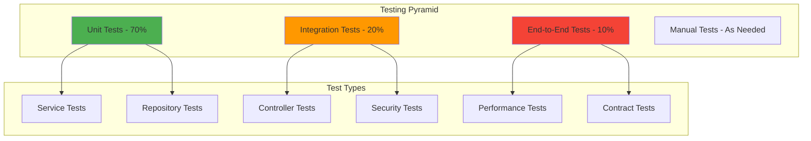

# Testing Overview

Testing is a critical aspect of OpenFrame OSS Tenant's development process. This guide covers the comprehensive testing strategy, test structure organization, test execution procedures, and best practices for writing effective tests in a multi-tenant microservices environment.

## Testing Strategy

OpenFrame implements a multi-layered testing approach following the testing pyramid principle:



## Test Structure and Organization

### Project Test Structure

```text
openframe-oss-tenant/
├── openframe/services/openframe-api/
│   └── src/test/java/com/openframe/api/
│       ├── controller/          # Controller layer tests
│       ├── service/             # Business logic tests
│       ├── repository/          # Data access tests
│       ├── security/            # Security tests
│       ├── integration/         # Integration tests
│       └── TestConstants.java   # Test constants and utilities
├── openframe/services/openframe-frontend/
│   └── src/
│       ├── __tests__/           # React component tests
│       ├── __mocks__/           # Mock implementations
│       └── test-utils/          # Testing utilities
└── tests/
    ├── e2e/                     # End-to-end tests
    ├── performance/             # Performance tests
    └── contracts/               # Contract tests
```

### Test Categories

| Category | Scope | Technology | Coverage |
|----------|--------|------------|----------|
| **Unit Tests** | Individual components, services, utilities | JUnit 5, Mockito, Jest | 70% |
| **Integration Tests** | Service interactions, database operations | Spring Boot Test, Testcontainers | 20% |
| **End-to-End Tests** | Complete user workflows | Playwright, RestAssured | 10% |
| **Security Tests** | Authentication, authorization, vulnerabilities | Spring Security Test | Critical paths |
| **Performance Tests** | Load testing, stress testing | JMeter, k6 | Critical endpoints |
| **Contract Tests** | API contract verification | Pact, Spring Cloud Contract | All APIs |

## Unit Testing

### Service Layer Testing

```java
@ExtendWith(MockitoExtension.class)
class UserServiceTest {
    
    @Mock
    private UserRepository userRepository;
    
    @Mock
    private OrganizationService organizationService;
    
    @Mock
    private EventPublisher eventPublisher;
    
    @InjectMocks
    private UserService userService;
    
    @Test
    @DisplayName("Should create user successfully with valid input")
    void shouldCreateUserSuccessfully() {
        // Given
        CreateUserRequest request = CreateUserRequest.builder()
            .email("test@example.com")
            .firstName("John")
            .lastName("Doe")
            .tenantId("tenant-123")
            .build();
            
        User expectedUser = User.builder()
            .id("user-456")
            .email("test@example.com")
            .firstName("John")
            .lastName("Doe")
            .tenantId("tenant-123")
            .status(UserStatus.ACTIVE)
            .build();
            
        when(userRepository.existsByEmailAndTenantId("test@example.com", "tenant-123"))
            .thenReturn(false);
        when(organizationService.validateOrganizationAccess("tenant-123", request.getOrganizationId()))
            .thenReturn(true);
        when(userRepository.save(any(User.class)))
            .thenReturn(expectedUser);
            
        // When
        User result = userService.createUser(request);
        
        // Then
        assertThat(result).isNotNull();
        assertThat(result.getEmail()).isEqualTo("test@example.com");
        assertThat(result.getTenantId()).isEqualTo("tenant-123");
        assertThat(result.getStatus()).isEqualTo(UserStatus.ACTIVE);
        
        verify(eventPublisher).publishEvent(any(UserCreatedEvent.class));
        verify(userRepository).save(argThat(user -> 
            user.getEmail().equals("test@example.com") &&
            user.getTenantId().equals("tenant-123")
        ));
    }
    
    @Test
    @DisplayName("Should throw exception when user already exists")
    void shouldThrowExceptionWhenUserExists() {
        // Given
        CreateUserRequest request = CreateUserRequest.builder()
            .email("existing@example.com")
            .tenantId("tenant-123")
            .build();
            
        when(userRepository.existsByEmailAndTenantId("existing@example.com", "tenant-123"))
            .thenReturn(true);
            
        // When & Then
        assertThatThrownBy(() -> userService.createUser(request))
            .isInstanceOf(UserAlreadyExistsException.class)
            .hasMessage("User with email existing@example.com already exists in tenant");
            
        verify(userRepository, never()).save(any(User.class));
        verify(eventPublisher, never()).publishEvent(any());
    }
    
    @Test
    @DisplayName("Should enforce tenant isolation in user queries")
    void shouldEnforceTenantIsolation() {
        // Given
        String tenantId = "tenant-123";
        String otherTenantId = "tenant-456";
        
        List<User> tenantUsers = List.of(
            User.builder().id("user-1").tenantId(tenantId).build(),
            User.builder().id("user-2").tenantId(tenantId).build()
        );
        
        when(userRepository.findByTenantId(tenantId))
            .thenReturn(tenantUsers);
            
        // When
        List<User> result = userService.findUsersByTenant(tenantId);
        
        // Then
        assertThat(result).hasSize(2);
        assertThat(result).allMatch(user -> user.getTenantId().equals(tenantId));
        
        verify(userRepository).findByTenantId(tenantId);
        verify(userRepository, never()).findByTenantId(otherTenantId);
    }
}
```

### Repository Testing

```java
@DataMongoTest
@TestPropertySource(properties = {
    "spring.mongodb.embedded.version=4.4.0"
})
class UserRepositoryTest {
    
    @Autowired
    private TestEntityManager entityManager;
    
    @Autowired
    private UserRepository userRepository;
    
    @Test
    @DisplayName("Should find users by tenant ID")
    void shouldFindUsersByTenantId() {
        // Given
        String tenantId = "tenant-123";
        User user1 = createTestUser("user1@example.com", tenantId);
        User user2 = createTestUser("user2@example.com", tenantId);
        User otherTenantUser = createTestUser("other@example.com", "tenant-456");
        
        entityManager.save(user1);
        entityManager.save(user2);
        entityManager.save(otherTenantUser);
        entityManager.flush();
        
        // When
        List<User> result = userRepository.findByTenantId(tenantId);
        
        // Then
        assertThat(result).hasSize(2);
        assertThat(result).extracting(User::getEmail)
            .containsExactlyInAnyOrder("user1@example.com", "user2@example.com");
        assertThat(result).allMatch(user -> user.getTenantId().equals(tenantId));
    }
    
    @Test
    @DisplayName("Should check user existence by email and tenant")
    void shouldCheckUserExistence() {
        // Given
        String email = "test@example.com";
        String tenantId = "tenant-123";
        User user = createTestUser(email, tenantId);
        entityManager.save(user);
        entityManager.flush();
        
        // When & Then
        assertThat(userRepository.existsByEmailAndTenantId(email, tenantId)).isTrue();
        assertThat(userRepository.existsByEmailAndTenantId(email, "other-tenant")).isFalse();
        assertThat(userRepository.existsByEmailAndTenantId("other@example.com", tenantId)).isFalse();
    }
    
    @Test
    @DisplayName("Should find active users with pagination")
    void shouldFindActiveUsersWithPagination() {
        // Given
        String tenantId = "tenant-123";
        for (int i = 1; i <= 15; i++) {
            User user = createTestUser("user" + i + "@example.com", tenantId);
            user.setStatus(i <= 10 ? UserStatus.ACTIVE : UserStatus.INACTIVE);
            entityManager.save(user);
        }
        entityManager.flush();
        
        Pageable pageable = PageRequest.of(0, 5, Sort.by("email"));
        
        // When
        Page<User> result = userRepository.findByTenantIdAndStatus(tenantId, UserStatus.ACTIVE, pageable);
        
        // Then
        assertThat(result.getTotalElements()).isEqualTo(10);
        assertThat(result.getContent()).hasSize(5);
        assertThat(result.getTotalPages()).isEqualTo(2);
        assertThat(result.getContent()).allMatch(user -> user.getStatus() == UserStatus.ACTIVE);
    }
    
    private User createTestUser(String email, String tenantId) {
        return User.builder()
            .email(email)
            .firstName("Test")
            .lastName("User")
            .tenantId(tenantId)
            .status(UserStatus.ACTIVE)
            .roles(Set.of("USER"))
            .createdAt(Instant.now())
            .build();
    }
}
```

### Controller Testing

```java
@WebMvcTest(UserController.class)
@Import({SecurityConfig.class, JwtConfig.class})
class UserControllerTest {
    
    @Autowired
    private MockMvc mockMvc;
    
    @MockBean
    private UserService userService;
    
    @MockBean
    private JwtDecoder jwtDecoder;
    
    private String validJwtToken;
    
    @BeforeEach
    void setUp() {
        validJwtToken = createValidJwtToken("tenant-123", "user-456", List.of("ROLE_ADMIN"));
        
        Jwt jwt = Jwt.withTokenValue(validJwtToken)
            .header("alg", "RS256")
            .claim("sub", "user-456")
            .claim("tenant_id", "tenant-123")
            .claim("scope", "read write")
            .claim("authorities", List.of("ROLE_ADMIN"))
            .build();
            
        when(jwtDecoder.decode(validJwtToken)).thenReturn(jwt);
    }
    
    @Test
    @DisplayName("Should create user with valid request and admin role")
    void shouldCreateUserWithValidRequest() throws Exception {
        // Given
        CreateUserRequest request = CreateUserRequest.builder()
            .email("newuser@example.com")
            .firstName("New")
            .lastName("User")
            .organizationId("org-123")
            .build();
            
        User createdUser = User.builder()
            .id("user-789")
            .email("newuser@example.com")
            .firstName("New")
            .lastName("User")
            .tenantId("tenant-123")
            .status(UserStatus.ACTIVE)
            .build();
            
        when(userService.createUser(any(CreateUserRequest.class)))
            .thenReturn(createdUser);
            
        // When & Then
        mockMvc.perform(post("/api/users")
                .header("Authorization", "Bearer " + validJwtToken)
                .contentType(MediaType.APPLICATION_JSON)
                .content(objectMapper.writeValueAsString(request)))
                .andExpect(status().isCreated())
                .andExpect(jsonPath("$.id").value("user-789"))
                .andExpect(jsonPath("$.email").value("newuser@example.com"))
                .andExpect(jsonPath("$.tenantId").value("tenant-123"));
                
        verify(userService).createUser(argThat(req -> 
            req.getEmail().equals("newuser@example.com") &&
            req.getTenantId().equals("tenant-123")
        ));
    }
    
    @Test
    @DisplayName("Should return 400 for invalid email format")
    void shouldReturnBadRequestForInvalidEmail() throws Exception {
        // Given
        CreateUserRequest request = CreateUserRequest.builder()
            .email("invalid-email")
            .firstName("Test")
            .lastName("User")
            .build();
            
        // When & Then
        mockMvc.perform(post("/api/users")
                .header("Authorization", "Bearer " + validJwtToken)
                .contentType(MediaType.APPLICATION_JSON)
                .content(objectMapper.writeValueAsString(request)))
                .andExpect(status().isBadRequest())
                .andExpect(jsonPath("$.errors[?(@.field == 'email')].message")
                    .value(containsString("Invalid email format")));
                    
        verify(userService, never()).createUser(any());
    }
    
    @Test
    @DisplayName("Should return 403 when user lacks admin role")
    void shouldReturnForbiddenWithoutAdminRole() throws Exception {
        // Given
        String userToken = createValidJwtToken("tenant-123", "user-456", List.of("ROLE_USER"));
        
        Jwt jwt = Jwt.withTokenValue(userToken)
            .header("alg", "RS256")
            .claim("sub", "user-456")
            .claim("tenant_id", "tenant-123")
            .claim("authorities", List.of("ROLE_USER"))
            .build();
            
        when(jwtDecoder.decode(userToken)).thenReturn(jwt);
        
        CreateUserRequest request = CreateUserRequest.builder()
            .email("test@example.com")
            .firstName("Test")
            .lastName("User")
            .build();
            
        // When & Then
        mockMvc.perform(post("/api/users")
                .header("Authorization", "Bearer " + userToken)
                .contentType(MediaType.APPLICATION_JSON)
                .content(objectMapper.writeValueAsString(request)))
                .andExpect(status().isForbidden());
                
        verify(userService, never()).createUser(any());
    }
}
```

## Integration Testing

### Service Integration Tests

```java
@SpringBootTest(webEnvironment = SpringBootTest.WebEnvironment.RANDOM_PORT)
@Testcontainers
class UserServiceIntegrationTest {
    
    @Container
    static MongoDBContainer mongoDBContainer = new MongoDBContainer("mongo:5.0")
            .withExposedPorts(27017);
            
    @Container
    static GenericContainer<?> redisContainer = new GenericContainer<>("redis:7-alpine")
            .withExposedPorts(6379);
            
    @Autowired
    private TestRestTemplate restTemplate;
    
    @Autowired
    private UserService userService;
    
    @Autowired
    private UserRepository userRepository;
    
    @DynamicPropertySource
    static void configureProperties(DynamicPropertyRegistry registry) {
        registry.add("spring.data.mongodb.uri", mongoDBContainer::getReplicaSetUrl);
        registry.add("spring.redis.host", redisContainer::getHost);
        registry.add("spring.redis.port", () -> redisContainer.getMappedPort(6379));
    }
    
    @Test
    @DisplayName("Should handle complete user lifecycle")
    void shouldHandleCompleteUserLifecycle() {
        // Create user
        CreateUserRequest createRequest = CreateUserRequest.builder()
            .email("lifecycle@example.com")
            .firstName("Lifecycle")
            .lastName("Test")
            .tenantId("tenant-integration")
            .organizationId("org-123")
            .build();
            
        User createdUser = userService.createUser(createRequest);
        assertThat(createdUser).isNotNull();
        assertThat(createdUser.getId()).isNotNull();
        
        // Verify user exists in database
        Optional<User> dbUser = userRepository.findById(createdUser.getId());
        assertThat(dbUser).isPresent();
        assertThat(dbUser.get().getEmail()).isEqualTo("lifecycle@example.com");
        
        // Update user
        UpdateUserRequest updateRequest = UpdateUserRequest.builder()
            .firstName("Updated")
            .lastName("Name")
            .build();
            
        User updatedUser = userService.updateUser(createdUser.getId(), updateRequest);
        assertThat(updatedUser.getFirstName()).isEqualTo("Updated");
        assertThat(updatedUser.getLastName()).isEqualTo("Name");
        
        // Deactivate user
        User deactivatedUser = userService.deactivateUser(createdUser.getId());
        assertThat(deactivatedUser.getStatus()).isEqualTo(UserStatus.INACTIVE);
        
        // Verify user is deactivated in database
        Optional<User> finalDbUser = userRepository.findById(createdUser.getId());
        assertThat(finalDbUser).isPresent();
        assertThat(finalDbUser.get().getStatus()).isEqualTo(UserStatus.INACTIVE);
    }
    
    @Test
    @DisplayName("Should enforce tenant isolation in integration scenarios")
    void shouldEnforceTenantIsolation() {
        // Create users in different tenants
        User tenant1User = userService.createUser(CreateUserRequest.builder()
            .email("tenant1@example.com")
            .tenantId("tenant-1")
            .firstName("Tenant1")
            .lastName("User")
            .build());
            
        User tenant2User = userService.createUser(CreateUserRequest.builder()
            .email("tenant2@example.com")
            .tenantId("tenant-2")
            .firstName("Tenant2")
            .lastName("User")
            .build());
            
        // Verify tenant isolation
        List<User> tenant1Users = userService.findUsersByTenant("tenant-1");
        List<User> tenant2Users = userService.findUsersByTenant("tenant-2");
        
        assertThat(tenant1Users).hasSize(1);
        assertThat(tenant1Users.get(0).getEmail()).isEqualTo("tenant1@example.com");
        
        assertThat(tenant2Users).hasSize(1);
        assertThat(tenant2Users.get(0).getEmail()).isEqualTo("tenant2@example.com");
        
        // Verify cross-tenant access is blocked
        assertThatThrownBy(() -> userService.findUserByIdAndTenant(tenant1User.getId(), "tenant-2"))
            .isInstanceOf(UserNotFoundException.class);
    }
}
```

### Database Integration Tests

```java
@SpringBootTest
@Testcontainers
@Transactional
class DatabaseIntegrationTest {
    
    @Container
    static MongoDBContainer mongoDBContainer = new MongoDBContainer("mongo:5.0");
    
    @Autowired
    private MongoTemplate mongoTemplate;
    
    @Test
    @DisplayName("Should handle concurrent user creation")
    void shouldHandleConcurrentUserCreation() throws InterruptedException {
        String tenantId = "concurrent-tenant";
        int numberOfThreads = 10;
        CountDownLatch latch = new CountDownLatch(numberOfThreads);
        List<String> createdUserIds = Collections.synchronizedList(new ArrayList<>());
        List<Exception> exceptions = Collections.synchronizedList(new ArrayList<>());
        
        ExecutorService executor = Executors.newFixedThreadPool(numberOfThreads);
        
        for (int i = 0; i < numberOfThreads; i++) {
            final int userIndex = i;
            executor.submit(() -> {
                try {
                    User user = User.builder()
                        .email("concurrent" + userIndex + "@example.com")
                        .firstName("Concurrent" + userIndex)
                        .lastName("User")
                        .tenantId(tenantId)
                        .status(UserStatus.ACTIVE)
                        .createdAt(Instant.now())
                        .build();
                        
                    User saved = mongoTemplate.save(user);
                    createdUserIds.add(saved.getId());
                } catch (Exception e) {
                    exceptions.add(e);
                } finally {
                    latch.countDown();
                }
            });
        }
        
        latch.await(10, TimeUnit.SECONDS);
        executor.shutdown();
        
        // Verify all users were created successfully
        assertThat(exceptions).isEmpty();
        assertThat(createdUserIds).hasSize(numberOfThreads);
        
        // Verify all users exist in database
        Query query = new Query(Criteria.where("tenantId").is(tenantId));
        List<User> dbUsers = mongoTemplate.find(query, User.class);
        assertThat(dbUsers).hasSize(numberOfThreads);
    }
    
    @Test
    @DisplayName("Should handle database constraint violations gracefully")
    void shouldHandleConstraintViolations() {
        String email = "duplicate@example.com";
        String tenantId = "constraint-tenant";
        
        // Create first user
        User user1 = User.builder()
            .email(email)
            .tenantId(tenantId)
            .firstName("First")
            .lastName("User")
            .status(UserStatus.ACTIVE)
            .build();
            
        mongoTemplate.save(user1);
        
        // Attempt to create duplicate user (same email and tenant)
        User user2 = User.builder()
            .email(email)
            .tenantId(tenantId)
            .firstName("Second")
            .lastName("User")
            .status(UserStatus.ACTIVE)
            .build();
            
        // This should be handled at application level, not database level
        // MongoDB doesn't enforce unique constraints by default
        assertThatNoException().isThrownBy(() -> mongoTemplate.save(user2));
        
        // But application logic should prevent duplicates
        Query query = new Query(Criteria.where("email").is(email).and("tenantId").is(tenantId));
        List<User> duplicateUsers = mongoTemplate.find(query, User.class);
        
        // Application should handle this - for testing we just verify the behavior
        assertThat(duplicateUsers.size()).isGreaterThan(1);
    }
}
```

## End-to-End Testing

### Full Workflow Testing

```java
@SpringBootTest(webEnvironment = SpringBootTest.WebEnvironment.RANDOM_PORT)
@TestMethodOrder(OrderAnnotation.class)
class UserWorkflowE2ETest {
    
    @Autowired
    private TestRestTemplate restTemplate;
    
    @LocalServerPort
    private int port;
    
    private String baseUrl;
    private String adminJwtToken;
    private String userId;
    
    @BeforeEach
    void setUp() {
        baseUrl = "http://localhost:" + port;
        adminJwtToken = obtainAdminJwtToken();
    }
    
    @Test
    @Order(1)
    @DisplayName("Admin should create user successfully")
    void adminShouldCreateUser() {
        CreateUserRequest request = CreateUserRequest.builder()
            .email("e2e-test@example.com")
            .firstName("E2E")
            .lastName("Test")
            .organizationId("org-e2e")
            .build();
            
        HttpHeaders headers = new HttpHeaders();
        headers.setBearerAuth(adminJwtToken);
        headers.setContentType(MediaType.APPLICATION_JSON);
        
        HttpEntity<CreateUserRequest> entity = new HttpEntity<>(request, headers);
        
        ResponseEntity<User> response = restTemplate.exchange(
            baseUrl + "/api/users",
            HttpMethod.POST,
            entity,
            User.class
        );
        
        assertThat(response.getStatusCode()).isEqualTo(HttpStatus.CREATED);
        assertThat(response.getBody()).isNotNull();
        assertThat(response.getBody().getEmail()).isEqualTo("e2e-test@example.com");
        
        userId = response.getBody().getId();
    }
    
    @Test
    @Order(2)
    @DisplayName("Created user should appear in user list")
    void createdUserShouldAppearInList() {
        HttpHeaders headers = new HttpHeaders();
        headers.setBearerAuth(adminJwtToken);
        
        HttpEntity<Void> entity = new HttpEntity<>(headers);
        
        ResponseEntity<UserPageResponse> response = restTemplate.exchange(
            baseUrl + "/api/users?page=0&size=20",
            HttpMethod.GET,
            entity,
            UserPageResponse.class
        );
        
        assertThat(response.getStatusCode()).isEqualTo(HttpStatus.OK);
        assertThat(response.getBody()).isNotNull();
        assertThat(response.getBody().getContent())
            .anyMatch(user -> user.getEmail().equals("e2e-test@example.com"));
    }
    
    @Test
    @Order(3)
    @DisplayName("Admin should update user successfully")
    void adminShouldUpdateUser() {
        UpdateUserRequest request = UpdateUserRequest.builder()
            .firstName("Updated")
            .lastName("Name")
            .build();
            
        HttpHeaders headers = new HttpHeaders();
        headers.setBearerAuth(adminJwtToken);
        headers.setContentType(MediaType.APPLICATION_JSON);
        
        HttpEntity<UpdateUserRequest> entity = new HttpEntity<>(request, headers);
        
        ResponseEntity<User> response = restTemplate.exchange(
            baseUrl + "/api/users/" + userId,
            HttpMethod.PUT,
            entity,
            User.class
        );
        
        assertThat(response.getStatusCode()).isEqualTo(HttpStatus.OK);
        assertThat(response.getBody()).isNotNull();
        assertThat(response.getBody().getFirstName()).isEqualTo("Updated");
        assertThat(response.getBody().getLastName()).isEqualTo("Name");
    }
    
    @Test
    @Order(4)
    @DisplayName("Non-admin user should not access admin endpoints")
    void nonAdminShouldNotAccessAdminEndpoints() {
        String userJwtToken = obtainUserJwtToken();
        
        CreateUserRequest request = CreateUserRequest.builder()
            .email("unauthorized@example.com")
            .firstName("Unauthorized")
            .lastName("User")
            .build();
            
        HttpHeaders headers = new HttpHeaders();
        headers.setBearerAuth(userJwtToken);
        headers.setContentType(MediaType.APPLICATION_JSON);
        
        HttpEntity<CreateUserRequest> entity = new HttpEntity<>(request, headers);
        
        ResponseEntity<String> response = restTemplate.exchange(
            baseUrl + "/api/users",
            HttpMethod.POST,
            entity,
            String.class
        );
        
        assertThat(response.getStatusCode()).isEqualTo(HttpStatus.FORBIDDEN);
    }
    
    private String obtainAdminJwtToken() {
        // Implementation to get admin JWT token
        // This would typically involve authentication flow
        return generateTestJwtToken("admin@example.com", List.of("ROLE_ADMIN"));
    }
    
    private String obtainUserJwtToken() {
        return generateTestJwtToken("user@example.com", List.of("ROLE_USER"));
    }
}
```

## Frontend Testing

### React Component Testing

```typescript
// __tests__/components/UserForm.test.tsx
import { render, screen, fireEvent, waitFor } from '@testing-library/react';
import { jest } from '@jest/globals';
import UserForm from '../components/UserForm';
import { createUser } from '../services/userService';

// Mock the user service
jest.mock('../services/userService');
const mockCreateUser = createUser as jest.MockedFunction<typeof createUser>;

describe('UserForm', () => {
  beforeEach(() => {
    jest.clearAllMocks();
  });

  it('should render form fields correctly', () => {
    render(<UserForm onSubmit={jest.fn()} />);
    
    expect(screen.getByLabelText(/email/i)).toBeInTheDocument();
    expect(screen.getByLabelText(/first name/i)).toBeInTheDocument();
    expect(screen.getByLabelText(/last name/i)).toBeInTheDocument();
    expect(screen.getByRole('button', { name: /create user/i })).toBeInTheDocument();
  });

  it('should validate email format', async () => {
    render(<UserForm onSubmit={jest.fn()} />);
    
    const emailInput = screen.getByLabelText(/email/i);
    const submitButton = screen.getByRole('button', { name: /create user/i });
    
    fireEvent.change(emailInput, { target: { value: 'invalid-email' } });
    fireEvent.click(submitButton);
    
    await waitFor(() => {
      expect(screen.getByText(/invalid email format/i)).toBeInTheDocument();
    });
  });

  it('should submit valid form data', async () => {
    const mockOnSubmit = jest.fn();
    mockCreateUser.mockResolvedValue({
      id: '123',
      email: 'test@example.com',
      firstName: 'Test',
      lastName: 'User',
      status: 'ACTIVE'
    });

    render(<UserForm onSubmit={mockOnSubmit} />);
    
    fireEvent.change(screen.getByLabelText(/email/i), { 
      target: { value: 'test@example.com' } 
    });
    fireEvent.change(screen.getByLabelText(/first name/i), { 
      target: { value: 'Test' } 
    });
    fireEvent.change(screen.getByLabelText(/last name/i), { 
      target: { value: 'User' } 
    });
    
    fireEvent.click(screen.getByRole('button', { name: /create user/i }));
    
    await waitFor(() => {
      expect(mockCreateUser).toHaveBeenCalledWith({
        email: 'test@example.com',
        firstName: 'Test',
        lastName: 'User'
      });
      expect(mockOnSubmit).toHaveBeenCalled();
    });
  });

  it('should handle API errors gracefully', async () => {
    mockCreateUser.mockRejectedValue(new Error('User already exists'));
    
    render(<UserForm onSubmit={jest.fn()} />);
    
    // Fill form and submit
    fireEvent.change(screen.getByLabelText(/email/i), { 
      target: { value: 'existing@example.com' } 
    });
    fireEvent.change(screen.getByLabelText(/first name/i), { 
      target: { value: 'Test' } 
    });
    fireEvent.change(screen.getByLabelText(/last name/i), { 
      target: { value: 'User' } 
    });
    
    fireEvent.click(screen.getByRole('button', { name: /create user/i }));
    
    await waitFor(() => {
      expect(screen.getByText(/user already exists/i)).toBeInTheDocument();
    });
  });
});
```

### API Integration Testing

```typescript
// __tests__/integration/userApi.test.ts
import { setupServer } from 'msw/node';
import { rest } from 'msw';
import { createUser, getUsers, updateUser } from '../services/userService';

const server = setupServer(
  rest.post('/api/users', (req, res, ctx) => {
    return res(ctx.json({
      id: 'new-user-id',
      email: 'test@example.com',
      firstName: 'Test',
      lastName: 'User',
      status: 'ACTIVE'
    }));
  }),
  
  rest.get('/api/users', (req, res, ctx) => {
    return res(ctx.json({
      content: [
        {
          id: 'user-1',
          email: 'user1@example.com',
          firstName: 'User',
          lastName: 'One'
        }
      ],
      totalElements: 1,
      totalPages: 1
    }));
  })
);

beforeAll(() => server.listen());
afterEach(() => server.resetHandlers());
afterAll(() => server.close());

describe('User API Integration', () => {
  it('should create user via API', async () => {
    const userData = {
      email: 'test@example.com',
      firstName: 'Test',
      lastName: 'User'
    };
    
    const result = await createUser(userData);
    
    expect(result).toEqual({
      id: 'new-user-id',
      email: 'test@example.com',
      firstName: 'Test',
      lastName: 'User',
      status: 'ACTIVE'
    });
  });
  
  it('should handle API errors', async () => {
    server.use(
      rest.post('/api/users', (req, res, ctx) => {
        return res(ctx.status(400), ctx.json({
          message: 'Validation failed',
          errors: [{ field: 'email', message: 'Email is required' }]
        }));
      })
    );
    
    await expect(createUser({ firstName: 'Test', lastName: 'User' }))
      .rejects.toThrow('Validation failed');
  });
});
```

## Running Tests

### Maven Test Execution

```bash
# Run all tests
mvn test

# Run tests for specific service
cd openframe/services/openframe-api
mvn test

# Run specific test class
mvn test -Dtest=UserServiceTest

# Run tests with specific profile
mvn test -Dspring.profiles.active=test

# Run tests with coverage report
mvn test jacoco:report

# Run integration tests only
mvn test -Dgroups=integration

# Skip unit tests, run integration tests
mvn verify -DskipUTs=true
```

### Frontend Test Execution

```bash
cd openframe/services/openframe-frontend

# Run all tests
npm test

# Run tests in watch mode
npm run test:watch

# Run tests with coverage
npm run test:coverage

# Run specific test file
npm test -- UserForm.test.tsx

# Run tests matching pattern
npm test -- --testNamePattern="should validate"

# Run tests and update snapshots
npm test -- --updateSnapshot
```

### Test Coverage Requirements

| Component | Minimum Coverage |
|-----------|-----------------|
| Service Layer | 90% |
| Repository Layer | 85% |
| Controller Layer | 80% |
| Utility Classes | 95% |
| Frontend Components | 80% |

### Coverage Analysis

```bash
# Generate coverage report
mvn jacoco:report

# View coverage report
open target/site/jacoco/index.html

# Frontend coverage
npm run test:coverage
open coverage/lcov-report/index.html
```

## Writing New Tests

### Test Naming Convention

```java
// Good test names - describe behavior
@Test
void shouldCreateUserWhenValidRequestProvided() { }

@Test  
void shouldThrowExceptionWhenEmailAlreadyExists() { }

@Test
void shouldEnforceTenantIsolationInUserQueries() { }

// Bad test names - not descriptive
@Test
void testCreateUser() { }

@Test
void userTest() { }
```

### Test Structure (AAA Pattern)

```java
@Test
void shouldCalculateUserStatisticsCorrectly() {
    // Arrange (Given)
    String tenantId = "tenant-123";
    List<User> users = Arrays.asList(
        createActiveUser("user1@example.com", tenantId),
        createActiveUser("user2@example.com", tenantId),
        createInactiveUser("user3@example.com", tenantId)
    );
    when(userRepository.findByTenantId(tenantId)).thenReturn(users);
    
    // Act (When)
    UserStatistics result = userService.calculateStatistics(tenantId);
    
    // Assert (Then)
    assertThat(result.getTotalUsers()).isEqualTo(3);
    assertThat(result.getActiveUsers()).isEqualTo(2);
    assertThat(result.getInactiveUsers()).isEqualTo(1);
    assertThat(result.getActivationRate()).isEqualTo(0.67, within(0.01));
}
```

### Mock Configuration Best Practices

```java
@ExtendWith(MockitoExtension.class)
class UserServiceTest {
    
    @Mock
    private UserRepository userRepository;
    
    @Mock 
    private EventPublisher eventPublisher;
    
    @InjectMocks
    private UserService userService;
    
    @Test
    void shouldVerifyMockInteractions() {
        // Given
        CreateUserRequest request = createValidUserRequest();
        User expectedUser = createExpectedUser();
        when(userRepository.save(any(User.class))).thenReturn(expectedUser);
        
        // When
        User result = userService.createUser(request);
        
        // Then - Verify state
        assertThat(result).isEqualTo(expectedUser);
        
        // Then - Verify interactions
        verify(userRepository).save(argThat(user -> 
            user.getEmail().equals(request.getEmail()) &&
            user.getTenantId().equals(request.getTenantId())
        ));
        verify(eventPublisher).publishEvent(any(UserCreatedEvent.class));
    }
}
```

### Test Data Builders

```java
public class TestDataBuilder {
    
    public static class UserBuilder {
        private User user = new User();
        
        public static UserBuilder aUser() {
            return new UserBuilder();
        }
        
        public UserBuilder withEmail(String email) {
            user.setEmail(email);
            return this;
        }
        
        public UserBuilder withTenant(String tenantId) {
            user.setTenantId(tenantId);
            return this;
        }
        
        public UserBuilder withStatus(UserStatus status) {
            user.setStatus(status);
            return this;
        }
        
        public User build() {
            // Set defaults
            if (user.getId() == null) user.setId(UUID.randomUUID().toString());
            if (user.getEmail() == null) user.setEmail("test@example.com");
            if (user.getFirstName() == null) user.setFirstName("Test");
            if (user.getLastName() == null) user.setLastName("User");
            if (user.getStatus() == null) user.setStatus(UserStatus.ACTIVE);
            if (user.getCreatedAt() == null) user.setCreatedAt(Instant.now());
            
            return user;
        }
    }
    
    // Usage in tests
    @Test
    void testWithBuilder() {
        User user = UserBuilder.aUser()
            .withEmail("test@example.com")
            .withTenant("tenant-123")
            .withStatus(UserStatus.ACTIVE)
            .build();
            
        // Use user in test...
    }
}
```

## Continuous Integration Testing

### GitHub Actions Test Pipeline

```yaml
# .github/workflows/test.yml
name: Test Pipeline

on:
  push:
    branches: [ main, develop ]
  pull_request:
    branches: [ main ]

jobs:
  backend-tests:
    runs-on: ubuntu-latest
    
    services:
      mongodb:
        image: mongo:5.0
        ports:
          - 27017:27017
      redis:
        image: redis:7-alpine
        ports:
          - 6379:6379
          
    steps:
    - uses: actions/checkout@v3
    
    - name: Set up JDK 21
      uses: actions/setup-java@v3
      with:
        java-version: '21'
        distribution: 'temurin'
        
    - name: Cache Maven dependencies
      uses: actions/cache@v3
      with:
        path: ~/.m2
        key: ${{ runner.os }}-m2-${{ hashFiles('**/pom.xml') }}
        
    - name: Run tests
      run: mvn clean test
      
    - name: Generate coverage report
      run: mvn jacoco:report
      
    - name: Upload coverage to Codecov
      uses: codecov/codecov-action@v3
      
  frontend-tests:
    runs-on: ubuntu-latest
    
    steps:
    - uses: actions/checkout@v3
    
    - name: Set up Node.js
      uses: actions/setup-node@v3
      with:
        node-version: '18'
        cache: 'npm'
        cache-dependency-path: openframe/services/openframe-frontend/package-lock.json
        
    - name: Install dependencies
      run: |
        cd openframe/services/openframe-frontend
        npm ci
        
    - name: Run tests
      run: |
        cd openframe/services/openframe-frontend
        npm test -- --coverage --watchAll=false
```

---

This comprehensive testing guide provides the foundation for maintaining high code quality and reliability in the OpenFrame OSS Tenant platform. Regular testing, proper test structure, and comprehensive coverage are essential for the success of this multi-tenant microservices platform.