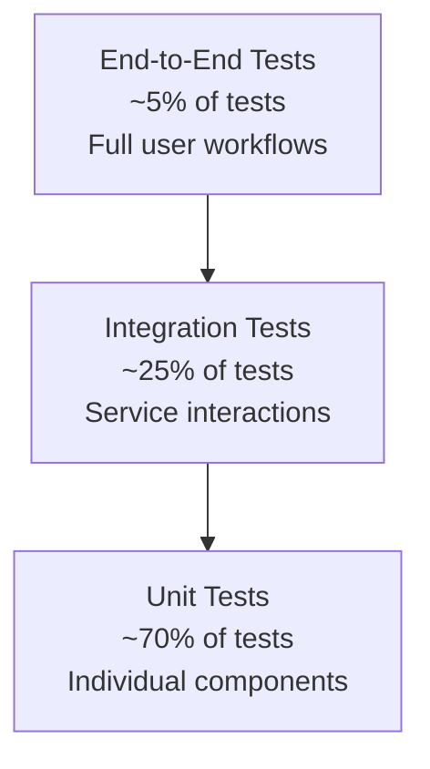
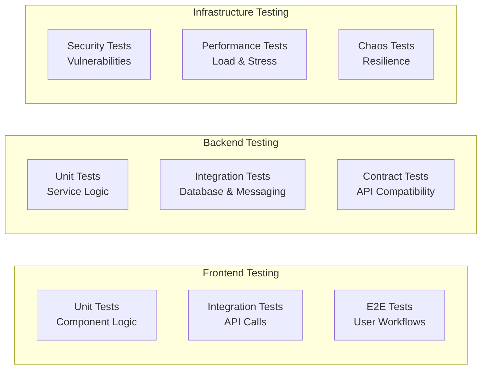

# Testing Overview

OpenFrame follows comprehensive testing practices to ensure reliability, security, and performance across all components. This guide covers the testing strategy, frameworks, and best practices used throughout the platform.

## Testing Strategy

### Testing Pyramid



**Test Distribution:**
- **Unit Tests (70%)**: Fast, isolated tests for individual components
- **Integration Tests (25%)**: Service interactions and database operations
- **End-to-End Tests (5%)**: Complete user workflows and system behavior

### Test Categories by Layer



## Test Structure and Organization

### Backend Test Structure

```text
src/test/java/
├── unit/                           # Unit tests
│   ├── service/                   # Service layer tests
│   ├── controller/                # Controller tests (with @WebMvcTest)
│   ├── mapper/                    # Mapper and DTO tests
│   └── util/                      # Utility class tests
├── integration/                   # Integration tests
│   ├── repository/                # Database integration tests
│   ├── messaging/                 # Kafka/NATS integration tests
│   ├── external/                  # External API integration tests
│   └── security/                  # Security integration tests
└── e2e/                          # End-to-end tests
    ├── api/                      # API workflow tests
    ├── auth/                     # Authentication flow tests
    └── tenant/                   # Multi-tenancy tests
```

### Frontend Test Structure

```text
src/
├── components/
│   └── __tests__/                # Component unit tests
├── hooks/
│   └── __tests__/                # Custom hook tests  
├── services/
│   └── __tests__/                # Service layer tests
├── utils/
│   └── __tests__/                # Utility function tests
└── __tests__/
    ├── integration/              # API integration tests
    ├── e2e/                      # End-to-end Playwright tests
    └── setup/                    # Test configuration
```

## Testing Frameworks and Tools

### Backend Testing Stack

| Framework | Purpose | Usage |
|-----------|---------|-------|
| **JUnit 5** | Unit testing framework | Core testing framework for all Java tests |
| **Mockito** | Mocking framework | Service mocking and behavior verification |
| **Spring Boot Test** | Spring integration testing | `@SpringBootTest`, `@WebMvcTest`, `@DataJpaTest` |
| **TestContainers** | Integration testing with real databases | MongoDB, Redis, Kafka containers for integration tests |
| **WireMock** | HTTP service mocking | External API mocking and contract testing |
| **RestAssured** | API testing | REST API integration and contract testing |

### Frontend Testing Stack

| Framework | Purpose | Usage |
|-----------|---------|-------|
| **Jest** | JavaScript testing framework | Unit and integration tests |
| **React Testing Library** | Component testing | Component behavior and user interaction testing |
| **MSW (Mock Service Worker)** | API mocking | HTTP request mocking for frontend tests |
| **Playwright** | End-to-end testing | Cross-browser E2E testing and automation |

## Running Tests

### Backend Test Execution

**Run all tests:**
```bash
# Maven: All tests with coverage
mvn clean test

# Maven: Integration tests only
mvn clean verify -Dtest.groups=integration

# Maven: Unit tests only (excluding integration)
mvn test -Dtest.groups='!integration'
```

**Run specific test categories:**
```bash
# Security tests only
mvn test -Dtest="**/*SecurityTest"

# Repository integration tests
mvn test -Dtest="**/*RepositoryTest" -Dspring.profiles.active=test

# Controller tests only
mvn test -Dtest="**/*ControllerTest"
```

**IDE Test Execution:**
```text
IntelliJ IDEA:
- Right-click on test class → Run 'TestClassName'
- Right-click on test method → Run specific test
- Use test runner window for batch execution

VS Code:
- Use Java Test Runner extension
- Run tests from Test Explorer panel
- Debug tests with integrated debugger
```

### Frontend Test Execution

**Run all frontend tests:**
```bash
cd openframe/services/openframe-frontend

# All tests with coverage
npm test

# Watch mode for development
npm run test:watch

# Integration tests only
npm run test:integration

# E2E tests
npm run test:e2e
```

**Specific test execution:**
```bash
# Component tests only
npm test -- --testPathPattern=components

# Service tests only  
npm test -- --testPathPattern=services

# Single test file
npm test -- ComponentName.test.tsx
```

## Test Examples and Patterns

### Unit Testing Examples

**Service Layer Unit Test:**
```java
@ExtendWith(MockitoExtension.class)
class OrganizationServiceTest {
    
    @Mock
    private OrganizationRepository organizationRepository;
    
    @Mock
    private TenantContext tenantContext;
    
    @InjectMocks
    private OrganizationService organizationService;
    
    @Test
    void createOrganization_Success() {
        // Given
        String tenantId = "tenant123";
        CreateOrganizationRequest request = new CreateOrganizationRequest("Test Org", "test@example.com");
        Organization savedOrg = new Organization("org123", "Test Org", tenantId);
        
        when(tenantContext.getTenantId()).thenReturn(tenantId);
        when(organizationRepository.save(any(Organization.class))).thenReturn(savedOrg);
        
        // When
        OrganizationResponse result = organizationService.createOrganization(request);
        
        // Then
        assertThat(result.getName()).isEqualTo("Test Org");
        assertThat(result.getTenantId()).isEqualTo(tenantId);
        
        verify(organizationRepository).save(argThat(org -> 
            org.getName().equals("Test Org") && 
            org.getTenantId().equals(tenantId)
        ));
    }
    
    @Test
    void createOrganization_TenantIsolation() {
        // Given
        when(tenantContext.getTenantId()).thenReturn("tenant123");
        CreateOrganizationRequest request = new CreateOrganizationRequest("Test Org", "test@example.com");
        
        // When
        organizationService.createOrganization(request);
        
        // Then - Verify tenant ID is always set
        verify(organizationRepository).save(argThat(org -> 
            "tenant123".equals(org.getTenantId())
        ));
    }
}
```

**Controller Layer Test:**
```java
@WebMvcTest(OrganizationController.class)
class OrganizationControllerTest {
    
    @Autowired
    private MockMvc mockMvc;
    
    @MockBean
    private OrganizationService organizationService;
    
    @MockBean
    private JwtDecoder jwtDecoder;
    
    @Test
    @WithMockUser(roles = "ORGANIZATION_ADMIN")
    void createOrganization_ValidRequest_Returns201() throws Exception {
        // Given
        CreateOrganizationRequest request = new CreateOrganizationRequest("Test Org", "test@example.com");
        OrganizationResponse response = new OrganizationResponse("org123", "Test Org");
        
        when(organizationService.createOrganization(any(CreateOrganizationRequest.class)))
            .thenReturn(response);
        
        // When & Then
        mockMvc.perform(post("/api/organizations")
                .contentType(MediaType.APPLICATION_JSON)
                .content(objectMapper.writeValueAsString(request)))
            .andExpect(status().isCreated())
            .andExpect(jsonPath("$.id").value("org123"))
            .andExpect(jsonPath("$.name").value("Test Org"));
    }
    
    @Test
    void createOrganization_Unauthorized_Returns401() throws Exception {
        // Given
        CreateOrganizationRequest request = new CreateOrganizationRequest("Test Org", "test@example.com");
        
        // When & Then
        mockMvc.perform(post("/api/organizations")
                .contentType(MediaType.APPLICATION_JSON)
                .content(objectMapper.writeValueAsString(request)))
            .andExpect(status().isUnauthorized());
    }
}
```

### Integration Testing Examples

**Database Integration Test:**
```java
@SpringBootTest
@Testcontainers
@TestPropertySource(properties = {
    "spring.data.mongodb.uri=mongodb://localhost:27017/test",
    "spring.profiles.active=test"
})
class OrganizationRepositoryIntegrationTest {
    
    @Container
    static MongoDBContainer mongoDBContainer = new MongoDBContainer("mongo:6.0")
            .withExposedPorts(27017);
    
    @Autowired
    private OrganizationRepository organizationRepository;
    
    @DynamicPropertySource
    static void configureProperties(DynamicPropertyRegistry registry) {
        registry.add("spring.data.mongodb.uri", mongoDBContainer::getReplicaSetUrl);
    }
    
    @Test
    @Transactional
    void findByTenantId_ReturnsOnlyTenantOrganizations() {
        // Given
        String tenant1 = "tenant1";
        String tenant2 = "tenant2";
        
        organizationRepository.save(new Organization("org1", "Org 1", tenant1));
        organizationRepository.save(new Organization("org2", "Org 2", tenant1));
        organizationRepository.save(new Organization("org3", "Org 3", tenant2));
        
        // When
        List<Organization> result = organizationRepository.findByTenantId(tenant1);
        
        // Then
        assertThat(result).hasSize(2);
        assertThat(result).extracting(Organization::getTenantId).containsOnly(tenant1);
        assertThat(result).extracting(Organization::getName).containsExactlyInAnyOrder("Org 1", "Org 2");
    }
}
```

**Messaging Integration Test:**
```java
@SpringBootTest
@EmbeddedKafka(partitions = 1, 
               brokerProperties = {"listeners=PLAINTEXT://localhost:9092", "port=9092"})
class EventProcessingIntegrationTest {
    
    @Autowired
    private KafkaTemplate<String, Object> kafkaTemplate;
    
    @Autowired
    private EventProcessor eventProcessor;
    
    @Test
    void processDeviceEvent_PublishesEnrichedEvent() throws InterruptedException {
        // Given
        DeviceEvent originalEvent = new DeviceEvent("device123", "tenant456", "STATUS_CHANGE");
        CountDownLatch latch = new CountDownLatch(1);
        
        // Set up consumer to verify enriched event
        eventProcessor.setEnrichedEventListener(event -> {
            assertThat(event.getDeviceId()).isEqualTo("device123");
            assertThat(event.getTenantId()).isEqualTo("tenant456");
            assertThat(event.getEnrichmentData()).isNotNull();
            latch.countDown();
        });
        
        // When
        kafkaTemplate.send("device-events", originalEvent);
        
        // Then
        assertThat(latch.await(5, TimeUnit.SECONDS)).isTrue();
    }
}
```

### Frontend Testing Examples

**Component Unit Test:**
```typescript
import { render, screen, fireEvent } from '@testing-library/react';
import { DeviceStatus } from '../DeviceStatus';

describe('DeviceStatus', () => {
  it('renders device status correctly', () => {
    render(<DeviceStatus deviceId="device123" status="online" />);
    
    expect(screen.getByText('Device device123: online')).toBeInTheDocument();
    expect(screen.getByRole('status')).toHaveClass('status-online');
  });
  
  it('handles status changes', () => {
    const onStatusChange = jest.fn();
    render(
      <DeviceStatus 
        deviceId="device123" 
        status="offline" 
        onStatusChange={onStatusChange} 
      />
    );
    
    fireEvent.click(screen.getByRole('button', { name: /change status/i }));
    
    expect(onStatusChange).toHaveBeenCalledWith('device123', 'online');
  });
});
```

**API Service Test:**
```typescript
import { rest } from 'msw';
import { setupServer } from 'msw/node';
import { DeviceApiService } from '../deviceApiService';

const server = setupServer(
  rest.get('/api/devices', (req, res, ctx) => {
    return res(ctx.json([
      { id: 'device1', name: 'Test Device', status: 'online' }
    ]));
  })
);

beforeAll(() => server.listen());
afterEach(() => server.resetHandlers());
afterAll(() => server.close());

describe('DeviceApiService', () => {
  it('fetches devices successfully', async () => {
    const devices = await DeviceApiService.getDevices();
    
    expect(devices).toHaveLength(1);
    expect(devices[0]).toMatchObject({
      id: 'device1',
      name: 'Test Device',
      status: 'online'
    });
  });
  
  it('handles API errors gracefully', async () => {
    server.use(
      rest.get('/api/devices', (req, res, ctx) => {
        return res(ctx.status(500), ctx.json({ error: 'Internal Server Error' }));
      })
    );
    
    await expect(DeviceApiService.getDevices()).rejects.toThrow('Failed to fetch devices');
  });
});
```

### End-to-End Testing Examples

**Authentication E2E Test:**
```typescript
import { test, expect } from '@playwright/test';

test.describe('Authentication Flow', () => {
  test('user can login and access dashboard', async ({ page }) => {
    // Navigate to login page
    await page.goto('/auth/login');
    
    // Fill in credentials
    await page.fill('[data-testid=email-input]', 'admin@example.com');
    await page.fill('[data-testid=password-input]', 'password123');
    
    // Submit login form
    await page.click('[data-testid=login-button]');
    
    // Verify redirect to dashboard
    await expect(page).toHaveURL('/dashboard');
    
    // Verify user is authenticated
    await expect(page.locator('[data-testid=user-menu]')).toBeVisible();
    
    // Verify dashboard content loads
    await expect(page.locator('[data-testid=devices-overview]')).toBeVisible();
    await expect(page.locator('[data-testid=organizations-overview]')).toBeVisible();
  });
  
  test('invalid credentials show error message', async ({ page }) => {
    await page.goto('/auth/login');
    
    await page.fill('[data-testid=email-input]', 'invalid@example.com');
    await page.fill('[data-testid=password-input]', 'wrongpassword');
    await page.click('[data-testid=login-button]');
    
    await expect(page.locator('[data-testid=error-message]')).toHaveText('Invalid credentials');
    await expect(page).toHaveURL('/auth/login');
  });
});
```

**Multi-Tenant E2E Test:**
```typescript
import { test, expect } from '@playwright/test';

test.describe('Multi-Tenant Isolation', () => {
  test('users only see their tenant data', async ({ page }) => {
    // Login as tenant1 user
    await loginAs(page, 'tenant1-admin@example.com', 'password123');
    
    // Navigate to organizations
    await page.goto('/organizations');
    
    // Should only see tenant1 organizations
    const organizations = page.locator('[data-testid=organization-row]');
    await expect(organizations).toHaveCount(2); // Only tenant1 orgs
    
    // Verify organization names are tenant1 specific
    await expect(organizations.first()).toContainText('Tenant 1 Org A');
    await expect(organizations.last()).toContainText('Tenant 1 Org B');
    
    // Logout and login as tenant2 user
    await logout(page);
    await loginAs(page, 'tenant2-admin@example.com', 'password123');
    
    // Navigate to organizations
    await page.goto('/organizations');
    
    // Should only see tenant2 organizations
    const tenant2Orgs = page.locator('[data-testid=organization-row]');
    await expect(tenant2Orgs).toHaveCount(1); // Only tenant2 orgs
    await expect(tenant2Orgs.first()).toContainText('Tenant 2 Org');
  });
});
```

## Coverage Requirements

### Coverage Targets

| Test Type | Minimum Coverage | Target Coverage |
|-----------|-----------------|-----------------|
| **Unit Tests** | 70% | 85% |
| **Integration Tests** | 60% | 75% |
| **E2E Tests** | 50% | 70% |
| **Security Tests** | 80% | 95% |

### Coverage Reporting

**Backend Coverage (JaCoCo):**
```xml
<plugin>
    <groupId>org.jacoco</groupId>
    <artifactId>jacoco-maven-plugin</artifactId>
    <version>0.8.8</version>
    <executions>
        <execution>
            <goals>
                <goal>prepare-agent</goal>
            </goals>
        </execution>
        <execution>
            <id>report</id>
            <phase>test</phase>
            <goals>
                <goal>report</goal>
            </goals>
        </execution>
        <execution>
            <id>check</id>
            <goals>
                <goal>check</goal>
            </goals>
            <configuration>
                <rules>
                    <rule>
                        <element>BUNDLE</element>
                        <limits>
                            <limit>
                                <counter>LINE</counter>
                                <value>COVEREDRATIO</value>
                                <minimum>0.70</minimum>
                            </limit>
                        </limits>
                    </rule>
                </rules>
            </configuration>
        </execution>
    </executions>
</plugin>
```

**Frontend Coverage (Jest):**
```json
{
  "collectCoverageFrom": [
    "src/**/*.{ts,tsx}",
    "!src/**/*.d.ts",
    "!src/**/*.stories.tsx",
    "!src/test/**/*"
  ],
  "coverageThreshold": {
    "global": {
      "lines": 70,
      "functions": 70,
      "branches": 60,
      "statements": 70
    }
  },
  "coverageReporters": ["text", "lcov", "html"]
}
```

## Test Data Management

### Test Database Setup

**MongoDB Test Configuration:**
```java
@TestConfiguration
public class TestDatabaseConfig {
    
    @Bean
    @Primary
    public MongoTemplate testMongoTemplate() {
        return new MongoTemplate(mongoClient(), "openframe_test");
    }
    
    @EventListener
    public void handleTestExecution(BeforeTestExecutionEvent event) {
        // Clean database before each test
        mongoTemplate.getDb().drop();
    }
}
```

**Test Data Builders:**
```java
public class TestDataBuilder {
    
    public static Organization.OrganizationBuilder defaultOrganization() {
        return Organization.builder()
            .id("test-org-" + UUID.randomUUID())
            .name("Test Organization")
            .tenantId("test-tenant")
            .contactEmail("test@example.com")
            .createdAt(Instant.now());
    }
    
    public static Device.DeviceBuilder defaultDevice() {
        return Device.builder()
            .id("test-device-" + UUID.randomUUID())
            .name("Test Device")
            .type(DeviceType.DESKTOP)
            .status(DeviceStatus.ONLINE)
            .organizationId("test-org")
            .tenantId("test-tenant");
    }
}
```

### Test Environment Configuration

**Application Test Properties:**
```yaml
# application-test.yml
spring:
  profiles:
    active: test
  data:
    mongodb:
      uri: mongodb://localhost:27017/openframe_test
  kafka:
    bootstrap-servers: localhost:9092
    consumer:
      group-id: openframe-test-group
      auto-offset-reset: earliest
  redis:
    host: localhost
    port: 6379
    database: 1

logging:
  level:
    com.openframe: DEBUG
    org.springframework.kafka: INFO

management:
  endpoints:
    web:
      exposure:
        include: health,info,metrics
```

## CI/CD Integration

### GitHub Actions Test Pipeline

```yaml
name: Test Pipeline

on:
  push:
    branches: [main, develop]
  pull_request:
    branches: [main]

jobs:
  backend-tests:
    runs-on: ubuntu-latest
    
    services:
      mongodb:
        image: mongo:6.0
        ports:
          - 27017:27017
      redis:
        image: redis:7.0
        ports:
          - 6379:6379
      kafka:
        image: confluentinc/cp-kafka:latest
        ports:
          - 9092:9092
        env:
          KAFKA_ZOOKEEPER_CONNECT: zookeeper:2181
          KAFKA_ADVERTISED_LISTENERS: PLAINTEXT://localhost:9092
    
    steps:
      - uses: actions/checkout@v3
      
      - name: Set up JDK 21
        uses: actions/setup-java@v3
        with:
          java-version: '21'
          distribution: 'temurin'
      
      - name: Cache Maven dependencies
        uses: actions/cache@v3
        with:
          path: ~/.m2
          key: ${{ runner.os }}-m2-${{ hashFiles('**/pom.xml') }}
      
      - name: Run tests
        run: mvn clean verify -Dspring.profiles.active=test
      
      - name: Upload coverage reports
        uses: codecov/codecov-action@v3
        with:
          file: ./target/site/jacoco/jacoco.xml

  frontend-tests:
    runs-on: ubuntu-latest
    
    steps:
      - uses: actions/checkout@v3
      
      - name: Setup Node.js
        uses: actions/setup-node@v3
        with:
          node-version: '18'
          cache: 'npm'
          cache-dependency-path: openframe/services/openframe-frontend/package-lock.json
      
      - name: Install dependencies
        run: |
          cd openframe/services/openframe-frontend
          npm ci
      
      - name: Run tests
        run: |
          cd openframe/services/openframe-frontend
          npm run test:ci
      
      - name: Run E2E tests
        run: |
          cd openframe/services/openframe-frontend
          npm run test:e2e:ci

  security-tests:
    runs-on: ubuntu-latest
    
    steps:
      - uses: actions/checkout@v3
      
      - name: Run OWASP Dependency Check
        uses: dependency-check/Dependency-Check_Action@main
        with:
          project: 'OpenFrame'
          path: '.'
          format: 'HTML,JSON'
      
      - name: Upload security results
        uses: actions/upload-artifact@v3
        with:
          name: security-reports
          path: reports/
```

---

*Comprehensive testing is essential for maintaining OpenFrame's reliability and security. Follow these practices and continue with [Contributing Guidelines](../contributing/guidelines.md) to understand the development workflow.*