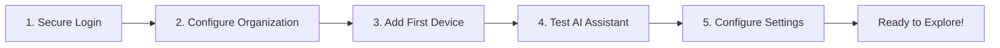

# First Steps with OpenFrame

After completing the Quick Start guide, this tutorial will walk you through your first 5 essential tasks to get the most out of OpenFrame.

## Overview



## Step 1: Secure Your Login

### Change Default Credentials

**⚠️ Important**: Never use default credentials in any environment.

1. **Log in** with default credentials (if not already logged in):
   - Email: `admin@example.com`
   - Password: `admin123`

2. **Navigate to Settings** → **Profile**

3. **Update your profile**:
   ```text
   Full Name: [Your Name]
   Email: [your-email@company.com]
   ```

4. **Change password**:
   - Click "Change Password"
   - Enter current password: `admin123`
   - Set a strong new password
   - Confirm the change

### Enable Two-Factor Authentication (Optional)

1. Go to **Settings** → **Security**
2. Click "Enable 2FA"
3. Scan QR code with authenticator app
4. Enter verification code
5. Save backup codes securely

## Step 2: Configure Your Organization

### Update Organization Details

1. **Navigate to Organizations** from the main menu

2. **Edit the default organization**:
   - Click on "Default Organization"
   - Click "Edit" button

3. **Fill in organization details**:
   ```text
   Organization Name: [Your Company Name]
   Domain: [your-domain.com]
   
   Contact Information:
   Primary Contact: [Your Name]
   Email: [contact@your-company.com]
   Phone: [Your Phone]
   
   Address:
   Street: [Your Address]
   City: [Your City]
   State: [Your State]
   Postal Code: [Your ZIP]
   Country: [Your Country]
   ```

4. **Save changes**

### Set Organization Policies

1. **Go to Settings** → **Policies**

2. **Configure device policies**:
   - Auto-enrollment settings
   - Security requirements  
   - Update policies
   - Compliance rules

3. **Set user policies**:
   - Password requirements
   - Session timeouts
   - Access permissions

## Step 3: Add Your First Device

### Manual Device Addition

1. **Navigate to Devices** → **Add Device**

2. **Choose device type**:
   - Desktop/Laptop
   - Server
   - Mobile device
   - Network device

3. **Enter device information**:
   ```text
   Device Name: [Descriptive name]
   Hostname: [device-hostname]
   IP Address: [192.168.1.100]
   Operating System: [Windows 11 / Ubuntu 22.04 / macOS]
   Organization: [Select your organization]
   ```

4. **Configure device settings**:
   - Enable monitoring
   - Set alert thresholds
   - Configure backup schedules
   - Apply security policies

5. **Save and register device**

### Agent Installation

After adding the device, install the OpenFrame agent:

1. **Download agent** from device details page

2. **Install on target device**:

   **Windows:**
   ```powershell
   # Run as Administrator
   .\openframe-agent-installer.exe /S /TENANT_ID=your-tenant-id /REG_SECRET=your-registration-secret
   ```

   **Linux:**
   ```bash
   # Run with sudo
   sudo ./openframe-agent-install.sh --tenant-id your-tenant-id --registration-secret your-registration-secret
   ```

   **macOS:**
   ```bash
   sudo installer -pkg OpenFrameAgent.pkg -target /
   ```

3. **Verify agent connection**:
   - Device should appear "Online" in the dashboard
   - Basic system info should populate
   - First heartbeat should be received

## Step 4: Test Mingo AI Assistant

### First Interaction

1. **Open Mingo Chat** (chat icon in navigation)

2. **Test basic functionality**:
   ```text
   You: Hello Mingo, what can you help me with?
   ```

3. **Expected response**:
   ```text
   Mingo: Hi! I'm your AI IT assistant. I can help you with:
   - Device management and monitoring
   - Troubleshooting system issues
   - Running scripts and commands
   - Analyzing logs and events
   - Automating routine tasks
   
   What would you like assistance with today?
   ```

### Test Device Query

1. **Ask about your devices**:
   ```text
   You: Show me the status of all devices
   ```

2. **Mingo should provide** a summary of device statuses

### Test Command Execution

1. **Request a simple task**:
   ```text
   You: Check disk space on [your-device-name]
   ```

2. **Mingo will**:
   - Confirm the action
   - Execute the command
   - Return results
   - Offer follow-up actions

[](https://www.youtube.com/watch?v=a45pzxtg27k)

## Step 5: Essential Settings Configuration

### API Keys

1. **Go to Settings** → **API Keys**

2. **Create your first API key**:
   - Name: "Development API Key"
   - Permissions: Read/Write
   - Expiration: 90 days
   - **Copy and secure the key** - you won't see it again!

### SSO Configuration (Optional)

1. **Navigate to Settings** → **SSO Configuration**

2. **Configure Google SSO** (if desired):
   ```text
   Provider: Google
   Client ID: [From Google Cloud Console]
   Client Secret: [From Google Cloud Console]
   Allowed Domains: your-company.com
   ```

3. **Test SSO**:
   - Save configuration
   - Log out
   - Try "Sign in with Google"

### Notification Settings

1. **Go to Settings** → **Notifications**

2. **Configure alerts**:
   - Email notifications: Enabled
   - Slack integration: (if applicable)
   - Device offline alerts: 15 minutes
   - Security alerts: Immediate
   - Performance alerts: Enabled

### User Management

1. **Navigate to Settings** → **Users**

2. **Invite team members**:
   - Click "Invite User"
   - Enter email addresses
   - Set roles (Admin, Technician, Viewer)
   - Send invitations

## Verification Checklist

After completing all steps, verify:

- ✅ **Profile updated** with your information
- ✅ **Organization configured** with company details  
- ✅ **First device added** and agent connected
- ✅ **Mingo AI responding** to queries
- ✅ **API key created** and secured
- ✅ **Notifications configured** for your preferences
- ✅ **Team members invited** (if applicable)

## Next Steps

### Explore Core Features

1. **Dashboard Analytics**:
   - Review system health metrics
   - Examine recent events
   - Check device performance

2. **Event Monitoring**:
   - Navigate to Logs
   - Filter by device or event type
   - Set up custom alerts

3. **Automation**:
   - Create your first script
   - Set up scheduled tasks
   - Configure automated responses

### Advanced Configuration

1. **Integration Setup**:
   - Connect external tools (Fleet, Tactical RMM)
   - Configure data sources
   - Set up webhooks

2. **Custom Policies**:
   - Define compliance rules
   - Set security standards  
   - Configure backup policies

3. **Reporting**:
   - Create custom dashboards
   - Set up scheduled reports
   - Configure data exports

## Common Next Actions

Based on your role:

### For MSP Administrators
- Set up client organizations
- Configure billing integrations
- Establish SLA monitoring
- Create service catalogs

### For IT Managers  
- Implement security policies
- Set up patch management
- Configure backup strategies
- Establish change management

### For Technicians
- Customize dashboard views
- Create diagnostic scripts
- Set up personal automation
- Configure alert preferences

## Getting Help

### Documentation Resources
- **Architecture guides** for understanding system design
- **API documentation** for integration development
- **Security guides** for hardening your deployment

### Community Support
- **OpenMSP Slack**: [Join here](https://join.slack.com/t/openmsp/shared_invite/zt-36bl7mx0h-3~U2nFH6nqHqoTPXMaHEHA)
- **Community forums** for peer support
- **Knowledge base** for common questions

### Professional Support
- **Enterprise support** for production deployments
- **Custom development** services
- **Training and certification** programs

## Troubleshooting Common Issues

### Device Won't Connect
```bash
# Check agent status
sudo systemctl status openframe-agent

# View agent logs
sudo journalctl -u openframe-agent -f

# Test connectivity
curl -k https://your-openframe-instance/api/health
```

### Mingo Not Responding
1. Check chat service status in Settings → Architecture
2. Verify AI service configuration
3. Review chat logs in the admin panel

### Authentication Issues
1. Clear browser cache and cookies
2. Check SSO configuration
3. Verify user permissions and roles

Congratulations! You've completed the essential first steps with OpenFrame. You're now ready to explore advanced features and customize the platform for your specific needs.