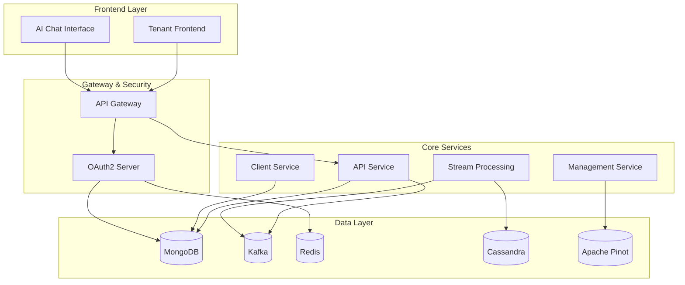

# OpenFrame Platform Introduction

Welcome to **OpenFrame**, the unified AI-powered MSP platform that replaces expensive proprietary software with open-source alternatives enhanced by intelligent automation.

## What is OpenFrame?

OpenFrame is a complete multi-tenant SaaS platform built for Managed Service Providers (MSPs) and IT operations teams. It integrates multiple MSP tools into a single AI-driven interface, automating IT support operations across your entire technology stack.

## Key Features

### 🤖 AI-Powered Automation
- **Mingo AI** for technicians - Intelligent automation and decision support
- **Fae AI** for clients - Self-service capabilities and instant support
- Advanced machine learning for predictive maintenance and issue resolution

### 🏢 Multi-Tenant Architecture  
- Complete tenant isolation and security
- OAuth2/OIDC authentication with SSO support
- Per-tenant configuration and branding

### 🔧 Unified Tool Integration
- **Fleet MDM** - Device management and compliance
- **Tactical RMM** - Remote monitoring and management  
- **MeshCentral** - Remote access and file management
- Extensible integration framework for additional tools

### 📊 Real-Time Analytics
- Unified event processing and normalization
- Device monitoring and health tracking
- Log aggregation and analysis
- Performance metrics and reporting

### 🛡️ Enterprise Security
- Multi-layered security architecture
- API key management and rate limiting
- Audit logging and compliance reporting
- Secure agent-to-server communication

## Architecture Overview

OpenFrame follows a modern microservices architecture with event-driven communication:

## Target Audience

**MSP Professionals**
- IT service providers looking to reduce vendor costs
- Teams seeking unified tool management
- Organizations wanting AI-powered automation

**DevOps Engineers** 
- Platform engineers building MSP solutions
- Developers integrating monitoring tools
- Teams implementing multi-tenant SaaS platforms

**System Administrators**
- IT professionals managing device fleets
- Administrators seeking centralized monitoring
- Teams requiring compliance and audit capabilities

## Technology Stack

### Backend Services
- **Java 21** with Spring Boot 3.3.0
- **Spring Cloud** for microservices coordination
- **OAuth2 Authorization Server** for identity management
- **GraphQL** (Netflix DGS) and REST APIs
- **Apache Kafka** for event streaming
- **NATS** for real-time messaging

### Data Storage
- **MongoDB** for operational data
- **Apache Cassandra** for time-series data
- **Apache Pinot** for analytics and reporting
- **Redis** for caching and sessions

### AI & Automation
- **Anthropic Claude** integration
- **VoltAgent Core** for AI orchestration
- **Custom AI pipelines** for MSP workflows

### Integration Framework
- **Debezium** for change data capture
- **Apache NiFi** for data processing
- **gRPC** for service communication
- **WebSocket** support for real-time updates

## Benefits

### 💰 Cost Reduction
- Replace expensive proprietary MSP tools
- Reduce vendor lock-in and licensing costs
- Optimize resource utilization with AI insights

### ⚡ Operational Efficiency  
- Unified interface for all MSP operations
- Automated routine tasks and workflows
- Real-time visibility across your infrastructure

### 🔒 Security & Compliance
- Enterprise-grade security controls
- Comprehensive audit trails
- Multi-tenant data isolation

### 📈 Scalability
- Cloud-native architecture
- Horizontal scaling capabilities
- Event-driven resilience

## What's Next?

Ready to get started? Here's your learning path:

1. **[Prerequisites](prerequisites.md)** - Set up your development environment
2. **[Quick Start](quick-start.md)** - Get OpenFrame running in 5 minutes  
3. **[First Steps](first-steps.md)** - Explore key features and configurations

## Community & Support

- 💬 **OpenMSP Slack Community**: [Join our community](https://join.slack.com/t/openmsp/shared_invite/zt-36bl7mx0h-3~U2nFH6nqHqoTPXMaHEHA)
- 🌐 **Website**: [https://flamingo.run](https://flamingo.run)
- 📚 **Documentation**: [https://www.flamingo.run/openframe](https://www.flamingo.run/openframe)

---

**Ready to revolutionize your MSP operations with AI-powered automation?** Let's begin your OpenFrame journey!