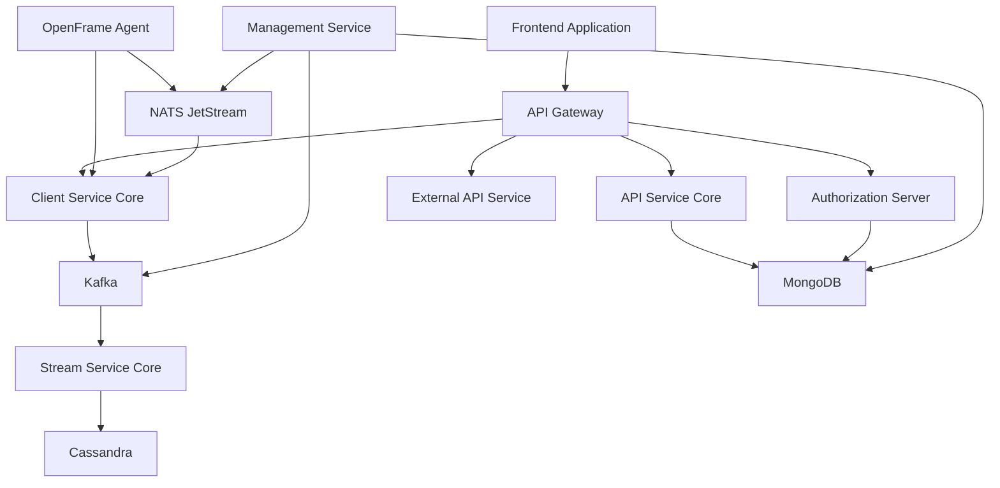

# OpenFrame Platform Introduction

Welcome to **OpenFrame** - Flamingo's unified AI-powered MSP platform that replaces expensive proprietary software with open-source alternatives enhanced by intelligent automation.

## What is OpenFrame?

OpenFrame is a comprehensive multi-tenant SaaS platform that integrates multiple MSP tools into a single AI-driven interface, automating IT support operations across the entire stack. It combines the power of open-source alternatives with intelligent AI assistants (Mingo for technicians, Fae for clients) to deliver enterprise-grade MSP capabilities at a fraction of the cost.

## Key Features

### 🤖 AI-Powered Automation
- **Mingo AI**: Intelligent technician assistant that augments MSP operations with AI-powered insights and automation
- **Fae AI**: Client-facing assistant that provides intelligent support and self-service capabilities
- Enterprise guardrails ensure AI assistance remains secure and compliant

### 🔧 Unified Platform
- Single interface for multiple MSP tools and services
- Centralized device management and monitoring
- Unified authentication with multi-tenant support
- Integrated remote access and file management

### 💰 Cost-Effective Alternative
- Replaces expensive proprietary MSP software
- Open-source foundation with commercial enhancements
- Transparent pricing and reduced vendor lock-in

### 🏢 Enterprise-Ready
- Multi-tenant architecture for MSP service providers
- OAuth2/OIDC authentication with SSO support
- Role-based access control and security policies
- Scalable microservices architecture

## Architecture Overview

OpenFrame is built on a modern, event-driven microservices architecture:

## Target Audience

OpenFrame is designed for:

- **Managed Service Providers (MSPs)** looking to modernize their toolstack
- **IT Service Organizations** seeking unified platform management
- **System Administrators** requiring centralized device and user management
- **Developers** wanting to extend MSP capabilities with open APIs

## Getting Started

Ready to begin your OpenFrame journey? Here's your roadmap:

1. **[Prerequisites](./prerequisites.md)** - Ensure your environment meets the requirements
2. **[Quick Start](./quick-start.md)** - Get OpenFrame running in 5 minutes
3. **[First Steps](./first-steps.md)** - Explore key features and initial configuration

## Platform Capabilities

| Feature | Description |
|---------|-------------|
| Device Management | Monitor and control endpoints across your organization |
| User Administration | Manage users, roles, and permissions with RBAC |
| Remote Access | Secure remote desktop and shell access to managed devices |
| File Management | Browser-based file operations on remote systems |
| AI Assistance | Intelligent automation and support through Mingo AI |
| API Integration | Extensive REST and GraphQL APIs for custom integrations |
| Multi-tenancy | Isolated tenant environments for MSP service delivery |
| SSO Integration | Azure AD, Google, and Microsoft authentication support |

## Community & Support

- **Slack Community**: Join our [OpenMSP Slack](https://join.slack.com/t/openmsp/shared_invite/zt-36bl7mx0h-3~U2nFH6nqHqoTPXMaHEHA) for community support and discussions
- **Website**: Visit [openframe.ai](https://openframe.ai) for latest updates and documentation
- **Flamingo Platform**: Learn more about the broader ecosystem at [flamingo.run](https://flamingo.run)

## Why Choose OpenFrame?

> "OpenFrame represents the future of MSP tooling - combining the best of open source with enterprise-grade AI automation to deliver unparalleled value to service providers and their clients."

### Benefits at a Glance:
- ✅ **Reduced Costs**: Replace expensive proprietary tools
- ✅ **Enhanced Productivity**: AI-powered automation reduces manual tasks
- ✅ **Unified Experience**: Single platform for all MSP operations
- ✅ **Open Ecosystem**: Extensible with APIs and integrations
- ✅ **Enterprise Security**: Military-grade security with compliance controls

## Next Steps

Continue your OpenFrame journey:

- Review the [Prerequisites](./prerequisites.md) to ensure your environment is ready
- Follow the [Quick Start Guide](./quick-start.md) for rapid deployment
- Explore [First Steps](./first-steps.md) to understand core functionality

Welcome to the future of MSP platforms with OpenFrame! 🚀