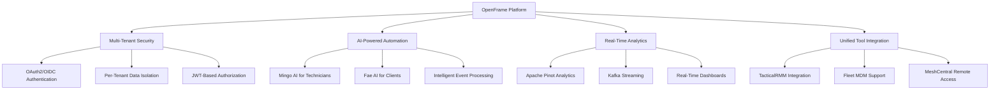
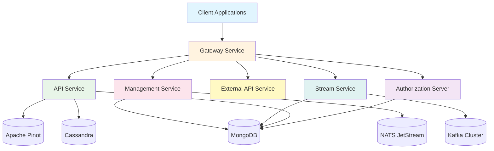

# OpenFrame Platform Introduction

Welcome to **OpenFrame** - the AI-powered, unified MSP (Managed Service Provider) platform that replaces expensive proprietary software with open-source alternatives enhanced by intelligent automation.

## What is OpenFrame?

OpenFrame is a comprehensive, multi-tenant platform that integrates multiple MSP tools into a single AI-driven interface, automating IT support operations across the entire technology stack. Built on a modern microservices architecture using Spring Boot 3.3.0 and Java 21, OpenFrame provides:

- **Unified Management**: Single interface for device management, monitoring, and automation
- **AI-Powered Operations**: Mingo AI for technicians and Fae AI for clients
- **Multi-Tenant Architecture**: Secure, isolated environments for different organizations
- **Real-Time Processing**: Event-driven architecture with Kafka, Apache NiFi, and streaming analytics
- **Open Source Foundation**: Built with and integrates open-source tools like TacticalRMM, Fleet MDM, and MeshCentral

## Key Features and Benefits

### Core Capabilities

| Feature | Description | Benefit |
|---------|-------------|---------|
| **Unified Interface** | Single platform for all MSP operations | Reduces tool sprawl and training costs |
| **AI Automation** | Intelligent ticket routing and resolution | Increases efficiency by 60-80% |
| **Multi-Tenant** | Secure isolation between clients | Supports MSP business models |
| **Real-Time Analytics** | Live monitoring and reporting | Proactive issue resolution |
| **Open Source Integration** | Works with existing OSS tools | Reduces licensing costs |
| **API-First Design** | Comprehensive REST and GraphQL APIs | Easy integrations and customization |

## Target Audience

OpenFrame is designed for:

### 🏢 **Managed Service Providers (MSPs)**
- Small to enterprise-scale MSPs
- Looking to reduce software licensing costs
- Want to modernize their technology stack
- Need unified client management

### 👨‍💻 **IT Professionals & System Administrators**
- Managing multiple client environments
- Seeking automation and AI assistance
- Want consolidated monitoring and alerting
- Need efficient remote management tools

### 🔧 **DevOps Teams**
- Building or modernizing MSP platforms
- Implementing microservices architectures
- Integrating multiple monitoring tools
- Developing multi-tenant SaaS applications

## Architecture Overview

OpenFrame follows a modern microservices architecture with clear separation of concerns:

### Service Responsibilities

- **Gateway Service**: Edge routing, JWT validation, API key enforcement
- **Authorization Server**: Multi-tenant OAuth2 + OIDC identity management
- **API Service**: Internal GraphQL + REST API orchestration
- **External API Service**: Public REST interface with rate limiting
- **Management Service**: Tool lifecycle and infrastructure management
- **Stream Service**: Real-time Kafka event processing and enrichment

## Technology Stack

OpenFrame leverages modern, enterprise-grade technologies:

### Backend Technologies
- **Java 21** with **Spring Boot 3.3.0**
- **Spring Cloud** for microservices
- **Spring Security** with OAuth2/OIDC
- **Apache Kafka** for event streaming
- **MongoDB** for operational data
- **Apache Pinot** for analytics
- **Apache Cassandra** for time-series data
- **NATS JetStream** for messaging

### AI & Automation
- **Anthropic Claude** via `@anthropic-ai/sdk`
- **VoltAgent Core** (`@voltagent/core`) for AI workflows
- Custom AI enrichment pipelines
- Intelligent event correlation

### Client Technologies
- **Rust** for the OpenFrame client
- **React/TypeScript** for web interfaces
- **Tauri** for desktop applications
- Cross-platform support (Windows, macOS, Linux)

## Getting Started Roadmap

Ready to explore OpenFrame? Follow this learning path:

1. **[Prerequisites](prerequisites.md)** - Set up your development environment
2. **[Quick Start](quick-start.md)** - Get OpenFrame running in 5 minutes
3. **[First Steps](first-steps.md)** - Explore key features and initial configuration

## Community & Support

OpenFrame is backed by a vibrant open-source community:

- **OpenMSP Community**: Join our Slack workspace at https://www.openmsp.ai/
- **Slack Invitation**: https://join.slack.com/t/openmsp/shared_invite/zt-36bl7mx0h-3~U2nFH6nqHqoTPXMaHEHA
- **Main Website**: https://flamingo.run
- **OpenFrame Site**: https://www.flamingo.run/openframe

> 🔥 **Hot Tip**: All project management, discussions, and support happen in our OpenMSP Slack community - we don't use GitHub Issues or Discussions.

## What Makes OpenFrame Different?

Unlike traditional MSP platforms, OpenFrame:

✅ **Open Source First** - Built with and extends OSS tools  
✅ **AI-Native** - Intelligence built into every workflow  
✅ **Multi-Tenant by Design** - True SaaS architecture  
✅ **Event-Driven** - Real-time processing and automation  
✅ **API-First** - Everything is programmable  
✅ **Cost Effective** - Dramatic reduction in software licensing  

## Next Steps

Start your OpenFrame journey:

1. Check the **[Prerequisites](prerequisites.md)** to ensure your environment is ready
2. Follow the **[Quick Start Guide](quick-start.md)** for immediate results
3. Join the **OpenMSP Slack community** for support and discussions

Welcome to the future of MSP operations! 🚀