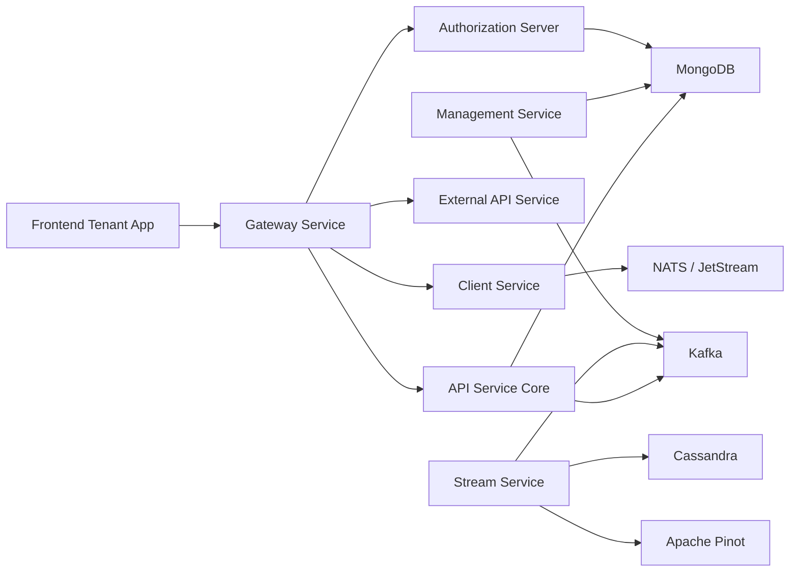
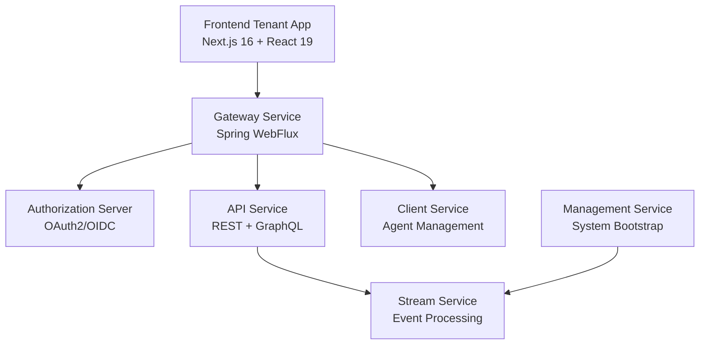
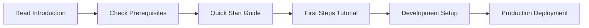

# OpenFrame Platform Introduction

Welcome to **OpenFrame** – the AI-powered MSP platform that replaces expensive proprietary software with open-source alternatives enhanced by intelligent automation.

## What is OpenFrame?

OpenFrame is a comprehensive, multi-tenant, event-driven MSP (Managed Service Provider) platform that unifies multiple IT management tools into a single AI-driven interface. It combines the power of open-source solutions with intelligent automation to deliver enterprise-grade IT support operations.

### Key Components

## Core Features

### 🤖 AI-Powered Automation
- **Mingo AI**: Intelligent assistant for technicians that automates routine IT tasks
- **Fae Client**: AI-driven interface for end-users
- **Smart Ticket Routing**: Automatically categorizes and assigns support tickets

### 🔧 Unified Tool Integration
- **Device Management**: Comprehensive device lifecycle management
- **Organization Management**: Multi-tenant organization structure
- **Event Processing**: Real-time event streaming and analytics
- **Tool Connectivity**: Seamless integration with existing IT tools

### 🛡️ Enterprise Security
- **Multi-tenant OAuth2/OIDC**: Secure authentication and authorization
- **Role-based Access Control**: Granular permission management
- **API Key Management**: Secure API access with rate limiting
- **SSO Integration**: Google, Microsoft, and custom SSO support

### 📊 Real-time Analytics
- **Streaming Data Pipeline**: Kafka, Apache Pinot, and Cassandra
- **Performance Monitoring**: Real-time system health metrics
- **Audit Logging**: Complete audit trail of all activities
- **Custom Dashboards**: Configurable analytics and reporting

## Target Audience

OpenFrame is designed for:

| User Type | Use Case |
|-----------|----------|
| **MSPs** | Comprehensive IT service management platform |
| **IT Departments** | Internal IT operations and device management |
| **System Administrators** | Centralized infrastructure monitoring |
| **DevOps Teams** | Automated deployment and monitoring workflows |

## Architecture Highlights

### Microservices Design

### Technology Stack
| Layer | Technologies |
|-------|--------------|
| **Frontend** | Next.js 16, React 19, TypeScript, TanStack Query, Zustand |
| **Backend** | Spring Boot 3.3, Java 21, Netflix DGS GraphQL |
| **Authentication** | Spring Authorization Server, OAuth2, OIDC |
| **Data Storage** | MongoDB, Apache Cassandra, Apache Pinot |
| **Messaging** | Apache Kafka, NATS JetStream |
| **API Gateway** | Spring Cloud Gateway, WebSocket proxy |

## Benefits

### For MSPs
- ✅ **Reduce Vendor Costs**: Replace expensive proprietary solutions
- ✅ **Increase Automation**: AI-driven task automation reduces manual work
- ✅ **Improve Margins**: Open-source foundation with enterprise features
- ✅ **Scale Operations**: Multi-tenant architecture supports growth

### For IT Teams
- ✅ **Unified Interface**: Single pane of glass for all IT operations
- ✅ **Real-time Insights**: Streaming analytics and monitoring
- ✅ **Flexible Integration**: Connect existing tools and workflows
- ✅ **Modern Stack**: Built on proven, scalable technologies

## Getting Started Journey

Ready to begin? Continue with our step-by-step guides:

1. **[Prerequisites](prerequisites.md)** - System requirements and preparation
2. **[Quick Start](quick-start.md)** - Get OpenFrame running in 5 minutes  
3. **[First Steps](first-steps.md)** - Initial configuration and exploration

## Community and Support

- **OpenMSP Slack**: [Join our community](https://join.slack.com/t/openmsp/shared_invite/zt-36bl7mx0h-3~U2nFH6nqHqoTPXMaHEHA)
- **Website**: [https://flamingo.run](https://flamingo.run)
- **OpenFrame**: [https://openframe.ai](https://openframe.ai)

> **Note**: We don't use GitHub Issues or GitHub Discussions. All support and community discussions happen in our OpenMSP Slack community.