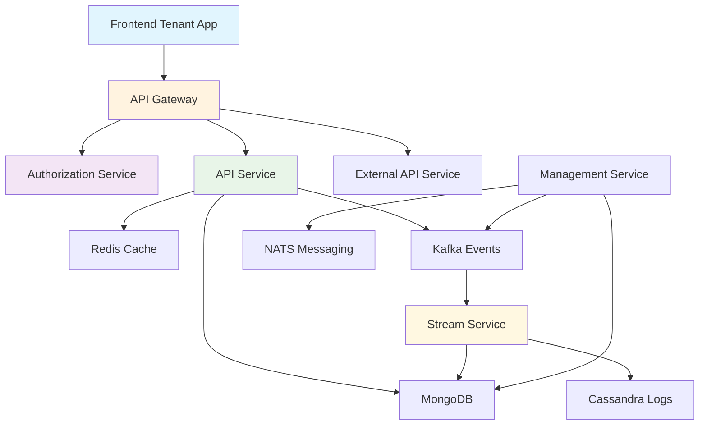

# Introduction to OpenFrame OSS Tenant

Welcome to **OpenFrame OSS Tenant** — the complete AI-driven MSP platform that powers the OpenFrame ecosystem. This is a production-ready, multi-tenant, microservices-based SaaS architecture designed to revolutionize IT infrastructure management through intelligent automation.

## What is OpenFrame OSS Tenant?

OpenFrame OSS Tenant is the unified platform that integrates multiple MSP tools into a single AI-driven interface, automating IT support operations across the entire stack. It replaces expensive proprietary software with open-source alternatives enhanced by intelligent automation.

## Key Features & Benefits

### 🏢 **Multi-Tenant Architecture**
- Complete tenant isolation with per-tenant RSA signing keys
- OAuth2/OIDC with Google and Microsoft SSO integration
- Secure gateway-based JWT and API key enforcement
- Scalable tenant discovery and onboarding

### 🤖 **AI-Powered Automation**
- Mingo AI for technicians - intelligent ticket triage and resolution
- Fae for clients - automated client communication
- Event-driven processing with real-time enrichment
- Autonomous agents that actually fix infrastructure

### 🔌 **Integrated Tool Ecosystem**
- Fleet MDM integration for device management
- Tactical RMM for remote monitoring and management
- MeshCentral for remote access
- Extensible architecture for custom integrations

### ⚡ **Event-Driven Architecture**
- Kafka-based event streaming
- Debezium CDC (Change Data Capture) for real-time updates
- Stream processing with data enrichment
- MongoDB and Cassandra persistence layers

### 🚀 **Production-Ready**
- Spring Boot 3.3.0 with Java 21
- Reactive and blocking hybrid model
- Distributed locking via Redis
- Comprehensive monitoring and health checks

## Platform Overview

## Target Audience

**OpenFrame OSS Tenant is ideal for:**

- **MSPs (Managed Service Providers)** looking to modernize their infrastructure
- **Enterprise IT Teams** seeking unified tool management
- **SaaS Developers** wanting a multi-tenant foundation
- **DevOps Engineers** building event-driven systems
- **Organizations** transitioning from proprietary to open-source solutions

## Technology Stack

### Backend Services
- **Spring Boot 3.3.0** with Java 21
- **OAuth2 Authorization Server** with per-tenant keys
- **GraphQL** (Netflix DGS) and REST APIs
- **Kafka** for event streaming
- **MongoDB** for document storage
- **Redis** for caching and distributed locking
- **Cassandra** for time-series data

### Frontend & Clients
- **TypeScript/React** web application
- **Rust-based** desktop clients
- **Tauri** for cross-platform desktop apps
- **OAuth BFF** (Backend for Frontend) pattern

### Data & Integration
- **Debezium** for Change Data Capture
- **NATS** for messaging
- **Apache Pinot** for analytics
- **Fleet MDM** and **Tactical RMM** integrations

## Quick Architecture Benefits

✅ **Multi-tenant by design** - Complete tenant isolation  
✅ **Event-driven CDC ingestion** - Real-time data processing  
✅ **Reactive + blocking hybrid model** - Optimal performance  
✅ **Cursor-based pagination everywhere** - Scalable data access  
✅ **Distributed locking via Redis** - Concurrent operation safety  
✅ **Infrastructure bootstrapping automation** - Easy deployment  
✅ **Clear contract isolation** - Maintainable architecture

## Getting Started Quickly

Ready to dive in? Here's your next steps:

1. **[Check Prerequisites](prerequisites.md)** - Ensure your environment is ready
2. **[Quick Start Guide](quick-start.md)** - Get up and running in 5 minutes
3. **[First Steps](first-steps.md)** - Explore the platform's key features

## Platform Components

| Component | Purpose |
|-----------|---------|
| **API Service** | Tenant-facing REST + GraphQL APIs |
| **Authorization Service** | OAuth2/OIDC + SSO authentication |
| **Gateway Service** | JWT validation, routing, rate limiting |
| **Stream Service** | Kafka ingestion and event processing |
| **Management Service** | Infrastructure and operational tasks |
| **External API Service** | Public API key-secured endpoints |
| **Frontend App** | Multi-tenant web interface |

## Community & Support

Join the OpenMSP community for support and collaboration:

- **Slack Community:** [OpenMSP Workspace](https://join.slack.com/t/openmsp/shared_invite/zt-36bl7mx0h-3~U2nFH6nqHqoTPXMaHEHA)
- **Website:** [https://www.flamingo.run/openframe](https://www.flamingo.run/openframe)
- **Main Site:** [https://openframe.ai](https://openframe.ai)

> **Note:** This project uses Slack for all discussions and issue tracking. GitHub Issues and Discussions are not monitored.

---

**Next Step:** Review the [Prerequisites](prerequisites.md) to ensure your development environment is properly configured.