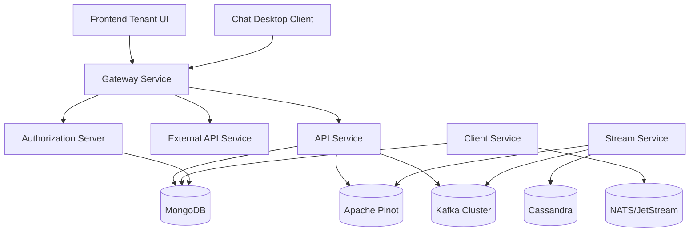

# OpenFrame Platform Introduction

OpenFrame is an AI-powered MSP (Managed Service Provider) platform that replaces expensive proprietary software with open-source alternatives enhanced by intelligent automation. Built by the team at Flamingo, OpenFrame provides the unified platform that integrates multiple MSP tools into a single AI-driven interface.

## What is OpenFrame?

OpenFrame is a **multi-tenant, microservice-based platform** that serves as the backbone for modern MSP operations. It combines:

- **Mingo AI** - Intelligent technician assistant that automates incident triage and alert management
- **Fae** - AI-powered client interface for streamlined communication
- **Unified Dashboard** - Single pane of glass for all MSP tools and data
- **Open Source Foundation** - Built on proven open-source technologies with enterprise-grade extensions

## Key Features and Benefits

### 🤖 AI-Powered Automation
- **Autonomous agent architecture** that handles incident triage
- **Intelligent alert management** to reduce noise and focus on critical issues  
- **Automated response workflows** for common IT support scenarios

### 🏗️ Microservice Architecture
- **Spring Boot 3.3.0** backend services with Java 21
- **Multi-tenant OAuth2/OIDC** authentication and authorization
- **Event-driven processing** with Kafka Streams for real-time data flow
- **Scalable infrastructure** designed for enterprise workloads

### 🔌 Comprehensive Integration
- **Fleet MDM, Tactical RMM, MeshCentral** - Device management and remote access
- **Apache NiFi, MongoDB, Cassandra, Apache Pinot** - Data pipeline and analytics
- **NATS/JetStream** - Real-time messaging and agent communication
- **Standardized APIs** for third-party tool integration

### 💰 Cost Optimization
- **Open-source foundation** eliminates expensive proprietary licensing
- **Unified platform** reduces the need for multiple separate tools
- **Intelligent automation** decreases manual workload and operational costs

## Target Audience

OpenFrame is designed for:

- **MSP Teams** looking to modernize their technology stack
- **IT Operations** seeking AI-powered automation and insights
- **Developers** building MSP tools and integrations
- **Organizations** wanting to reduce vendor dependency and costs

## High-Level Architecture

The platform follows a **layered microservice architecture** where:

- **Gateway Layer** handles authentication, routing, and security
- **API Layer** provides REST and GraphQL endpoints for data access
- **Service Layer** contains domain logic and business rules
- **Data Layer** includes multiple specialized databases for different use cases
- **Streaming Layer** processes real-time events and enriches data

## Core Technology Stack

### Backend Services
- **Java 21** with **Spring Boot 3.3.0**
- **Spring Cloud** for microservice infrastructure
- **Spring Security** with OAuth2/OIDC support
- **Apache Kafka** for event streaming
- **NATS/JetStream** for agent messaging

### Data Layer
- **MongoDB** - Primary transactional storage
- **Apache Cassandra** - Time-series and log persistence  
- **Apache Pinot** - Real-time analytics
- **Redis** - Caching and session management

### Frontend & Integration
- **Node.js** application with AI/LLM capabilities
- **VoltAgent core** for intelligent automation
- **Anthropic SDK** and **OpenAI integration**
- **Cross-platform desktop clients** (Rust/Tauri for chat client)

## Platform Components

| Component | Purpose | Technology |
|-----------|---------|------------|
| API Service | Internal REST + GraphQL APIs | Spring Boot, GraphQL |
| Authorization Server | Multi-tenant OAuth2/OIDC | Spring Authorization Server |
| Gateway Service | Security, routing, WebSocket proxy | Spring Cloud Gateway |
| External API Service | Public API endpoints | Spring Boot REST |
| Stream Service | Event processing and enrichment | Kafka Streams |
| Client Service | Agent lifecycle management | Spring Boot, NATS |
| Frontend UI | Web-based tenant dashboard | Next.js-style framework |
| Chat Client | Desktop AI assistant | Rust/Tauri |

## Getting Started Path

Ready to explore OpenFrame? Here's your recommended learning path:

1. **[Prerequisites](prerequisites.md)** - Set up your development environment
2. **[Quick Start](quick-start.md)** - Get OpenFrame running in 5 minutes
3. **[First Steps](first-steps.md)** - Explore key features and functionality

## Community and Support

- **Slack Community**: Join [OpenMSP Slack](https://join.slack.com/t/openmsp/shared_invite/zt-36bl7mx0h-3~U2nFH6nqHqoTPXMaHEHA)
- **Documentation**: [Official OpenFrame Docs](https://www.flamingo.run/openframe)
- **Company**: [Flamingo Platform](https://flamingo.run)

---

*OpenFrame is an open-source project by [Flamingo](https://flamingo.run), empowering MSPs with AI-driven automation and cost-effective tooling.*