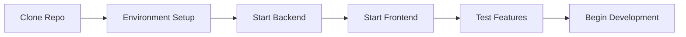

# Quick Start Guide

Get OpenFrame up and running in 5 minutes with this streamlined setup process.

## TL;DR Setup

```bash
# 1. Clone the repository
git clone https://github.com/your-org/openframe-oss-tenant.git
cd openframe-oss-tenant

# 2. Setup development environment
./clients/openframe-client/scripts/setup_dev_init_config.sh

# 3. Start MongoDB
sudo systemctl start mongod

# 4. Build and run backend services
mvn clean install
mvn spring-boot:run -pl openframe/services/openframe-api &
mvn spring-boot:run -pl openframe/services/openframe-authorization-server &
mvn spring-boot:run -pl openframe/services/openframe-gateway &

# 5. Start frontend
cd openframe/services/openframe-frontend
npm install
npm run dev

# 6. Access OpenFrame at https://localhost:3000
```

[](https://www.youtube.com/watch?v=O8hbBO5Mym8)

## Step-by-Step Quick Start

### Step 1: Clone the Repository

```bash
git clone https://github.com/your-org/openframe-oss-tenant.git
cd openframe-oss-tenant
```

### Step 2: Environment Setup

**Set required environment variables:**

```bash
# Create environment file
cat > .env.local << 'EOF'
# Database
MONGO_URI=mongodb://localhost:27017
MONGO_DATABASE=openframe_dev

# Security
JWT_SECRET=dev-secret-change-in-production

# Application URLs
OPENFRAME_BASE_URL=https://localhost:3000
API_BASE_URL=https://localhost:8080
AUTHORIZATION_SERVER_URL=https://localhost:8081

# Development mode
NODE_ENV=development
SPRING_PROFILES_ACTIVE=dev
EOF

# Load environment variables
source .env.local
```

### Step 3: Initialize Development Configuration

Run the development setup script:

```bash
# Make script executable
chmod +x clients/openframe-client/scripts/setup_dev_init_config.sh

# Run setup (will prompt for access token)
./clients/openframe-client/scripts/setup_dev_init_config.sh
```

**What this script does:**
- Fetches active registration secrets
- Configures initial tenant setup
- Sets up local development certificates
- Initializes MongoDB collections

### Step 4: Start Backend Services

**Terminal 1 - API Service:**
```bash
mvn spring-boot:run -pl openframe/services/openframe-api \
  -Dspring-boot.run.profiles=dev \
  -Dserver.port=8080
```

**Terminal 2 - Authorization Server:**
```bash
mvn spring-boot:run -pl openframe/services/openframe-authorization-server \
  -Dspring-boot.run.profiles=dev \
  -Dserver.port=8081
```

**Terminal 3 - Gateway Service:**
```bash
mvn spring-boot:run -pl openframe/services/openframe-gateway \
  -Dspring-boot.run.profiles=dev \
  -Dserver.port=8082
```

### Step 5: Start Frontend Application

**Terminal 4 - Frontend:**
```bash
cd openframe/services/openframe-frontend

# Install dependencies
npm install

# Start development server
npm run dev
```

### Step 6: Verify Installation

Open your browser and navigate to:

```text
https://localhost:3000
```

You should see the OpenFrame login page.

## Service Health Checks

Verify all services are running:

```bash
# API Service health
curl -k https://localhost:8080/actuator/health

# Authorization Server health  
curl -k https://localhost:8081/actuator/health

# Gateway health
curl -k https://localhost:8082/actuator/health

# Frontend (should return HTML)
curl -k https://localhost:3000
```

Expected responses should include `"status":"UP"` for backend services.

## Default Login

After setup, you can log in with:

| Field | Value |
|-------|-------|
| **Email** | `admin@example.com` |
| **Password** | `admin123` |
| **Organization** | `Default Organization` |

> **Note**: Change these credentials immediately after first login.

## Quick Feature Test

Once logged in, test core functionality:

### 1. Dashboard Access
- Navigate to the main dashboard
- Verify organization and device counts display

### 2. Device Management
- Go to "Devices" section
- Add a test device
- Verify device appears in the list

### 3. AI Chat (Mingo)
- Access the Mingo chat interface
- Send a test message: "Hello, what can you help with?"
- Verify AI response

### 4. Settings
- Navigate to Settings > Profile
- Update your profile information
- Test SSO configuration (optional)

## Expected Output

### Backend Service Startup
```text
INFO  - Starting ApiApplication using Java 21
INFO  - The following profiles are active: dev
INFO  - Started ApiApplication in 12.345 seconds
```

### Frontend Startup
```text
Local:        https://localhost:3000
ready - started server on 0.0.0.0:3000, url: https://localhost:3000
```

### MongoDB Collections
After initialization, you should see these collections:
- `tenants`
- `users` 
- `organizations`
- `devices`
- `api_keys`

## Troubleshooting Quick Issues

### Port Already in Use
```bash
# Kill process on port 3000
sudo lsof -ti:3000 | xargs kill -9

# Kill process on port 8080
sudo lsof -ti:8080 | xargs kill -9
```

### MongoDB Not Running
```bash
# Start MongoDB
sudo systemctl start mongod

# Check status
sudo systemctl status mongod
```

### SSL Certificate Issues
```bash
# Regenerate development certificates
mkcert localhost 127.0.0.1 ::1

# Trust the local CA
mkcert -install
```

### Build Failures
```bash
# Clean and rebuild
mvn clean install -DskipTests

# If still failing, check Java version
java -version
# Must be Java 21
```

### Frontend Won't Start
```bash
# Clear npm cache
npm cache clean --force

# Delete node_modules and reinstall
rm -rf node_modules package-lock.json
npm install
```

## Docker Quick Start (Alternative)

If you prefer Docker:

```bash
# Start all services with Docker Compose
docker-compose -f docker-compose.dev.yml up -d

# View logs
docker-compose -f docker-compose.dev.yml logs -f
```

## Development Workflow



## Next Steps

Now that OpenFrame is running:

1. **[First Steps](first-steps.md)** - Complete initial configuration
2. **Development Environment Setup** - Set up your IDE and development tools
3. **Local Development Guide** - Learn the development workflow

## Performance Tips

### For Development
- Use `npm run dev:turbo` for faster frontend builds
- Enable Spring Boot dev tools for hot reload
- Use profile `dev` to skip unnecessary initializations

### Resource Usage
| Service | RAM Usage | CPU Usage |
|---------|-----------|-----------|
| API Service | ~512MB | Low |
| Frontend | ~256MB | Low |
| MongoDB | ~256MB | Low |
| **Total** | ~1GB | Light |

## Quick Commands Reference

```bash
# Stop all services
pkill -f "spring-boot:run"
npm stop  # In frontend directory

# Restart backend service
mvn spring-boot:run -pl openframe/services/openframe-api &

# View application logs
tail -f logs/openframe-api.log

# Connect to MongoDB
mongosh openframe_dev

# Check environment
env | grep OPENFRAME
```

Congratulations! You now have OpenFrame running locally. Continue with the [First Steps Guide](first-steps.md) to complete your setup and explore the platform features.